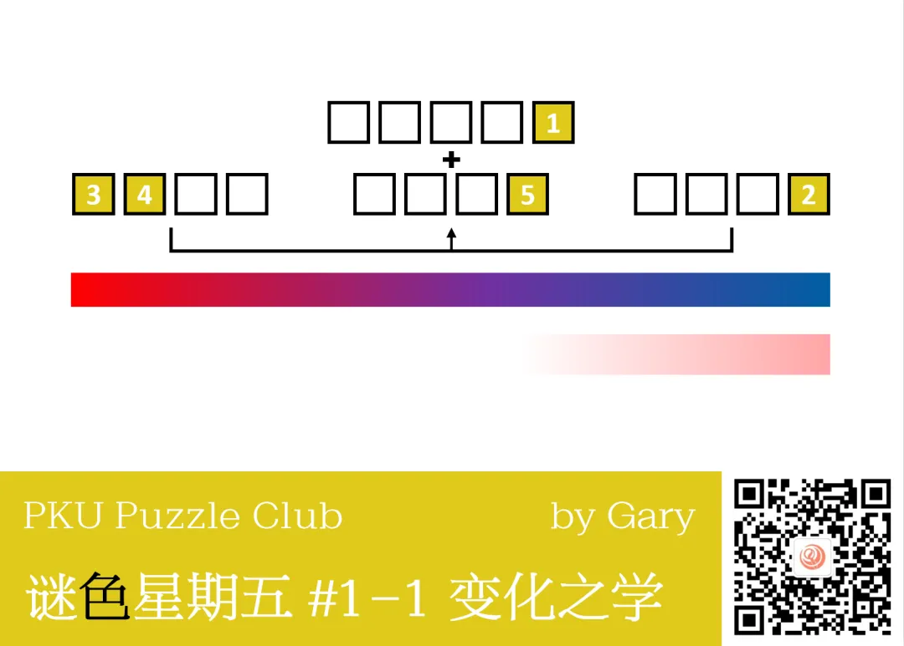
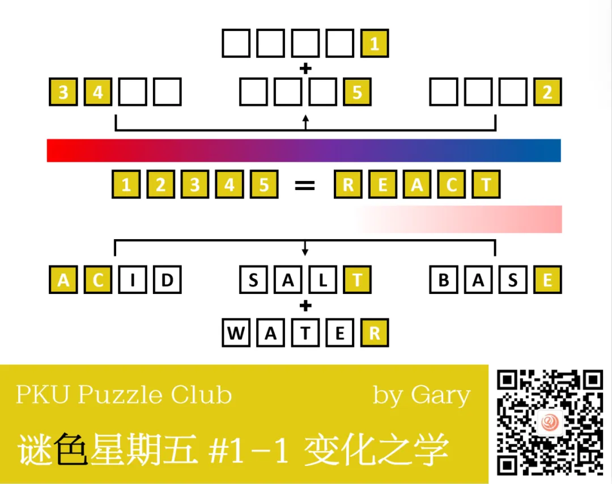
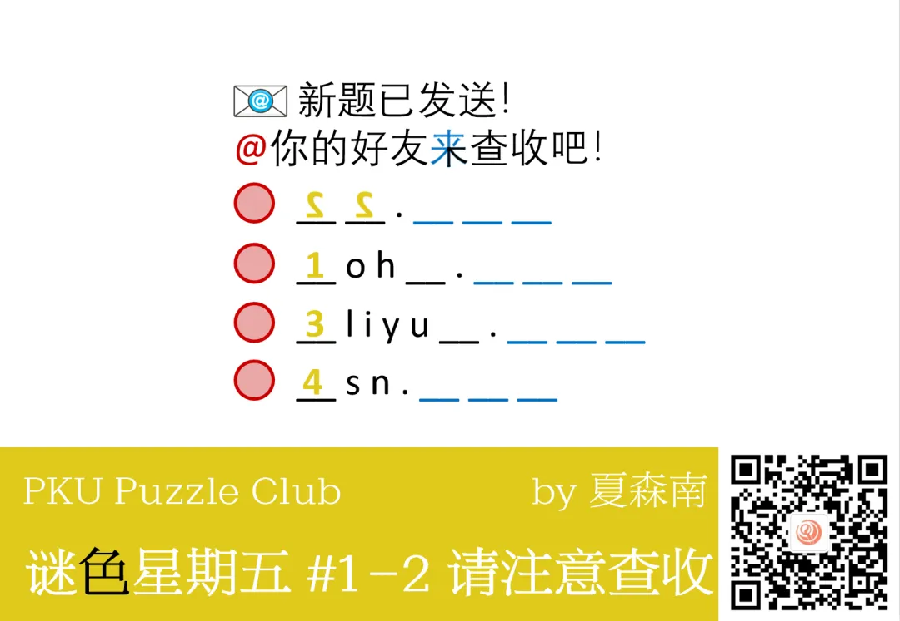
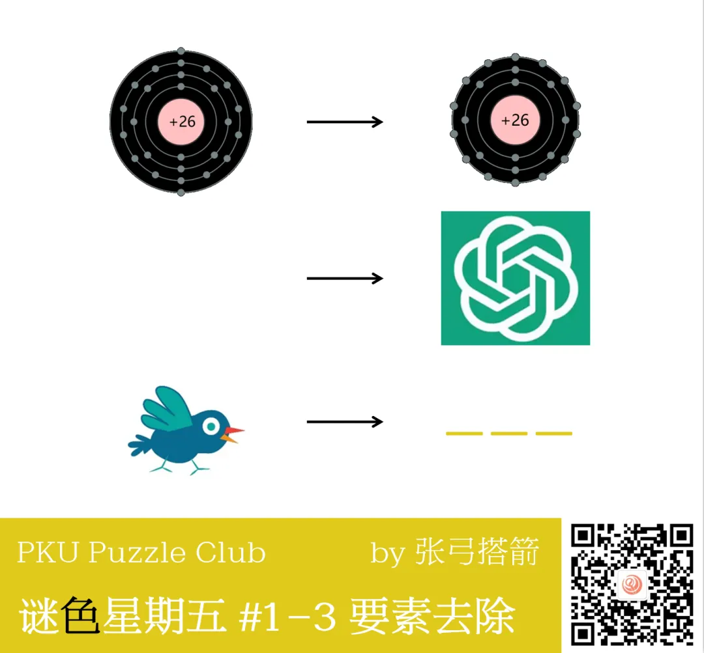
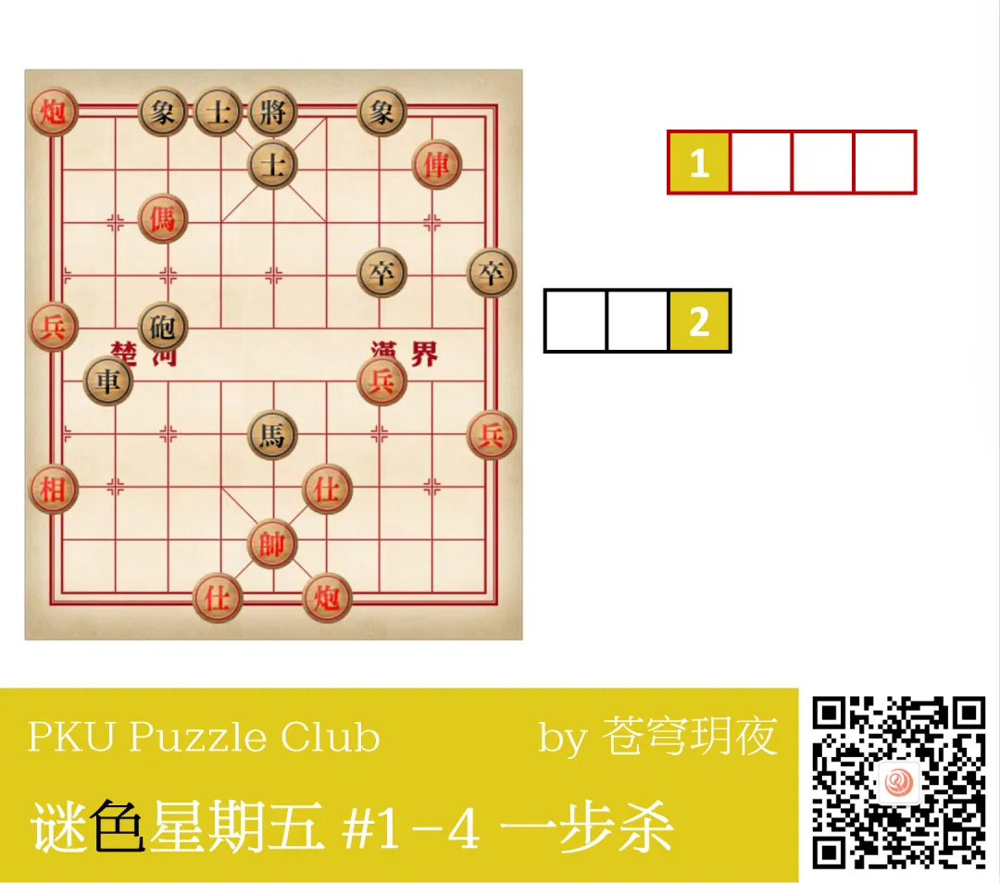
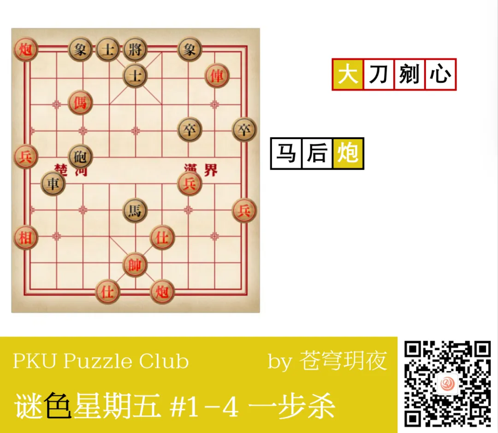
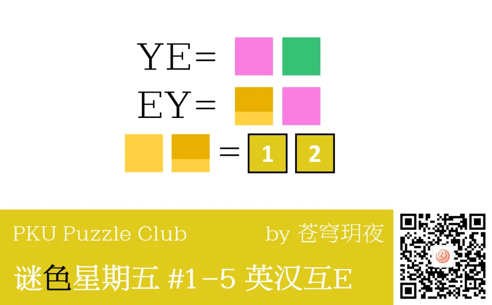
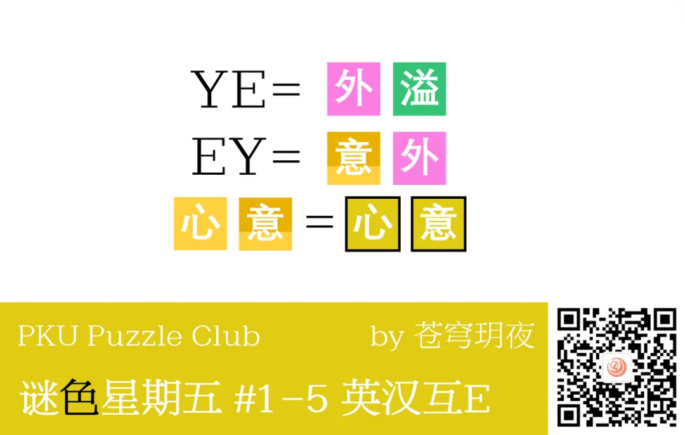
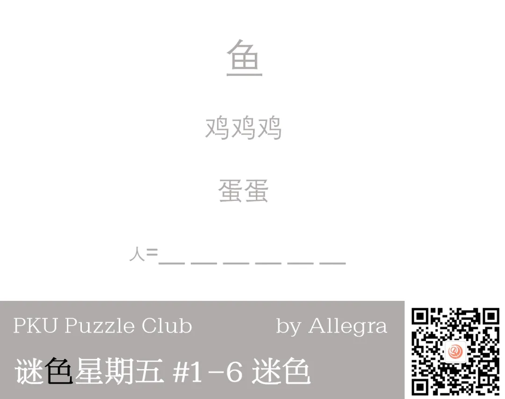
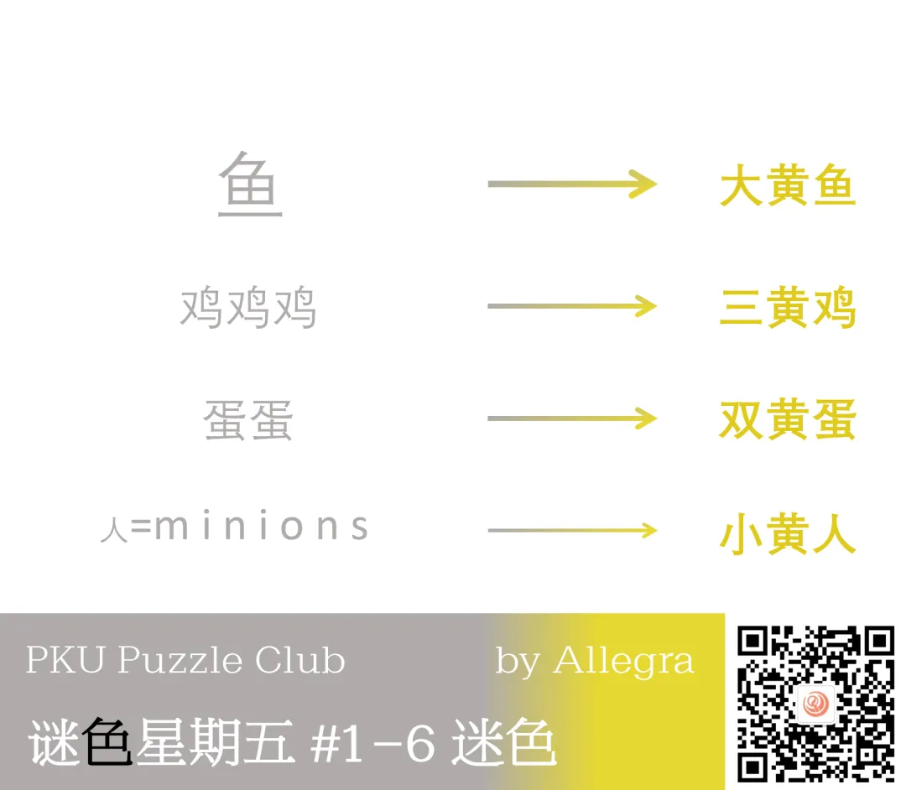

从 9 月 20 日起，每周一题的谜色星期五板块已经更新至今天的第 13 期了！
在观察日历时忽然发现：这一周的星期五恰好是 13 日，农历也是十三，不仅与期数相等，还是“**黑色星期五**”——真是奇妙的巧合！

为纪念这充满巧合的一天，从本期开始，每当这周的星期五日期恰为 13 日（即是黑色星期五），谜色星期五板块将会进行**特殊更新**
——将会有大量谜题同时放出，并且会邀请大家对过去的谜色星期五谜题进行投票评价！欢迎大家积极参与这一不定期的谜题狂欢！祝大家玩得开心～

{/* truncate */}

> 投票结果请查看[微信文章](https://mp.weixin.qq.com/s/FBfCnEFvfH4698bbcdviHA)，这里不再搬运。

## 变化之学 (by Gary)

<AnswerCheck answer={'react'} />

    
提示 01

    观察两个渐变的颜色条，现实中什么物质在什么条件变化下会显示这些颜色？

### 解析：变化之学

<Solution author={'Gary'}>
谜题的正确答案是：**react**。

图中两个渐变的颜色条分别代表石蕊和酚酞在不同酸碱度下颜色变化的情况。
在酸性，中性和碱性条件下的典型物质分别是酸（acid），盐（salt）和水（water），碱（base）。
同时图中的箭头表达了酸和碱会反应生成盐和水。提取得到答案 react。

</Solution>

## 请注意查收 (by 夏森南)

<AnswerCheck answer={'spam'} />

    
提示 01

    注意观察题干中的符号和颜色，以及它们与填空部分的对应，这暗示了各行其实都属于一类常见的后缀格式。

### 解析：请注意查收

<Solution author={'夏森南'}>
谜题的正确答案是：**spam**。

由“@”“查收”和信封 emoji 可知是邮箱主题。红色的@对应下面的红色圆圈，而涂成 3/4 蓝的“来”（come）则恰好对应了蓝色空格的 com。
由此去查找常见邮箱地址后缀，各行依次为 \@qq.com，\@sohu.com，\@aliyun.com，\@msn.com，提取对应位置得到答案 spam。

ph 新人第一次出题，非常感谢 pkupc 给了这样一个机会！这道题也是当时不少群友群策群力共同做了优化，再次感谢。
个人感觉比较有趣的点在于“\@从题干中提取出来”和“come 与 com 的巧妙联系”。
以及敲定美工时发现 3/4 蓝色的涂法恰好留出了一个黑色↖，意料之外的巧合。

</Solution>

## 要素去除 (by 张弓搭箭)

<AnswerCheck answer={'bid'} />

    
提示 01

    第一行右侧的单词是 ion，第二行左侧的单词是 air。

### 解析：要素去除

<Solution author={'张弓搭箭'}>
谜题的正确答案是：**bid**。

首先将每个图片先翻译为英文：第一行对应的单词是 iron ion；第二行对应的单词是 air ai；第三行左边对应的单词是 bird。
从前两行可以看出箭头对应的规则是删除单词中的 r，因此可以得到答案为 bid。

题目的来源在于 iron 和 ion 的有趣关联，接着又找到了 air 到 ai 的变化，同样也包含了用空白代表 air 的形式。

</Solution>

    
补充点评（By Gary）

    这题的答案示例“nor”实际上暗示了本题需要去除 r。
    可以注意到谜色星期五的所有答案示例均会提示该题的语言以及字数特征，有时示例会和题目或答案息息相关，大家在做题时可以多加留意。

## 一步杀 (by 苍穹玥夜)

<AnswerCheck answer={'大炮'} />

    
提示 01

    现在黑红双方都只需要一步棋就可以获得将死对面，而要走的那步棋是有名字的。

### 解析：一步杀

<Solution author={'苍穹玥夜'}>
谜题的正确答案是：**大炮**。

这道题左侧的棋盘中存在一步杀，而且区别于红黑方谁先手，分别存在一步将死对手的方式。
而这步棋可以使用象棋术语进行描述（你可以参考 [Wikibooks:中国象棋/基本杀法列表](https://zh.wikibooks.org/wiki/%E4%B8%AD%E5%9C%8B%E8%B1%A1%E6%A3%8B/%E5%9F%BA%E6%9C%AC%E6%AE%BA%E6%B3%95%E5%88%97%E8%A1%A8)）。
对于红方来说，应该走車二平五杀中士将杀，符合“大刀剜心”的特点。这种杀法还有一个别称叫“大胆穿心”，不影响最终提取。
对于黑方来说，应该炮七平五将杀，符合“马后炮”的特点。将这两步棋的名字填入右侧空格中即可提取本题答案“大炮”。

发现大家最大的困难似乎是“大刀剜心”的识别问题。
不过由于“马后炮”杀法过于有名，大家多少可以感觉到红方走的那步棋应该也是有名字的，还是通过查阅资料做出来了。
希望这种“虽然我不是很懂，但是通过一定的分析依然可以学会”的感觉能令大家感到欣喜。

</Solution>

## 英汉互Ｅ (by 苍穹玥夜)

<AnswerCheck answer={'心意'} />

    
提示 01

    试试看念一下题目中的4个字母。

### 解析：英汉互Ｅ

<Solution author={'苍穹玥夜'}>
谜题的正确答案是：**心意**。

通过英文读音和字形联系可以判断出上方的两个词是“外溢”和“意外”。提取本题答案“心意”。

应该是本次最水的题（

主要是我早就知道这次谜五会一次性放很多题，所以希望我的题目能加入更多轻松的感觉，所以就在定标题的时候又送了一把。
有好多同学说做这道题是少有的没有开提示直接出的，那又体验了 YE 和 EY 中 E 的不同，又收获了秒题的爽感，就是我为大家准备的“心意”。
另外这道题的灵感是某天看到 AUV 的弹幕不由自主地笑出声来的时候想到的。

另外这道题的初稿其实是用 YE 和 GE 的部首拼“讣”这个字，不过我不说答案的话大家第一时间想到的 GE 应该都不止一个词吧，所以就改掉了。

</Solution>

## 迷色 (by Allegra)

<AnswerCheck answer={'minion'} />

    
提示 01

    你需要结合上下文将本题还原为原本的颜色，并结合文本的形态上的特征做出推理。

### 解析：迷色

<Solution author={'Gary'}>
谜题的正确答案是：**minion**。

这题实际的颜色应与其他几道题一致，均为黄色。通过将每串字符的数字特征或字体大小特征与颜色特征结合在一起可以还原所有的词组。
如第一串字符显示了一个较大的黄色的鱼，因此可以得到大黄鱼。由此可以得到最后一行的字代表的是小黄人，英文为 minion。

</Solution>
