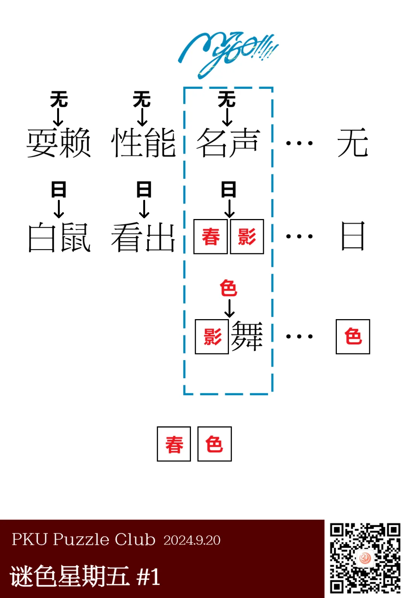
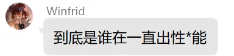

{/* truncate */}

<AnswerCheck answer={'春色'} />

<Solution author={'同同'}>
谜题的正确答案是：**春色**。

规律是将最右侧的字插入左侧的二字词语中间后，能够生成一个通顺的三字词语。其中MyGO记号一列的三字词语是“BanG Dream! It's MyGO!!!!!”相关作品中出现的歌曲。

“白日鼠”是水浒传人物白胜的绰号。如果不熟悉水浒传的话可能不容易看出本题的规律。

不要问为什么会有“性无能”这种词。也许题目作者对这个词情有独钟？

<ImgCaption>对啊，到底是谁呢</ImgCaption>

如果熟悉MyGO相关作品的话，应该会比较容易看出本题的规律。如果没有观看过相关作品，可以通过搜索关键词“名 声 无 MyGO”从而发现名无声是MyGO中出现的一首曲目。此后也可以通过搜索关键词“影 舞”等方法来得到答案。

<ImgCaption>“BanG Dream! It's MyGO!!!!!”作品截图 应某人的要求在文章末尾添加</ImgCaption>

</Solution>
