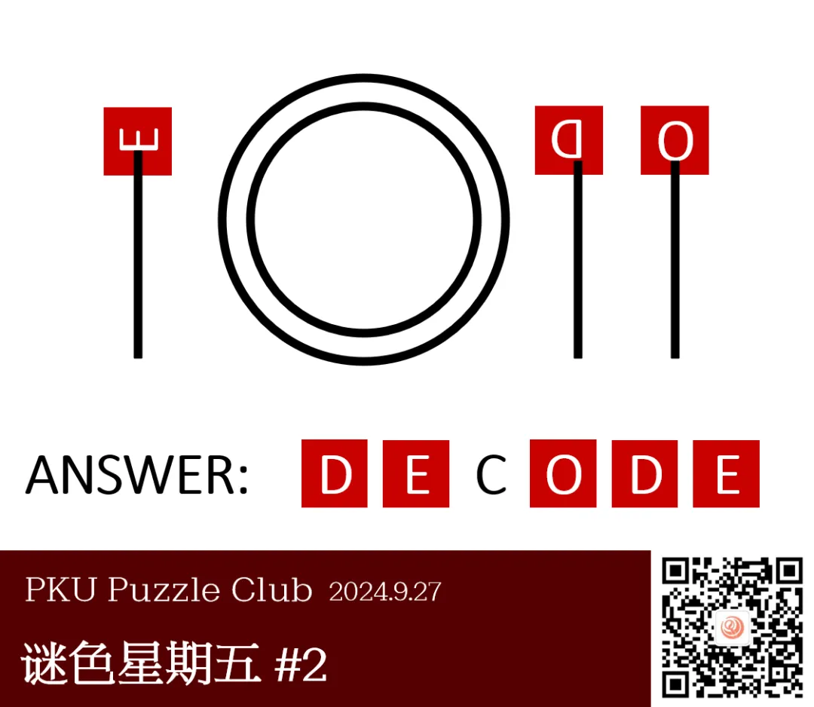
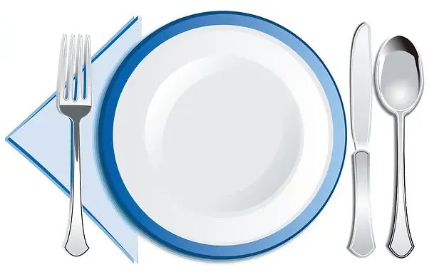
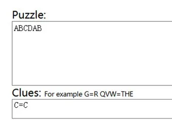
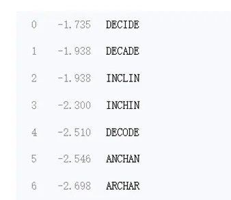
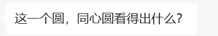

{/* truncate */}

<AnswerCheck answer={'decode'} />

<Solution author={'Gary'}>
谜题的正确答案是：**DECODE**。

这期的谜题非常简洁，可用的信息只有图上的两个圈和一些竖线。
观察力比较强的朋友们可能会直接联想到西餐的餐具摆放，从左到右分别是叉子，刀子和勺子。
当然本期谜题的标题“晚间活动”以及提交答案示例中的“DINNER”（没错，我们的答案示例可不是随便乱写的）也可以一定程度的提示本期主题。
在了解本期主题以后，根据餐具的象形提取出对应的字母：刀子对应 D，餐叉对应 E，勺子对应 O，按照给定的序号填写至答案上得到：DECODE。

<ImgCaption>西餐餐具餐盘摆放样例，图片来源于网络</ImgCaption>

笔者在这里想要说明的一点是，虽然这题对脑洞的要素比较大（毕竟想不到西餐餐具摆放就做不出来嘛），
但是我们也可以用一些工具辅助答题（这在 PUZZLE HUNT 当中也是一种技巧）。
在此笔者为大家推荐 QUIPQIUP，网站是 <a href="https://www.quipqiup.com">www.quipqiup.com</a>。
这是一个解决单表替换的工具。单表替换可以理解为从字母表至字母表的一个一一对应
（常见的单表替换有凯撒密码，即每个字母和之后的字母对应）。
对于这种重复字母较多的谜题，可以直接尝试用单表替换的方法找到可能的解。
例如本题，我们可以在第一个输入框输入“ABCDAB”（表示第一个和第五个字母相同，第二个和第六个字母相同），
在第二个输入框输入“C=C”（表示第三个字母是 C），得到如下结果：

<ImgCaption>输入方法</ImgCaption>

<ImgCaption>输出内容</ImgCaption>

可以看到，正确答案在第五个位置上，经过一定数量的尝试便可以成功地尝试到正确答案。
所以对于实在无法看出本题主题的朋友，可以尝试先用工具把答案解出来后，反过去理解题目的主题。

当然，介绍该工具的目的并不在于推荐大家无论什么题目都用工具直接求解，
而是提供一个解题的可能路径，笔者在出完本题以后自己也尝试了工具求解，
认为该答案所在的顺位既不会使工具解比正解快太多，也不会使工具解的尝试次数太多。
笔者希望解谜工具的使用能够优化各位解谜者的解谜体验，不论是刚刚接触谜题的新人还是久经沙场的老手。
本期谜色星期五的解析不仅作为一个解析，也作为对新人的一次工具介绍，也希望这些解谜工具能够帮助大家更好的享受谜题。
</Solution>

    
补充点评（By 同同）

    正如上文所说，这一期谜题用简单的几个图形就表现了西餐餐具摆放的场景，并用不同的餐具头的形状来表示 E，D，O 三个字母。
    原题中数字 1 即为 E，2 即为 D，3 即为 O。数字的旋转和字母的旋转相对应，可以通过从正确的方向看向数字来得到字母的准确形状。

    然而，想要单从两个同心圆和几根竖线就看出端倪相当困难。
    比如我在内测的时候，在得到提示以前也是什么都没看出来。
    而另一方面，如果光明正大地提示“吃饭”或者“餐厅”之类的词，被人一上来就想到了 trick，这道好题就又会变得相当简单无聊。
    为了避免大家毫无头绪，同时避免浪费这道题的设计，我最终采用了在答案示例里暗藏提示“dinner”的方法。
    标题“晚间活动”指的是晚饭。希望能通过这种暗示的方法，使得大家虽然没有受到明确的提示，
    但能在潜意识里把这道题和“dinner”联系起来。不知道这样的设计有没有实现这个目的。

    

        
        <ImgCaption>显然不可能所有人都意识到了这一点</ImgCaption>
    

    另外，似乎有搞错了刀叉和勺子顺序的错误答案。在网上搜索西餐餐具摆放顺序时，“叉子 盘子 刀 勺子”的顺序应该是最多见的。
    另外，还有一处细节可以帮助纠正，那就是 D 的刀柄略微偏右，说明对应餐具的头应该不具有对称性，因此是最适合刀的位置。

    本次的正确答案也可以通过解谜工具暴力枚举得到，使得即使没看懂图片也有机会做出题目。
    事实上，从后台的提交记录来看，这样做的人并不在少数。
    暴力尝试从来都不可耻，是解谜中常用的策略技巧，可以用于跳过解谜中没有理解或过于繁琐的步骤。
    借此机会向各位尚不了解这些工具的同学们加以介绍，一定程度上也是设计此题的目的之一。
    另一个常用的工具是 <a href="https://nutrimatic.org/2024/">nutrimatic.org</a>，也许你会在今后常常用到它。
    不过，如果是有趣的题目，还是建议至少了解一下官方正解的方案，以免丧失解谜本身的乐趣。

