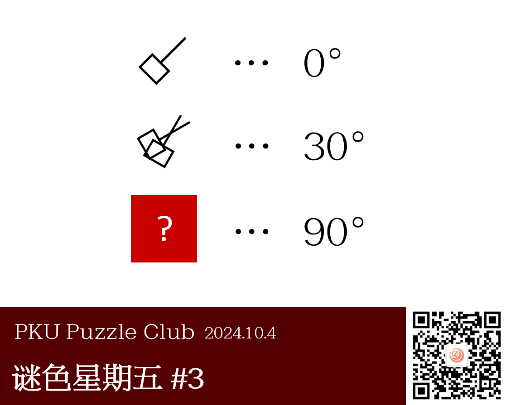
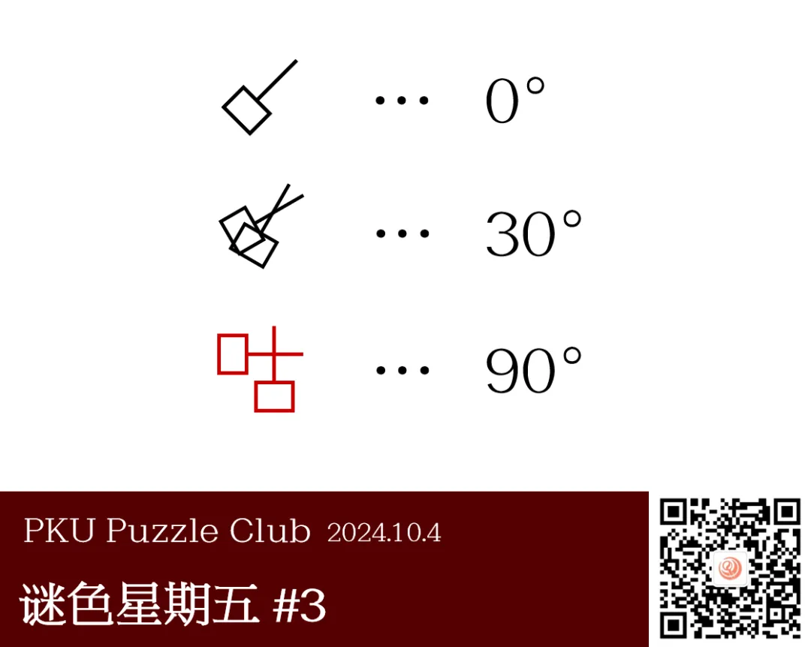

{/* truncate */}

<AnswerCheck answer={'咕'} />

    
提示 01

    把左侧看成一把剪刀，右侧的度数就是剪刀开合的角度。

<Solution author={'Winfrid'}>
谜题的正确答案是：**咕**。

将左侧的图形看作剪刀，右侧的度数则是两个形状张开的角度。在张开的角度是 90 度时，正好能够形成“咕”这个汉字。

实际上这是一个一直打算在 P&KU 系列里使用的小巧合，但后来觉得有点太迷你了所以就在这里用上啦。
</Solution>
