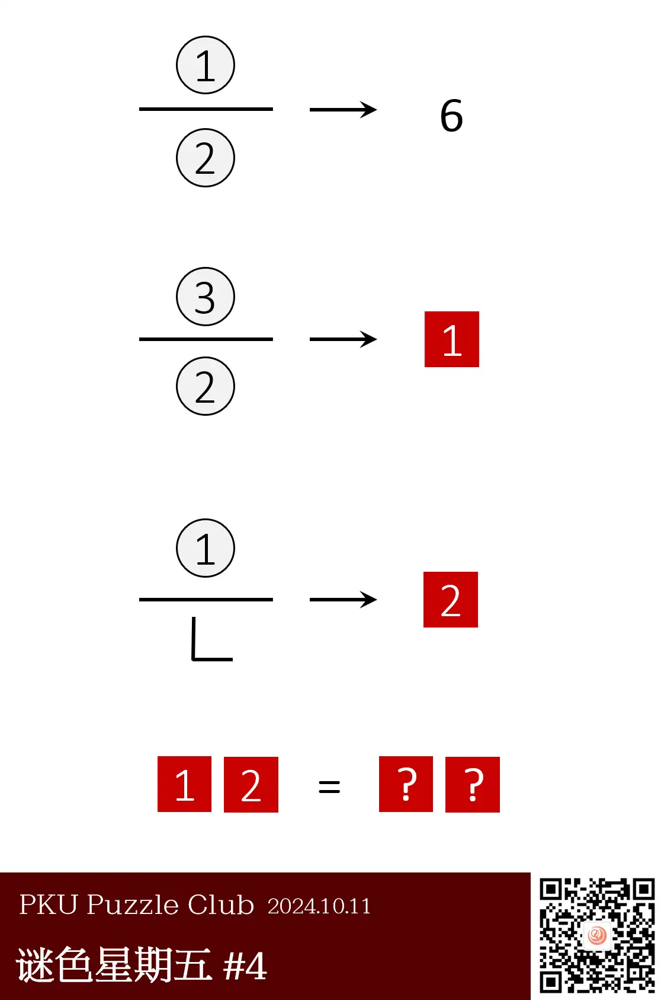
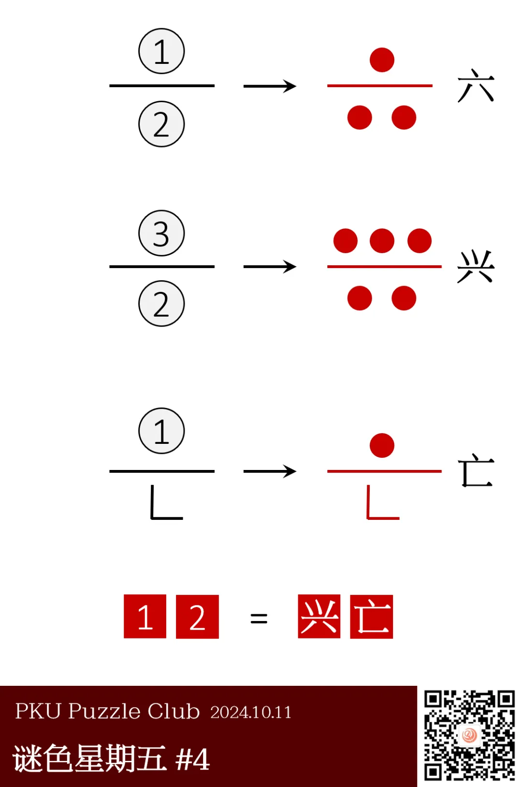
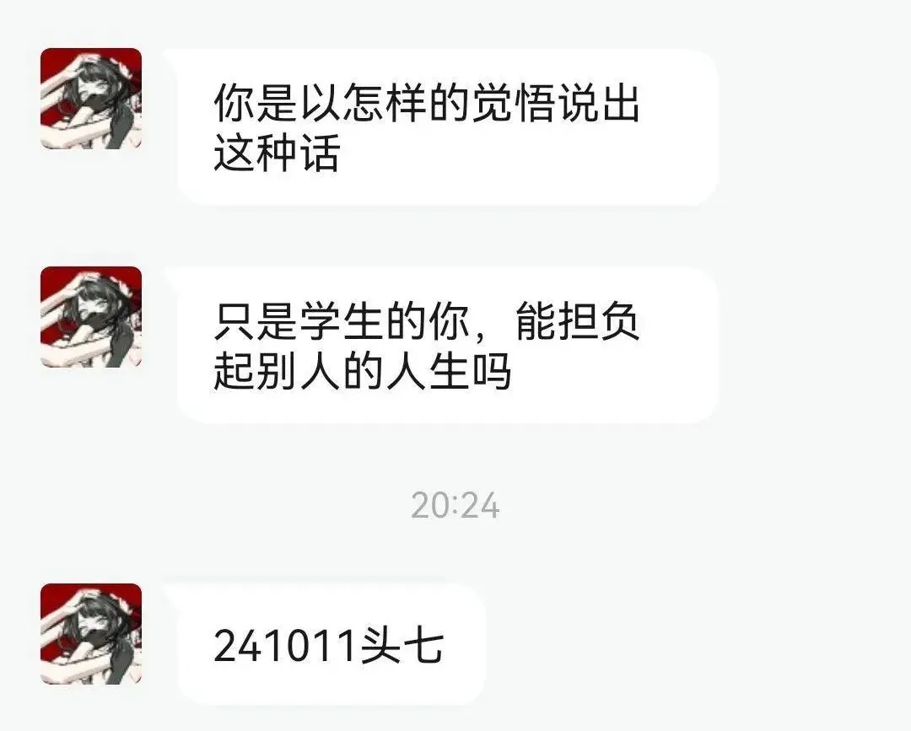
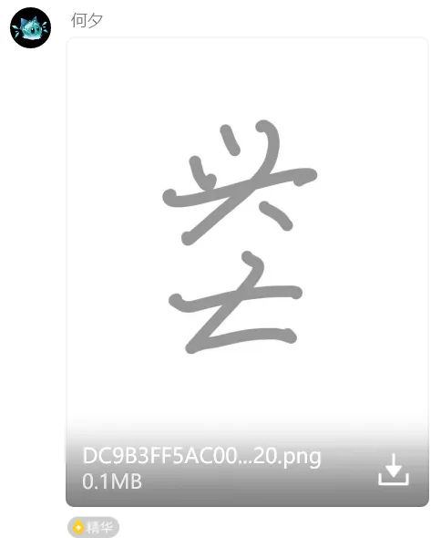
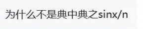
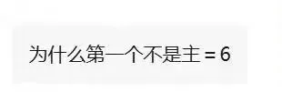
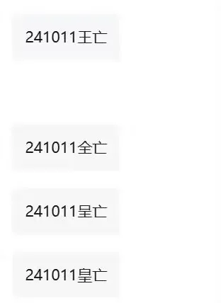

{/* truncate */}

<AnswerCheck answer={'兴亡'} />

## 提示

    
提示 01

    第一个例子里，左侧的图形以某种方式暗示了“6”的汉字——六。

    
提示 02

    含有“1”的圆圈表示 1 个点，含有“2”的圆圈表示2个点。

## 解析

<Solution author={'Gary'}>
谜题的正确答案是：**兴亡**。

首先关注到这题的答案是中文，尝试将数字 6 变成汉字形式“六”，注意到其形式与左边相同：
一条横线分隔上下，上半部分是 1 个点，下半部分是 2 个点。由此得到本题规律是带圈的数字表示点的个数。

所以下面两个式子的结果分别是兴（上面三个点&下面两个点）和亡（上面一个点&下面“L”字）得到答案：兴亡。

 
Fun stuff：

  
  <ImgCaption>
    所以为什么会出现“头七”这个答案呢？
     
    请看VCR——
  </ImgCaption>

<ImgCaption>分不清，根本分不清啊！</ImgCaption>

</Solution>

### 补充点评

    
补充点评（By 同同）

    
    原来圈里的数字是点的个数啊，我还以为什么结构都可以呢。虽然内测的时候做出了这道题，但还是直到今天看到了解析才知道这一点。
    如果允许①②③可以表示任意结构，那么答案的第一个字还可以是“共”。不过词语“兴亡”比“共亡”还是出现频率更高一些？

    关于“?/?=6”等式的理解，我们还看到了不同的解释。

    

        
        <ImgCaption>sinx/n=6，约去了分子分母的 n</ImgCaption>
    

    

        
        <ImgCaption>知名等式 主=6</ImgCaption>
    

    

        
        <ImgCaption>由 主=6 得出的一些答案。说起来今天是八月几号了来着？</ImgCaption>
    

     
    还有同学最先联想到了谚文。其实绝大多数的小谜题只会在中文和英文上下功夫，不太会涉及到各种小语种。
    所以除非有明显的相关提示，大家在解题时还是优先考虑中文和英文吧。

