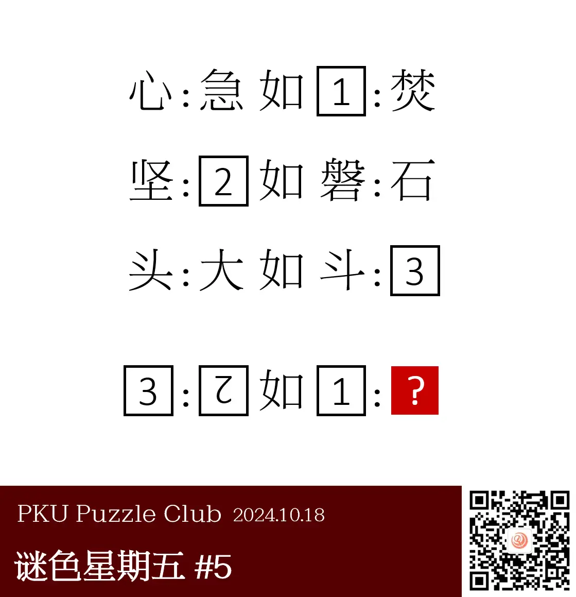
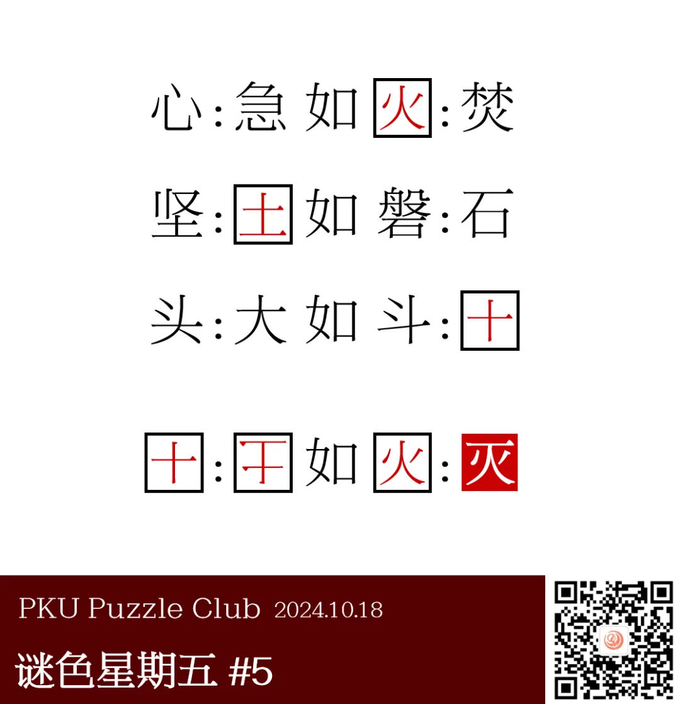

{/* truncate */}

<AnswerCheck answer={'灭'} />

## 提示

    
提示 01

    类比推理是一类常见题型。A:B 如 C:D，是指【B 相对于 A 的关系】和【D 相对于 C 的关系】相同。例如，“心:急 如 火:焚”。

## 解析

<Solution author={'Winfrid'}>
谜题的正确答案是：**灭**。

“类比推理”是一类公考题型——给出一组相关的词，要求通过观察分析，找出一组与之在逻辑关系上最为贴近或相似的词。
A:B 如 C:D，是指【B 相对于 A 的关系】和【D 相对于 C 的关系】相同。例如“京剧:芭蕾 相当于“武术:拳击”。

在此处，三行的答案分别为“心:急 如 火:焚”（前一个字是后一个字的下半部分）、
“坚:土 如 磐:石”（后一个字是前一个字的下半部分）、“头:大 如 斗:十”（前一个字是后一个字左上角加上两点）。

最后，我们将 1、2、3 代入最后一行，得到“十:干 如 火:灭”（后一个字是前一个字上方加上一横）。因此，答案是“灭”。

值得一提的是，本题趣味在于题面上“心急如焚”、“坚如磐石”、“头大如斗”都是现成的汉语成语，有一种浑然天成之感。

</Solution>

### 补充点评

    
补充点评（By 同同）

    这道题目最开始的版本是只有“头:大 如 斗:?”，答案是“十”。
    大家觉得例子太少，规律不容易确定，而且得出答案也有点太快了，所以后来多加了一点例子。
    最初的最后一行形式是“十:土 如 火:灭”，但是添加横线的位置不太对，所以最终采用了把土倒过来的形式。
    最终形式在规律上确实更为一致了。

    在这四行题目中，前面三行的规律都是在汉字的上方加一部分变成新汉字，或者在汉字的上方删去一部分变成新汉字。
    这样看，“十:土 如 火:?”的答案可以在“火”上面添加任何部件，使得“灾”“炎”等字也成为备选的答案。
    不过，由于“在上面添加一横”是更强的规律限制，“灭”应该当之无愧是最好的答案。
    根据解析的解释，每一行的规律也确实不一定非得要沿用到其他行上，只要主题一致、大致相符就可以。
    事实上，从后台反馈来看，“灭”也确实是更多人的第一反应。

    同样也有更强的规律限制的是“头:大 如 斗:十”。按出题人说法，这也是最初的“醋”。
    “头:大”和“斗:十”的变化是完全一致的，都是删去了左上角的两个点，所以巧合性比“心急如焚”和“坚如磐石”更高。
    不过，因为“头大如斗”并不是很常用的成语（甚至无法在字典里检索到），所以我感觉似乎差一点意思。

