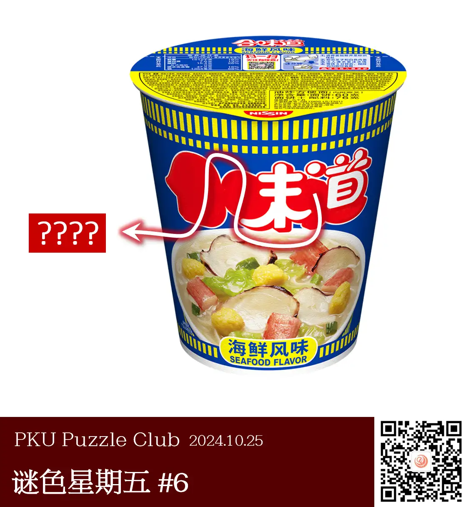
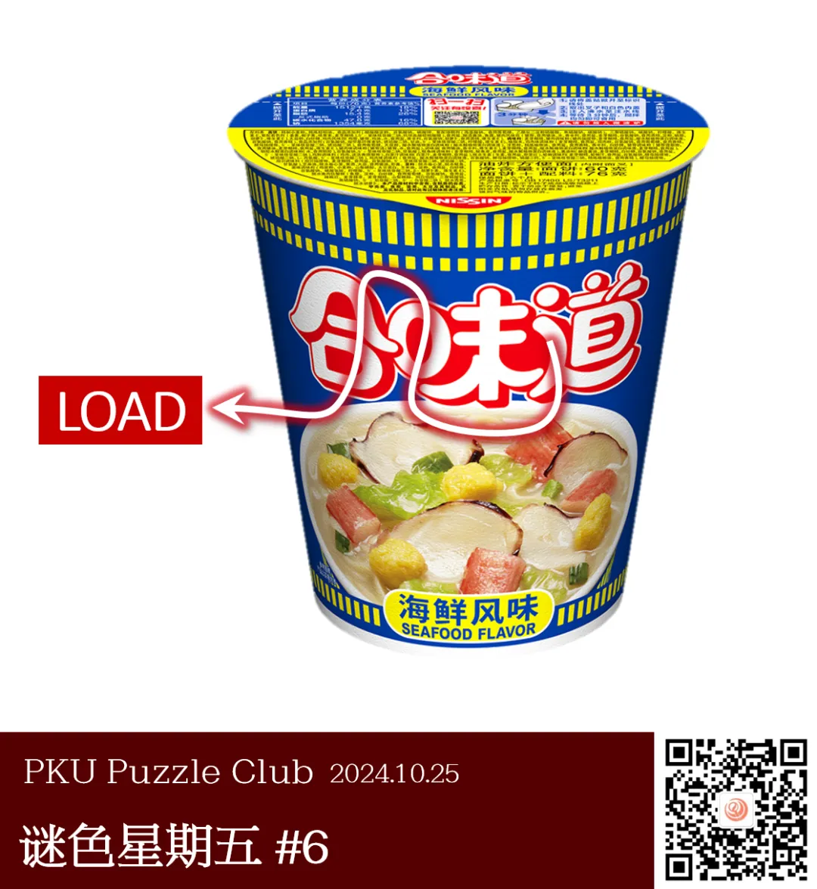
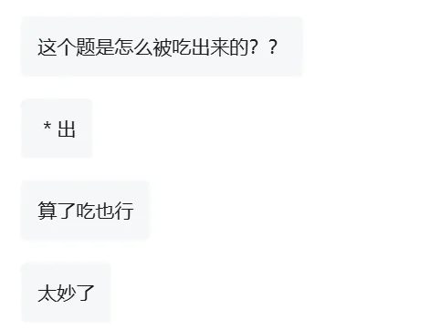

{/* truncate */}

<AnswerCheck answer={'load'} />

    
提示 01

    补全图片里缺失的 logo，你会发现箭头该穿过的每一部分都像是一个大写的英文字母。

<Solution author={'Winfrid'}>
谜题的正确答案是：**load**。

图中给出了一桶杯面的示意图，但其正面杯壁上的 LOGO 缺失了一部分。
通过对比原先“合味道”的 LOGO 可以发现，缺失的部分是四个白色区域，
而这四个白色区域分别形似 L、O、A、D 四个字母（按箭头顺序），因此答案是 LOAD。

值得一提的是，本题不需要搜索 LOGO 也可以得到答案。其实，原题的杯盖上最上方就有合味道的原 LOGO 哦！

此外，“杯谜宴”谐音“杯面”。
</Solution>

    
补充点评（By 同同）

    在通过汉字提取字母时，最好要找到原始的商标图片才行。这是因为商标的字体本身会对提取形状的判断有很大影响。
    比如说，从商标图形中可以看出“合味道”的“合”字下面的“口”，相比于 O 更像是 D。
    在后台私信中我们收到了大量错误尝试，例如把 L 认成 r，A 认成 V，D 认成 O 等等。
    如果直接从商标图片中观察，得到 LOAD 要更容易一些。

    

        
        <ImgCaption>大概抠了一下图。（好丑）</ImgCaption>
    

    最后附上某位同学的高度评价：

    

        
        <ImgCaption>好吃，爱吃</ImgCaption>
    

