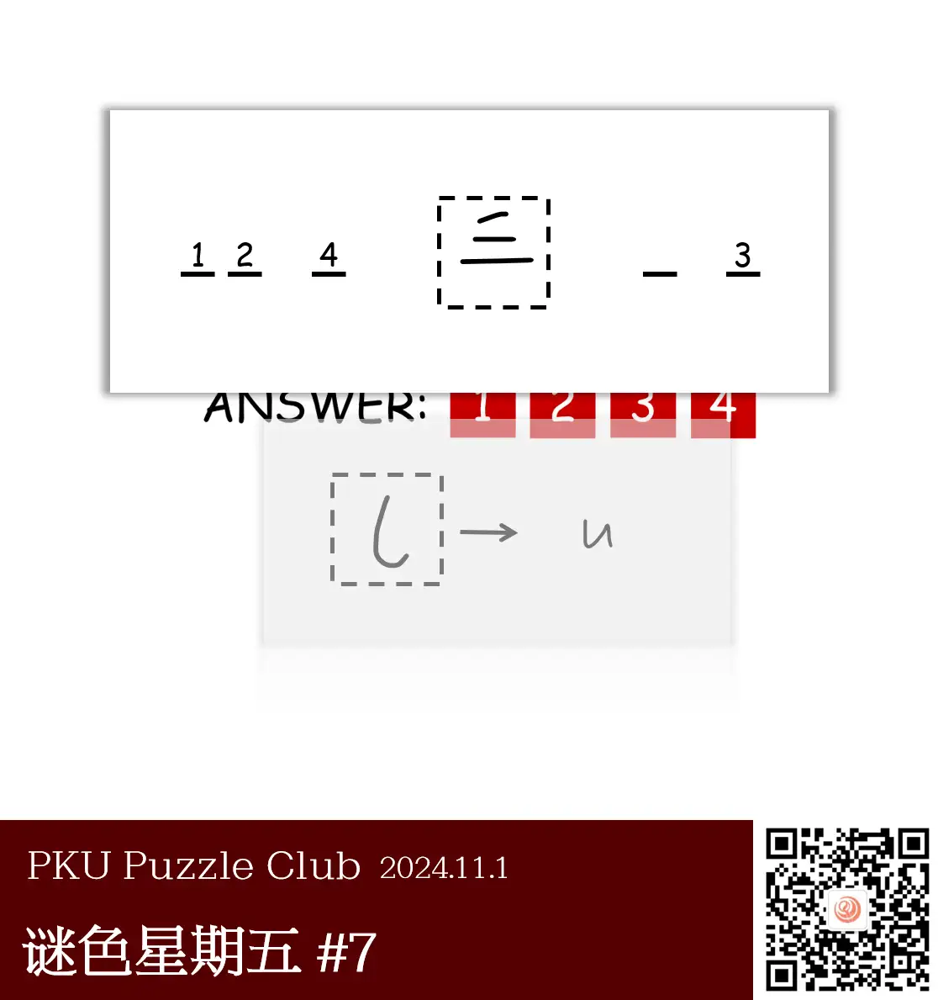
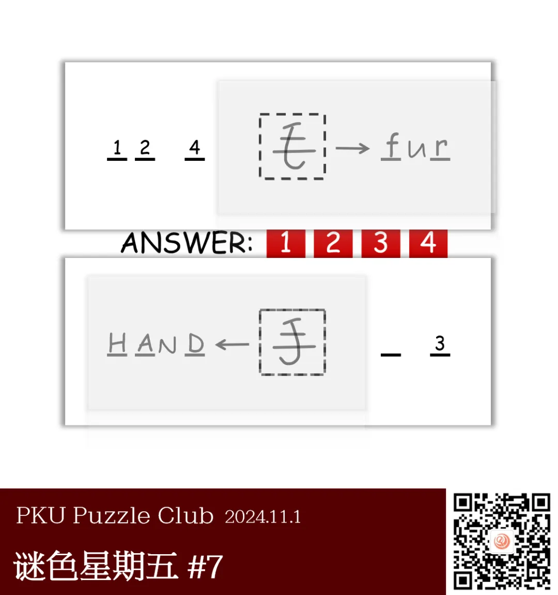
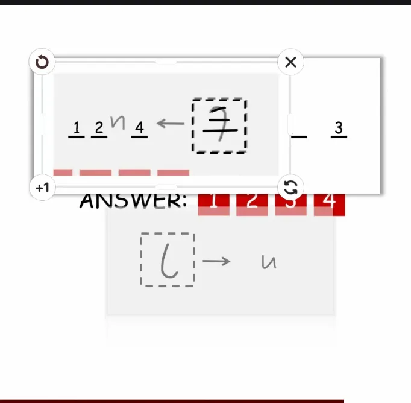

{/* truncate */}

<AnswerCheck answer={'hard'} />

    
提示 01

    从题面中可以看出，灰色是一块透明玻璃片。你要将它盖到上面的纸片上，让两个虚线框重合。

    
提示 02

    玻璃片可以被翻面，所以有两种盖法。注意翻过来之后，u 变成了另一个字母。

<Solution author={'Winfrid'}>
谜题的正确答案是：**hard**。

图中给出了一张白色的纸和一个透明的卡片，它们上面都有一块大小相同的虚线方框。
将透明卡片如解密卡一样叠到白纸上，能拼成一个题面，由“毛”这个字得到右侧的三字母单词是 fur，因此 3 号字母是 r。

但是，因为卡片是透明的，所以也可以把它翻面再叠到白纸上！
这个时候，原先透明卡片上的 u 就翻面成了 N，拼成的汉字也变成了“手”，左侧的四字母单词是 HAND，因此 1、2、4 号字母是 H, A, D。

从而，答案是 HArD，也即单词 hard。

</Solution>

    
补充点评（By 同同）

    字母 u 翻转后变为字母 N 的操作相对来说是非常少见的。
    在进行这一步操作的时候，我们看到大家有很多不同的理解。
    不过在如上的解析图中可以看出，用这种字体写出的 u 翻转后和 N 确实很相似。

    就完成这道题目而言，观察合成的汉字相对来说更容易得到答案。

    下图是一种虽然不是最初预设，但仍能做出答案的一种理解。

    

        
        <ImgCaption>果然还是原解答的字写得好看，这个还是相对有点勉强了</ImgCaption>
    

