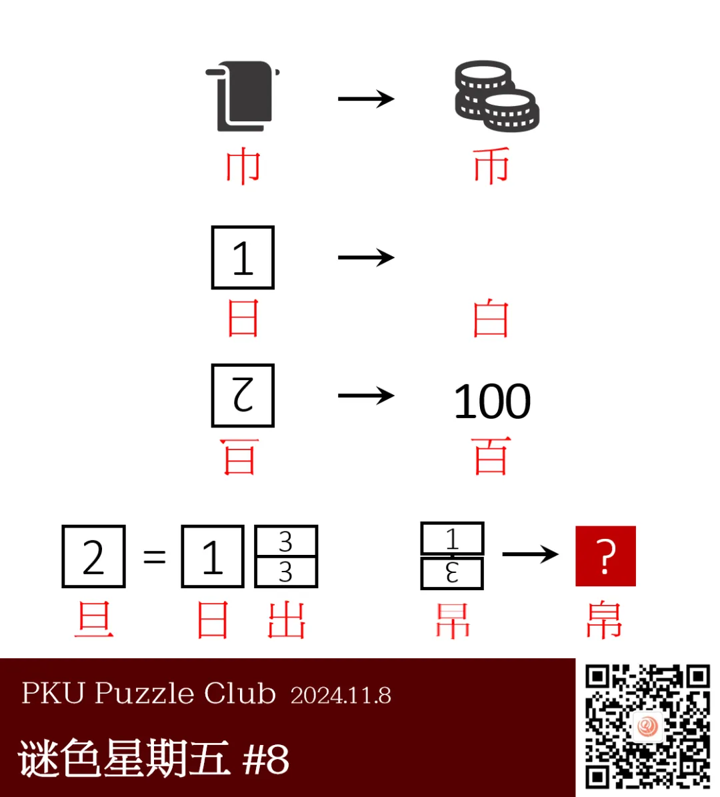

{/* truncate */}

<AnswerCheck answer={'帛'} />

    
提示 01

    每个箭头左右的内容都代表一个常用的汉字，观察箭头左右的汉字的字形关系得到箭头代表的“要素添加”含义。
    第一行左侧的图片代表的汉字是“巾”。

    
提示 02

    第二行右侧隐藏了一个白色方块。

<Solution author={'Gary'}>
谜题的正确答案是：**帛**。

首先注意到第一行箭头左右分别是“巾”和“币”，观察汉字特征可以得到左边汉字通过加上一撇得到右边的汉字。
第二行右侧隐藏了一个白色方块，因此可以得到“日”→“白”，1 代表的汉字是“日”。
第三行右侧代表的汉字是“百”，因此可以得到左侧是一个翻转的“旦”字。
2 代表的汉字是“旦”。“旦”是日出的意思，得到 3 代表的汉字是“山”。
按照右下角的指示组合 1 和 3（注意中间有一根竖线），再经过箭头做“加一撇”的操作，得到最后答案是“帛”。
</Solution>

    
补充点评（By 同同）

    似乎很容易忘记最后一步的箭头需要再添加一次撇。
    题目发布以后，在私信中看到“吊”这个错误答案频繁出现，
    也有提问质疑得出答案的最后一步存在问题的情况，都属于是在最后一步的处理中发生了失误。
    虽然之前做过一次，在收到题目错误的反馈消息时还是大惊失色，以为真的出错了，闹了一个小乌龙。

    题目的第一版中“白”是用一个正方形来表示的，可能会导致被误导想到“方”之类的字。
    后来制作题目图片的时候提出可以直接把方框删去，用背景颜色的白来指示。
    这种类型的信息提供似乎也是日谜的常规操作。
    原则上应该是变难了，但是不知道在汉字指代上是不是确实更清晰了一些呢。

