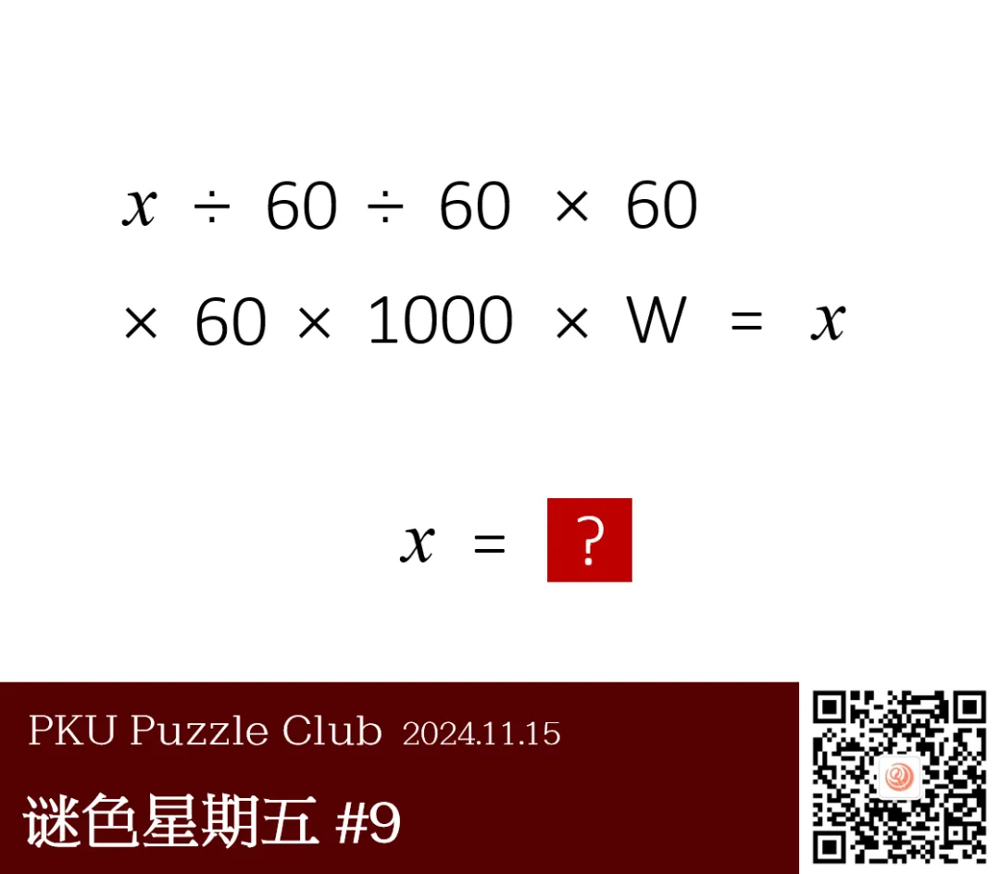
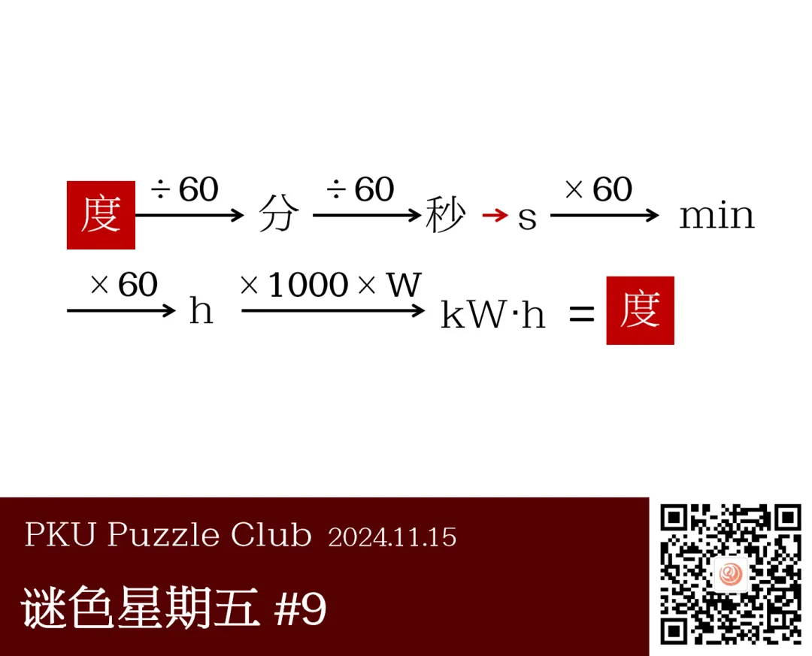
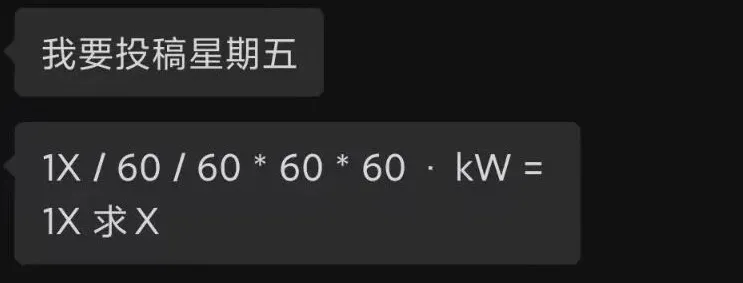
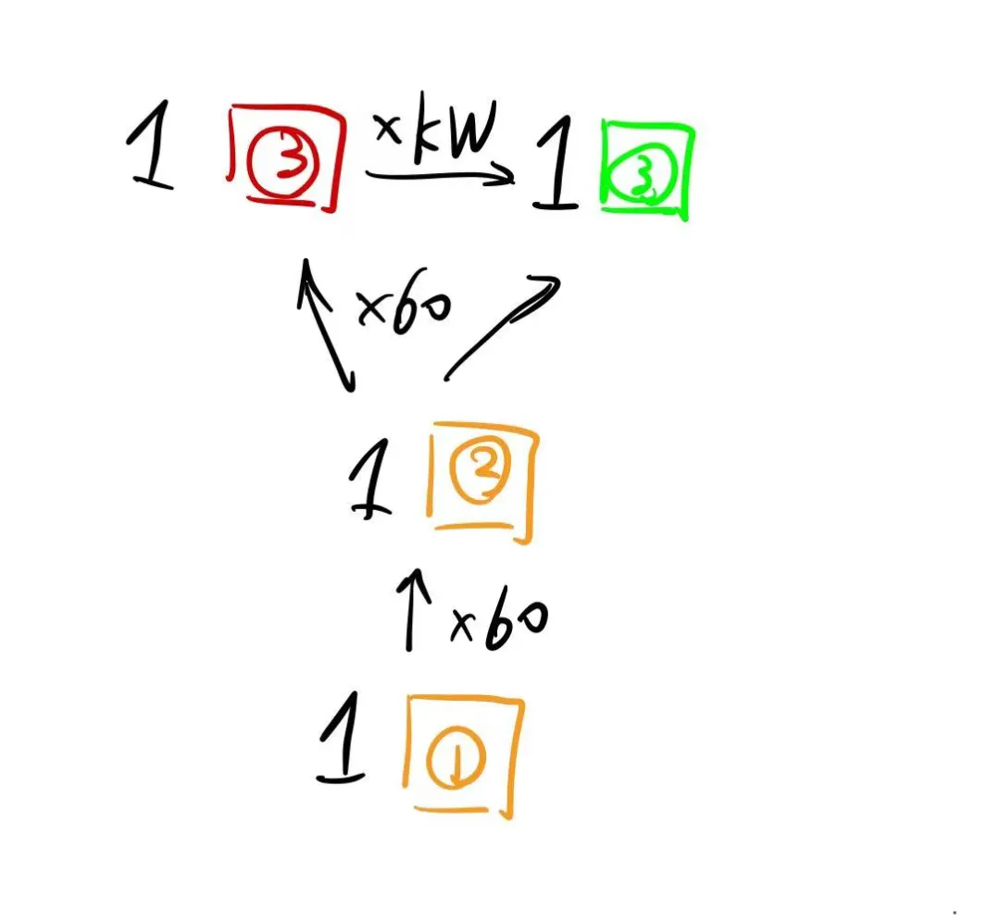

{/* truncate */}

<AnswerCheck answer={'度'} />

    
提示 01

    题目中的“W”是单位“瓦特”。

<Solution author={'Gary'}>
谜题的正确答案是：**度**。

该题使用了两个双关：角度单位“度”和电能单位“度”（千瓦时）以及角度单位“秒”和时间单位“秒”。
因此原方程表达的转换实际上是“度”（角度）转化为“秒”（角度→时间）转化为小时（时间）转化为“千瓦时”（“度”）的过程。
</Solution>

    
补充点评（By 同同）

    按照Winfrid的建议，这道题的题面保留了最初的设计，呈现为一个简单的计算式。

    

        
    

    不过我私下觉得，这个形式不能体现1度或1小时除以60再除以60后的这两档仍然是有意义的物理量，
    使得其中的一对除以60和乘以60在计算式中有些多余。
    我提出过另外一种题目呈现形式，不知道大家觉得哪种更好。

    

        
        <ImgCaption>我设计的草稿。这样可以表现每一个位置都是有意义的单位</ImgCaption>
    

    “度”似乎是一个很常见的中文单位。这有可能是因为“度”在中文中有“度量”之类的含义，使得这个字和物理量的契合度很高。
    例如这里的角度，时间和电能，还有温度等等都和“度”的单位有关。
    答案示例给出的“表”也可以和钟表或电表联系起来，将这道题目中三个物理量中的至少两个联系了起来。

