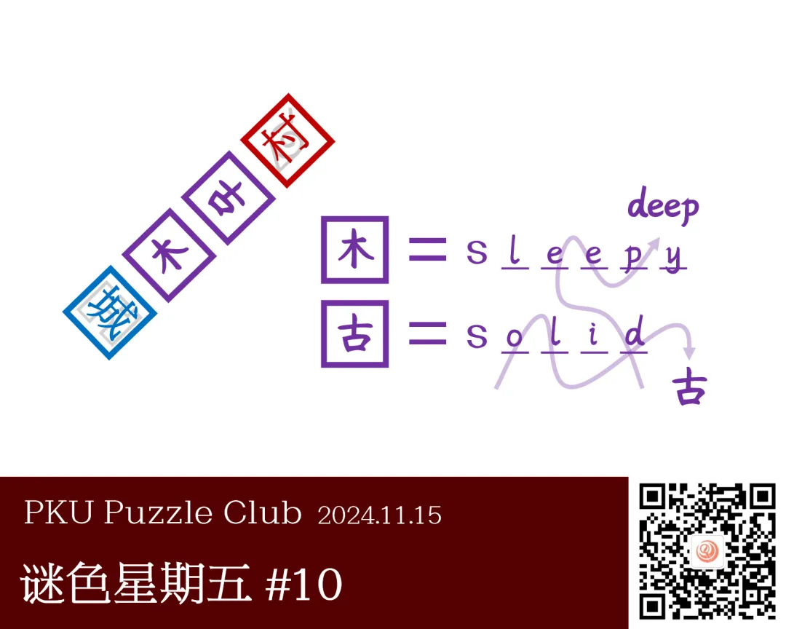

注：谜题图片中的编号存在错误，实为 \#10。

{/* truncate */}

<AnswerCheck answer={'deep'} />

    
提示 01

    紫色是红色和蓝色的叠加。
    左侧的汉字 1 和汉字 2 同时能和“城”和“村”组成对应图标的词语，但组词时旋转了 90 度。请先推测出 1 和 2 对应的字。

    
提示 02

    右侧的等号是由汉字转向英文的过程。要注意等号左侧的汉字是带有外框的。

<Solution author={'Gary'}>
谜题的正确答案是：**deep**。

题目中给了由紫色、红色、蓝色组成的框。
紫色是红色和蓝色的叠加，暗示着左侧的汉字 1 和汉字 2 同时能和“城”和“村”组成对应图标的词语，但组词时旋转了 90 度。

事实上，“古长”顺时针旋转 90 度是“木叶”。填入这两个字形，能得到“古长城”和“木叶村”两个词（这也可以从灰色符号推断得到）。

右侧的等号是由汉字转向英文的过程。
注意等号左侧的汉字是带有外框的，所以对应的是困→sleep 和固→solid，solid 对应位置的字母提取出来是 old（古）。
因此，答案是箭头穿过的字母，deep。

</Solution>

    
补充点评（By Gary）

    本期谜色星期五的题目让我想起了 CCBC13 中的“朱古力”小题以及 P&KU3（上）第一区的 META“围困”。
    虽然本题的技巧在之前的 PH 中有出现过，但是“木叶村”和“古长城”的这组巧合还是非常惊艳的。
    当然，从实际做题角度来看，我也收到了不少的反馈反映“木叶村”没法想到，这可能是该题唯一不太完美的地方
    （为了尝试解决该问题我在该题原稿的基础上添加了木叶村的标志性水印以及古长城的简笔画，不过还是不太方便搜索）。
    除此之外我认为这题称得上是极好的题目。

