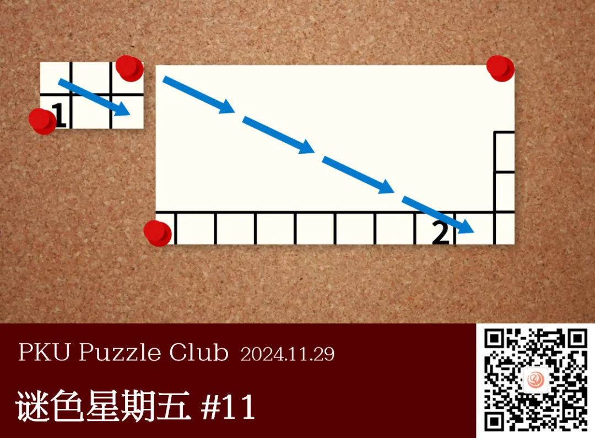
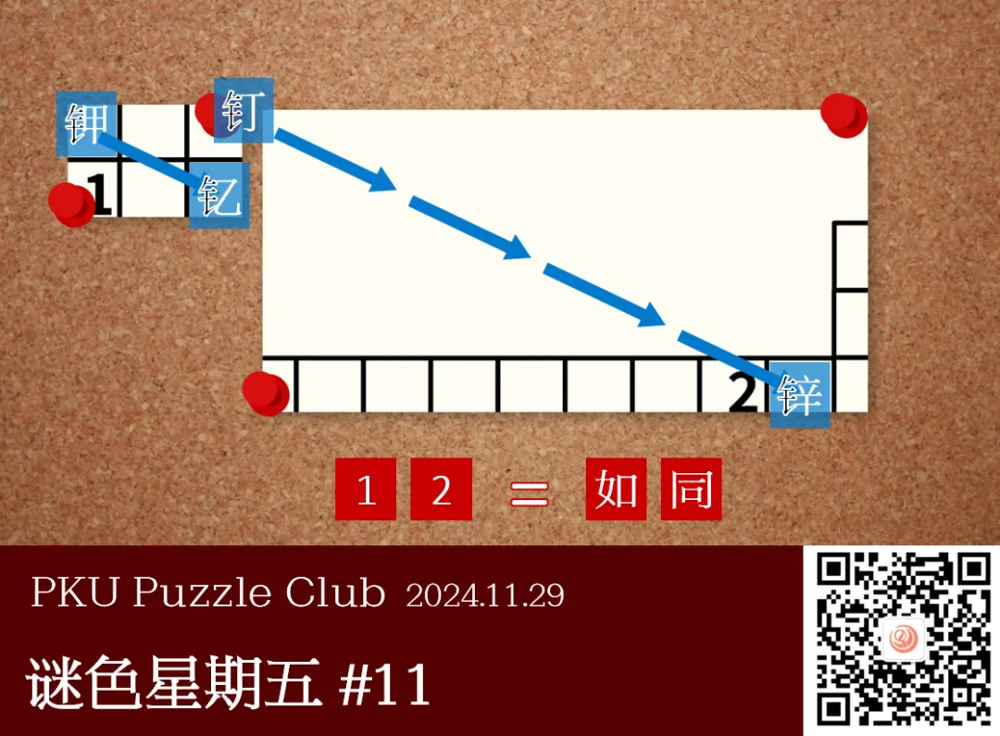
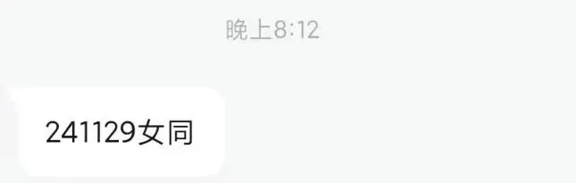

{/* truncate */}

<AnswerCheck answer={'如同'} />

    
提示 01

    这些纸片都是元素周期表的碎片。
    蓝色箭头代表了汉字之间的转换关系，你要推测出这种关系，以此来定位左侧的纸片在元素周期表中所在的位置。

<Solution author={'Winfrid'}>
谜题的正确答案是：**如同**。

非常感谢 CALS 老师为上一期谜题绘制的题面！

结合标题“炼金术”和图片中的形状，可以确认题目中出现的纸片是元素周期表中的碎片。
那么可以推定图片右侧出现的四个箭头的终点是元素周期表中的“锌”。并且2代表的汉字是“铜”的右侧——“同”。

那么我们看向四个箭头的起点。什么东西可以在经过四次相同的变换后变成“锌”呢？
我们会发现，如果蓝色箭头代表“天干向后推移一次”，那么“锌”就可以是由“钉”这个字推移四次得到的！（丁→戊→己→庚→辛，钉→→→→锌）
而四个箭头的起点，正好是另一个纸片角落的图钉！

不过，我们还需要确定 1 是什么，也就是要确定左侧纸片在元素周期表里的位置。
在元素周期表中，有什么元素经过“天干向后推移一次”能得到另一个元素，并且后者在前者向右三格、向下一格的位置呢？
答案是“钾”→“钇”！因此，1 对应的是元素“铷”的右半部分，“如”。

所以，答案是“如同”。
</Solution>

    
补充点评（By 同同）

    这可能算是谜色星期五的第一道序列题。序列题也是日谜小题的常见题型。
    常见的序列有月份、生肖、周期表、天干地支、数字、字母表等等，例如这道题就综合使用了天干和周期表。
    之所以出现频率较低可能是因为：常见序列使用过于频繁，相对而言难以出彩；而使用非常规序列可能又显得刻意，或者需要过多前置知识。
    这一次综合使用列表的特色是使用了看上去只是题目背景的图钉的“钉”字。虽然不是元素周期表中的元素，但却恰好能符合本题的规律。
    以及，“钾”和“钇”两元素竟然在周期表距离这么近的位置。希望这样的设计能足够有趣。

    顺便一提，仔细想来，除了本题涉及到的这些字以外，金字旁加天干就几乎没有其他的常用字了。

    上期答案示例的“周期”当然是指元素周期表和序列的主题。
    “炼金术”除了指向元素之外，还有指向“答案提取需要将相应位置的元素删去（炼去）金字旁”的含义。
    之所以有这样的考量，是因为我提出意见认为原题目的答案提取可能不够清晰。
    如果在数字1和2左侧，也就是字对应方格的竖直中线处作虚线分割，呈现效果应该会更好。
    不过题目作者认为没有必要，那只好尊重作者的想法了。

    

        
        <ImgCaption>比如可能会出现这样的答案。也许很符合题目作者的趣味？</ImgCaption>
    

