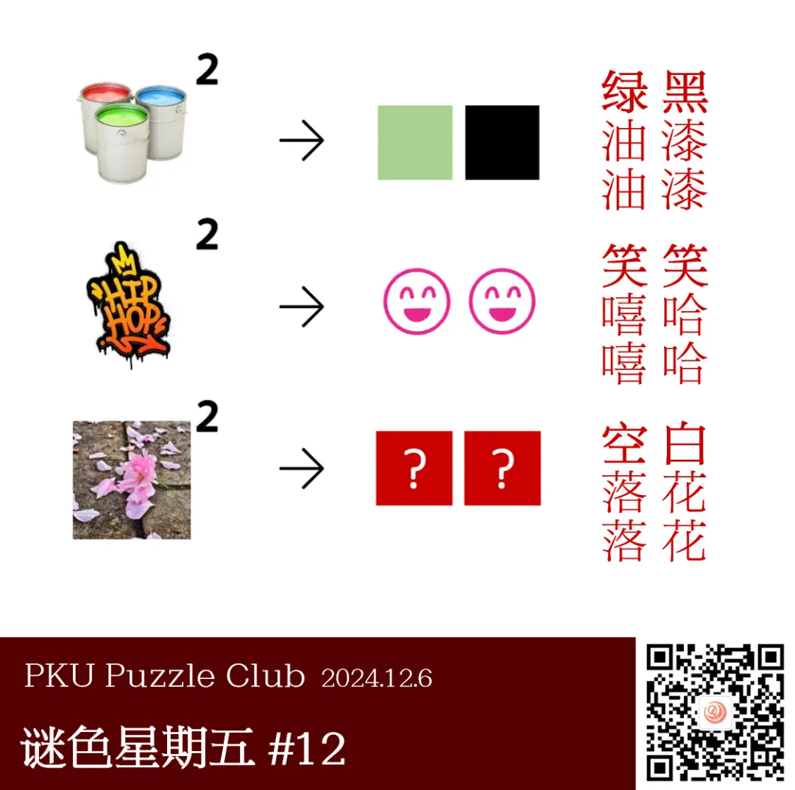

{/* truncate */}

<AnswerCheck answer={'空白'} />

## 提示

    
提示 01

    注意到图像右上角的平方符号，可以像标题一样，将左侧的词语用叠词的方式表示。

    
提示 02

    左侧的三个图像分别是“油漆”、“嘻哈“、“落花”。

## 解析

<Solution author={'Orthos'}>
谜题的正确答案是：**空白**。

在这里先为上周因识图失败而无法解出答案的读者们说一声抱歉！
因为选取的词语本身不太适合成图，所以即使更换了图片后，识图依然是一个很大的阻碍，这并非出题人的本意，实在抱歉！

结合标题“三三两两”和题目中图片右上角的平方符号，容易想到将左侧的文字也写成类似的形式，第一行的图片是“油漆”，第二行的图片是“嘻哈”。
虽然嘻嘻哈哈是一个成词，但显然油油漆漆不是（或许有选手会尝试别的词语，如颜料、铁桶等，但也无法成词）。
然而，结合右侧的图像后，却不难发现其中的联系：绿油油、黑漆漆、笑嘻嘻、笑哈哈均是 ABB 式的成词，
标题的“三”与“两”其实也是在提示这一步的变化方式。

在注意到这一点后，则可根据第三行的图像“落花”，找到对应的 ABB 式成词，常见的成词分别仅有一个：空落落、白花花，因此答案为“空白”。

 

这道题的诞生，是因为出题人注意到油漆一词分别存在绿油油、黑漆漆两个 ABB 式成词，
而其中绿与黑都是颜色，满足 X 油油和 X 漆漆的成词也几乎只有绿油油和黑漆漆（其他可能的成词使用频率极低），这种现象十分有趣。
通过对 ABB 式词语的研究，进一步发现了嘻哈→笑/笑，落花→空/白的组合，“落花”终将化为“空白”，这个巧合也让人十分惊喜，从而便产生了这道题目。

根据结果来看，不少人因“嘻嘻哈哈”是一个成词而被误导，未能识别出 ABB 的规则；
也有不少人发现规则后，因将“落花”识别为“花瓣”而答出了错误答案“白一”（白花花、一瓣瓣）。
现在想来，由于对词语精确性要求很高，或许这道题目更适合用纯文字的形式呈现。

</Solution>
