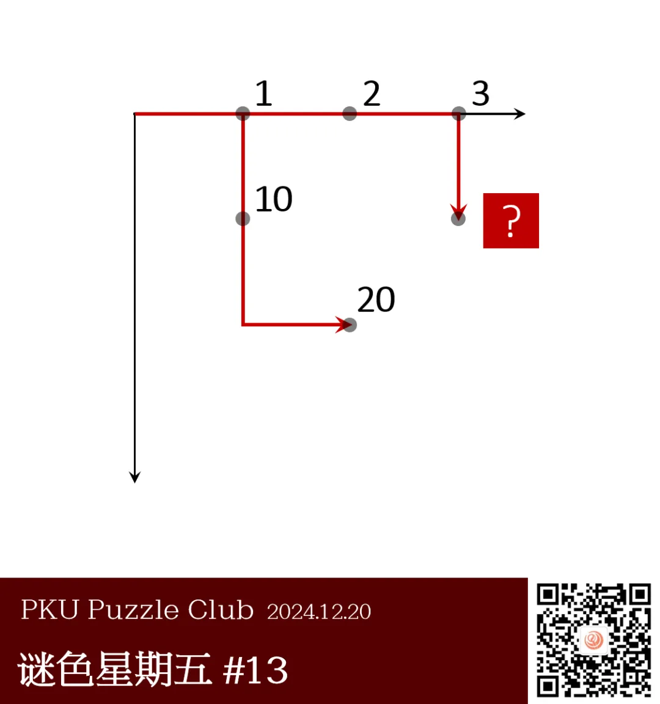
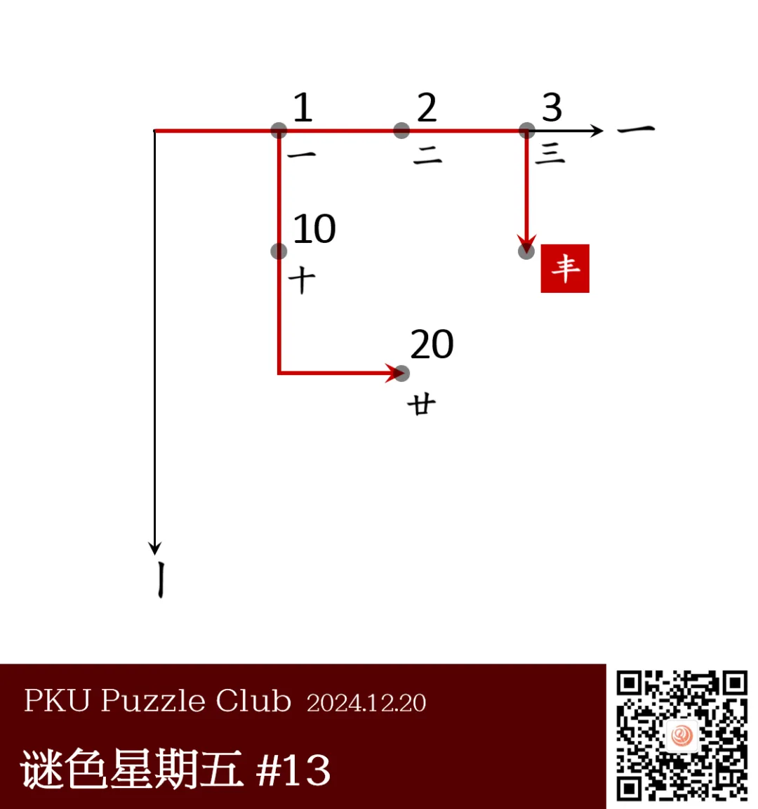

{/* truncate */}

<AnswerCheck answer={'丰'} />

## 提示

    
提示 01

    应该要把每个点上的数都转化成一个汉字。

## 解析

<Solution author={'Winfrid'}>
谜题的正确答案是：**丰**。

本题给出了一个坐标系，两个坐标轴分别指向右方和下方。
而在坐标轴上描出了一些轨迹，并在轨迹上有一些点，点的旁边标注了数字。
实际上，这些点代表的其实是数字对应的汉字（一、二、三、十、廿），这些汉字均只由横和竖组成，并且到达这些点的轨迹与汉字的笔顺一一对应。
因此，答案的笔顺应该是“横、横、横、竖”，符合条件的答案是“丰”。

</Solution>

### 补充点评

    
补充点评（By 同同）

    有接到反馈说，答案也可以是“十二”，因为按数学规律，碰巧是上面一行的数字+9 可以得到下面一行的数字。
    再仔细一看，“十二”同样也是“三横一竖”，满足笔画数量的要求。这确实是出题时没有想过的巧合。
    不过可惜不太满足笔画顺序，和规律还是有所出入。

