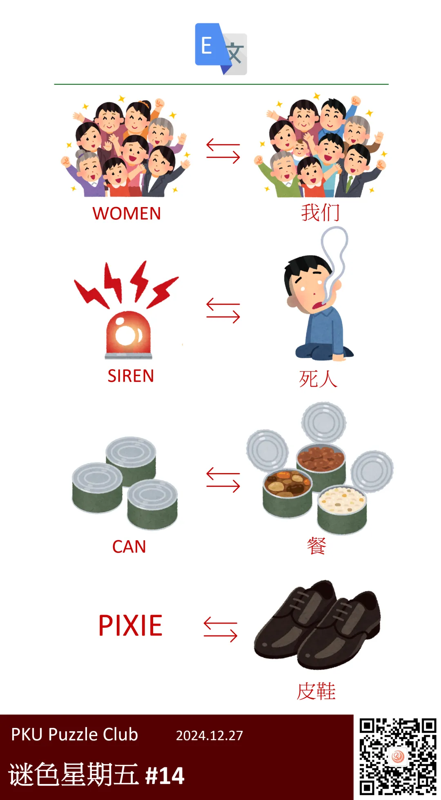

{/* truncate */}

<AnswerCheck answer={'pixie'} />

    
提示 01

    左侧的图片各代表一个英文单词，可以尝试将这些单词写出来后，用另一种方式读出来。

<Solution author={'Orthos'}>
谜题的正确答案是：**pixie**。

本题给出了两列图片，以一个“翻译”的图标将其分隔，这提示可以用左侧英文，右侧中文的方式去理解图片。
先将左侧的英文单词写出来，从上到下的三个单词分别是 WOMEN、SIREN、CAN，结合标题“自然拼读法”，
可以发现这些单词都可以用汉语拼音的方式去拼读，分别得到“我们”、“死人”、“餐”，对应到右侧的图片。

因此，根据最后一行的右侧图片“皮鞋”，将其反过来对应到左侧，得到单词 PIXIE，即为本题答案。

此外，本题的答案示例 CACHE 也是一个符合这种变换规律的单词，可以对应到中文词语“擦车”。
</Solution>

    
补充点评（By 同同）

    最初的时候，SIREN 计划使用海妖塞壬的含义，不过免费素材提供的图片太像美人鱼了，担心可能无法识别。

    

        
        <ImgCaption>最初的图片设计，SIREN使用了类似于美人鱼的图片</ImgCaption>
    

    我个人认为这一版本题面精彩的地方在于，提示部分左右两侧的图片具有一定的联系，
    例如打开罐头（CAN）吃饭（餐）、听到海妖（SIREN）歌声而被害（死人）。
    不过为了稍微提升可做性，我们还是决定对图片进行了更换。

    然而似乎即使是这一版本，前两行的图片对应文字也很困难。

