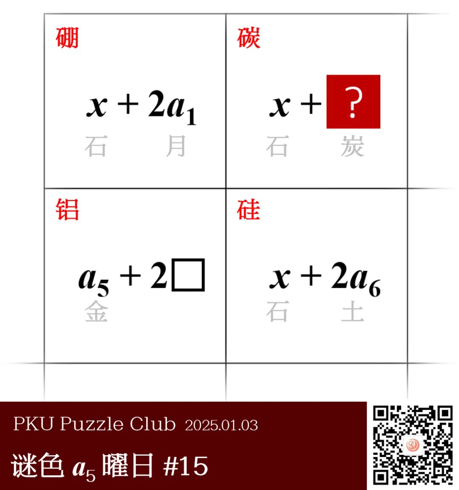

{/* truncate */}

<AnswerCheck answer={'炭'} />

## 提示

    
提示 01

    往常的标题是《谜色星期五》，现在是《谜色 a5 曜日》，所以 a5 是金。类似也可以得出 a1 是月、a6 是土。

    
提示 02

    这是元素周期表的局部。

## 解析

<Solution author={'Winfrid'}>
谜题的正确答案是：**炭**。

图中给出了四个方格，每个方格里都写了一个多项式，里面有形如 x 和 a_i 的未知数。
但值得注意的是，平常的“谜色星期五”在此处被换成了“谜色 a_5 曜日”，星期五也即金曜日，说明 a 代表的是对应的星期几是什么曜日。
所以，a1 是月（因为星期一是月曜日）、a6 是土（星期六是土曜日）。

从而，我们可以意识到其实 a5+2□ 其实组成的是汉字“铝”。
再联系方格周围的奇怪边框，可以意识到这实际上是元素周期表的局部（怎么听着这么熟悉）！
从而，我们可以推断出剩下的几个格子分别是硼、碳和硅。那么，x 代表的汉字就是“石”，因此问号处所填的答案是“炭”。

值得一提的是，“周而复始”既指一周的各星期日的叫法，也提示着元素周期表，同时更暗合着新年万象更新的氛围。可以玩一辈子谜题吗？

</Solution>

### 补充点评

    
补充点评（By 同同）

    这又是一道和序列相关的题目，使用了元素周期表和星期的七曜记法。
    如果对日语熟悉的话，在看到“X 曜日”的表述时可以很快反应过来。不过即使不了解，也可以进行相关搜索。
    虽然目前中文已经很少采用这种称呼方式，但根据百度百科记载，似乎这本来就是中国古代的星期记法，
    后来才流传到日本，并在那里一直保留了下来。

    已经连续出了两道化学元素周期表的序列题了，还真是没什么创意呢。什么时候才能出一点和物理相关的序列题啊唉唉。

    文章最后，给大家送上（迟到 10 天的）新年祝福吧！祝大家在 2025 年新的一年里，学业有成，事业进步，身体健康，诸事顺遂。
    感谢大家 3 个月以来对北京大学谜题协会和谜色星期五栏目的支持！新的一年，仍旧星期五晚 8 点不见不散！

