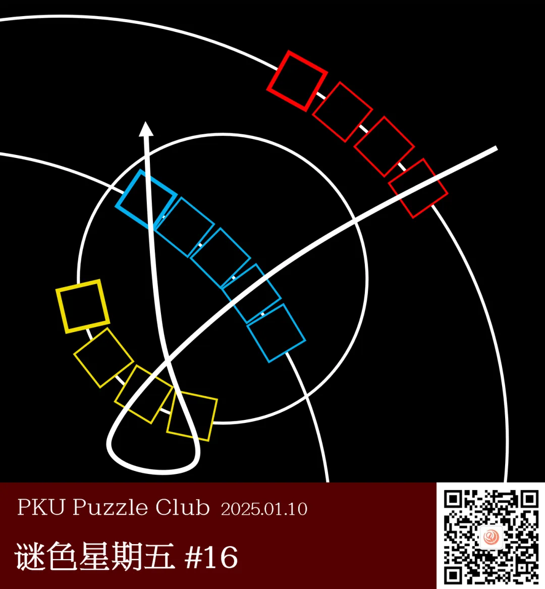
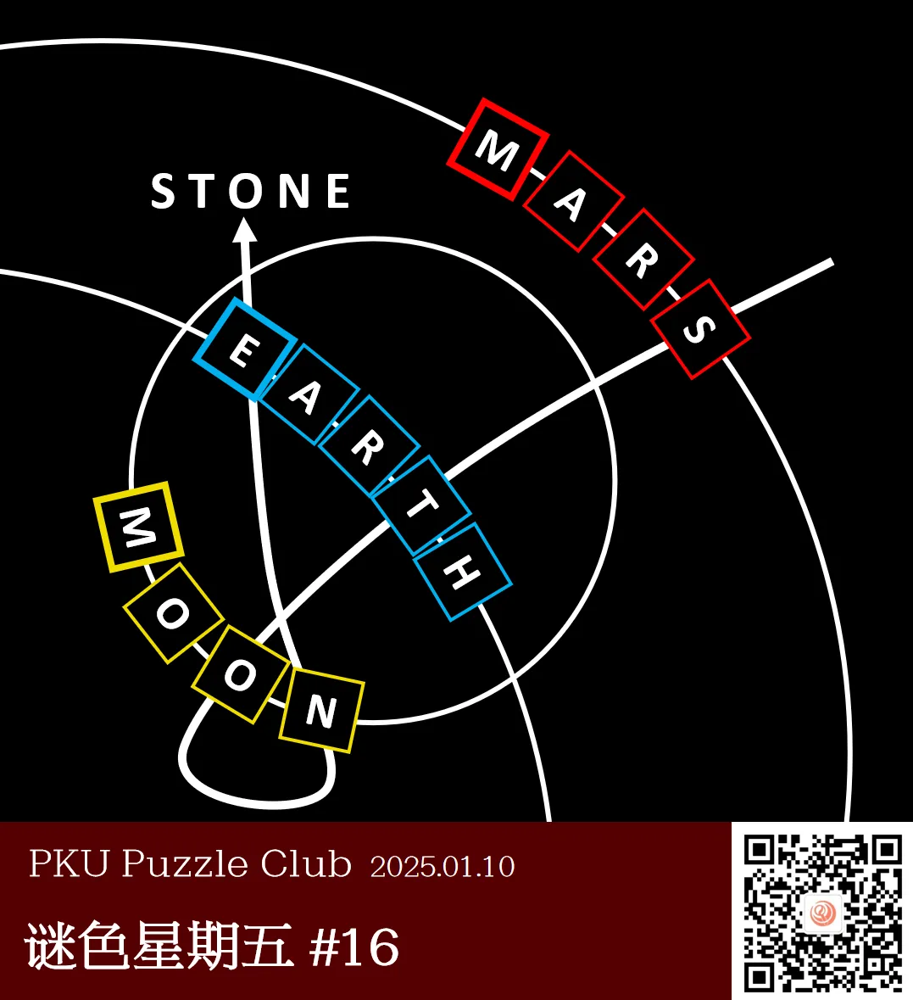

{/* truncate */}

<AnswerCheck answer={'stone'} />

    
提示 01

    图片中的白色圆形曲线代表着自然界的某些物体的行进方向，方框颜色为它们在人们印象当中的颜色。

<Solution author={'Gary'}>
谜题的正确答案是：**stone**。

本题以简笔图的形式描绘了地球，月亮与火星在太阳系中的相对位置与运动轨迹。
方框的颜色代表着这三个星球被描绘时常用的颜色（地球：蓝色；月亮：黄色；火星：红色）。
在对应颜色的方框中填入星球的英文，沿着箭头读取路过的字母，得到答案：STONE。
</Solution>

    
补充点评（By 同同）

    本题的英文答案示例是 verse，是宇宙 universe 这个单词的后一半。“大爆炸”也是对本次主题的暗示。
    原本为了避免对本次题目的过度提示，题目想简单用“红黄蓝”或“三原色”，但是被反馈说过于无关了，还是现在的版本更加合适。

    不过题图中表示三个天体的印象颜色碰巧确实是红、黄、蓝三种颜色。也许是某种可以用于出题的巧合？

    上期大家打趣说全是化学题没有物理题，这一期总能算作是有一道物理（天文）题了。期待我们以后可以发表出更加多元化的谜题。

