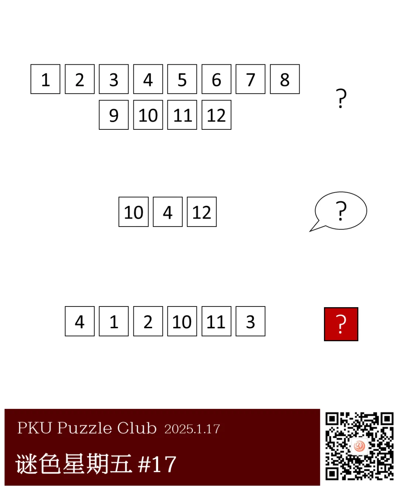
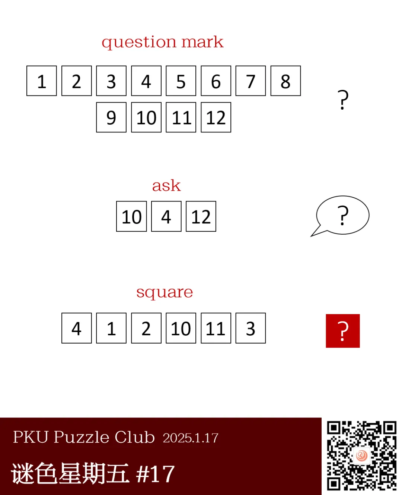
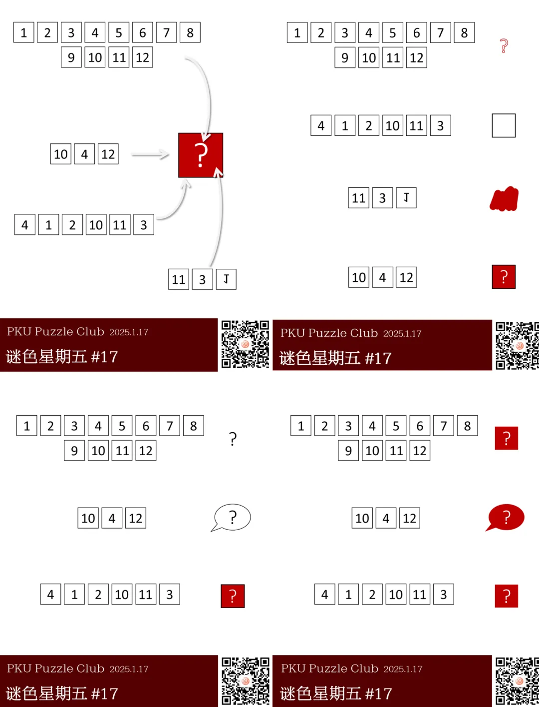

{/* truncate */}

<AnswerCheck answer={'square'} />

    
提示 01

    第一个图案中，1 至 12 每个格子是一个字母，对应的词组是“问号”。

<Solution author={'Winfrid'}>
谜题的正确答案是：**square**。

本题给出了三段带数字的方格以及它们对应的含义，同一数字的方格所对应的字母是一致的。
虽然三行右侧都是问号，但第一行的问号是 question mark 的意思，第二行气泡框里的问号是 ask 的意思，而第三行的问号是代表本题的答案是该行内容。

因此，推得每个数字代表的字母之后，我们发现答案应该是 square。有趣的是，square 也对应上了右侧问号的外框——正方形。

</Solution>

    
作者的话

    其实本期最后产生了四个有微弱差别的稿件。在询问了五月以及谜协 staff 的意见后，最后现在的这一版以绝对优势在投票中胜出。

    

        
    

    四个稿件如上所示，其中第一行两题的标题为《解构主义》，第二行两题的标题为《？？？》。不知道大家喜欢哪个版本呢？

    
补充点评（By changgong）

    看过好几个版本的题干，认为本题的入手点还是在于第一幅图片代表的含义，剩余部分为对于解答的验证，
    作为一道图片形式的谜题，第一个问号图片所可能代表的歧义又少之又少，
    一旦意识到所指的含义就是问号本身，那么问题便迎刃而解，这个过程是相当有趣的。
    如果先确定第二个图片，利用 nutri 也可以找出第一个图片所指的英文。
    本题的趣味也在于每个图片中的问号含义不尽相同，希望大家可以从找寻符号的不同所指中获得快乐。

