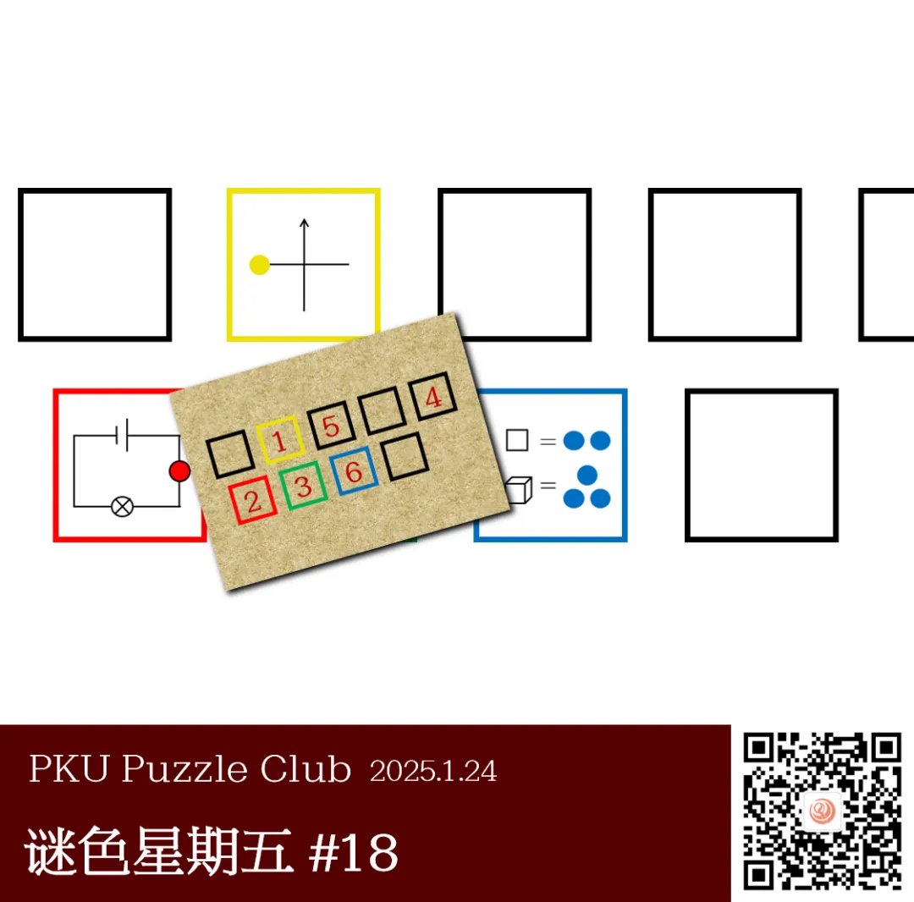
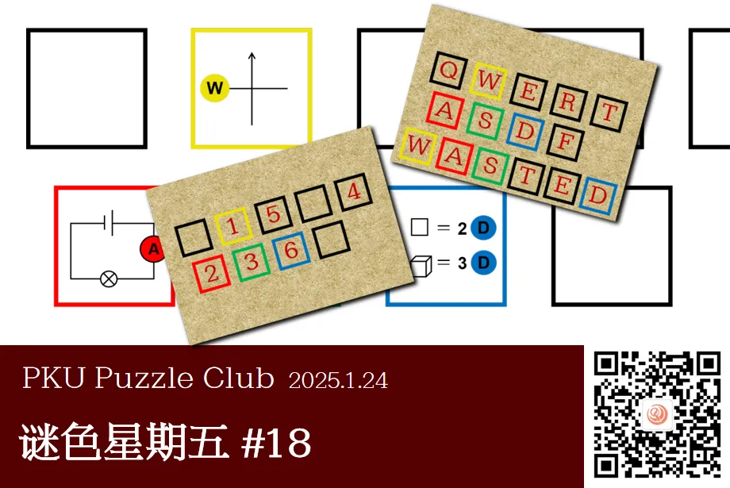

<WechatArticleLink
  href="https://mp.weixin.qq.com/s?__biz=MzkwMDc0MzAwNw==&mid=2247484560&idx=1&sn=947f194826d03800ea1167cadf2e3a1d&chksm=c0be2ea0f7c9a7b60d07d57e763d16bbb81f52a1a0f555a76b92c2906acb9b84904a2cdd2335#rd"
/>

{/* truncate */}

<AnswerCheck answer={'wasted'} />

## 提示

    
提示 01

    每个方框中都是一个字母，本题涉及一个常见的字母排布，绿色框中的字母是 S。

## 解析

<Solution author={'Gary'}>
谜题的正确答案是：**wasted**。

本题首先涉及三个小问。红色方框中的小题描绘了一个电路图，其中红色圈应该填入的是电流表，为字母 A；
黄色方框中的小题描绘了地图中用于指示方位的十字，其中黄色圈应该填入的是代表“西”的字母 W；
蓝色方框中的小题两个等式分别表示的是“二维”和“三维”，蓝色圈中应该填入字母 D。
将三个方框的正确字母填入小卡片中的对应位置，结合用彩色描出的四个框的相对位置关系可以联想得到此为电脑键盘的一个部分。
将剩余字母全部填入后按照数字顺序提取字母可以得到“wasted”。

</Solution>
