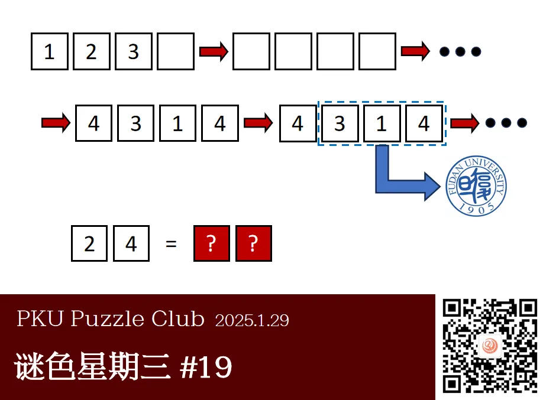
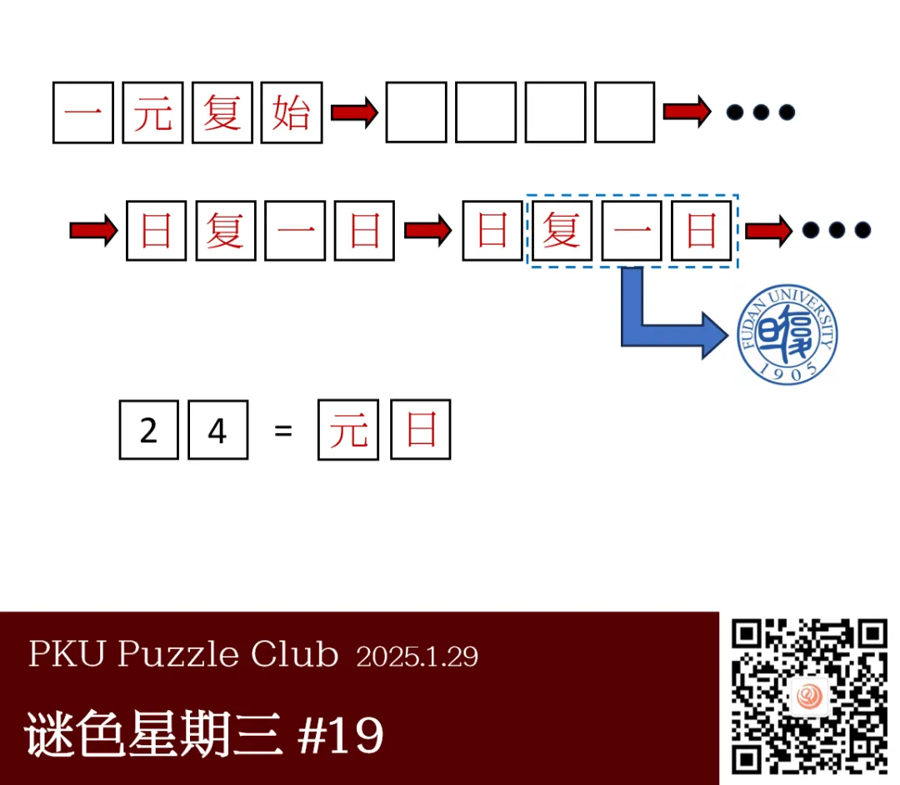

今天是乙巳蛇年正月初一。**祝大家在 2025 年，吐故纳谜、谜色满园、谜鱼得水、心满谜足！**
新年新气象，值此佳节，我们决定**加更**一期谜色星期“三”。

{/* truncate */}

<AnswerCheck 
    answer={{
        '元日': {
            type: 'CORRECT',
        },
        '新春如意': {
            type: 'CORRECT',
            message: '恭喜你，触发了隐藏彩蛋！'
        },
    }}
/>

    
提示 01

    每一个方框都代表一个汉字。本题题面展现了一种经典的文字游戏。标有数字3的方框中的汉字是复。

<Solution author={'樵子若木、Winfrid'}>
谜题的正确答案是：**元日**。

与此同时，上一期还有一个隐藏彩蛋，答案是**新春如意**。

本题题面展现了成语接龙的一部分过程。包含同一数字的方格所对应的汉字是一致的。
首先，结合方格 3、1、4 的组合表示“复旦”这一条件，可以确定第二行的两个成语均为“日复一日”（汉字一和日的组合恰好为旦），
由此可以得到方格 1、3、4 分别代表的汉字是“一、复、日”。
其次，将方格 1 与 3 代表的汉字代入第一个成语中。结合一定的搜索可知，满足第一个汉字与第三个汉字分别为“一”与“复”的常见四字成语仅有“一元复始”。
由此可以得到方格 2 代表的汉字是“元”。组合方格 2 与 4 所代表的汉字，可以得到本题的答案“**元日**”。

作为农历新年的第一次更新，这篇谜题在开头藏了一个彩蛋：原文写着**“祝大家在 2025 年，吐故纳谜、谜色满园、谜鱼得水、心满谜足！”**
而这四个魔改的成语原先分别是吐故纳新、春色满园、如鱼得水、心满意足，因此四个“谜”对应的原来的汉字，连在一起就是——**新春如意**。
</Solution>

    
作者的话（By 樵子若木）

    很高兴能为 PKU 谜协供题！由于本人命题经验较浅，题目不免存在一些瑕疵，还望各位多多包涵。

    在本题最开始的构想中，我希望题面呈现**“成语接龙里的无尽循环”**这一有趣的现象，
    也由此确定了题目中涉及到的“日复一日”和“一元复始”两个成语。
    然而受限于本题的提取方式，这一循环并不能很好地隐藏起来（可以通过题面第二行的两个一样的成语非常直观地发现这种循环）。
    这也是我认为本题里最大的遗憾。不过我仍然觉得这是一个有趣的点子。

    值得一提的是，题面中第一个成语“一元复始”常常与本题的标题“万象更新”合成一对春联。也许标题能够为寻找成语提供一些灵感。

