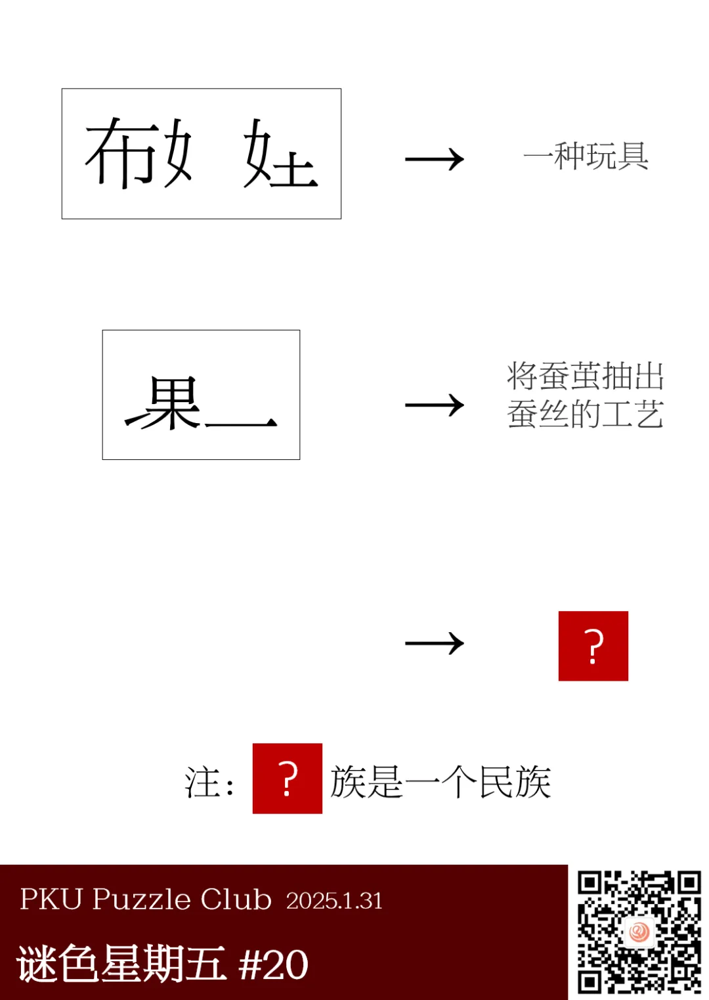
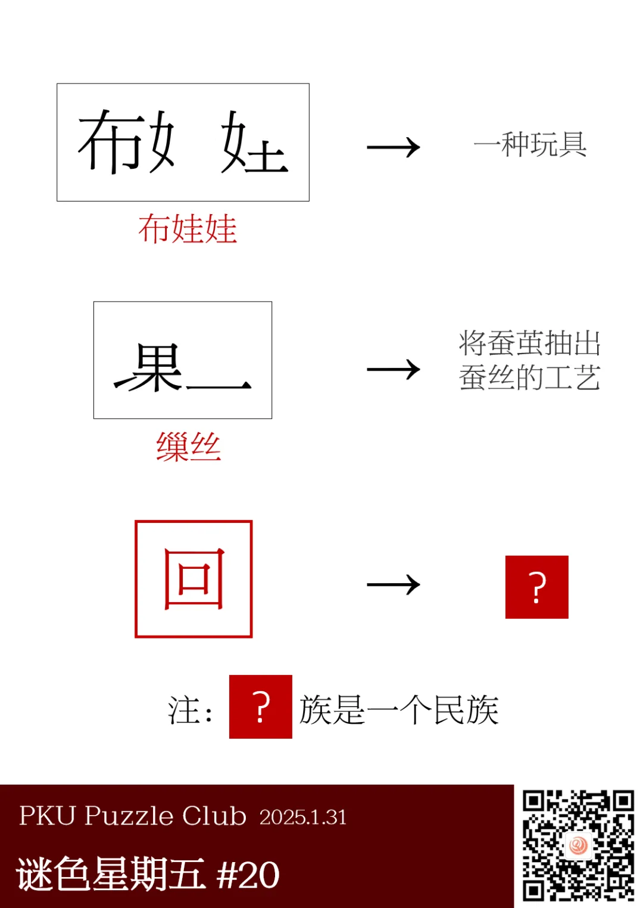

{/* truncate */}

<AnswerCheck answer={'回'} />

    
提示 01

    从前两行可以看出，箭头左侧的内容是经历了“每有三个相同的部件就消掉”的产物。

    
提示 02

    最后一行的左侧，外框也一并消掉了。

<Solution author={'Winfrid'}>
谜题的正确答案是：**回**。

图中给出了被消去一部分的“布娃娃”和“缫丝”两个字，可以看出箭头左侧消除的规则是：
词语中每有三个相同的部件就消掉（就算有四个相同的部件也只消掉其中的三个）。

最后一行左侧什么都没有，那么我们很自然地可以想到要去找一下：有没有什么民族的汉字是可以用三消的方式消干净的呢？但其实没有。

不过我们会发现，前两行词语外面的方框在最后一行也消失了！
所以其实它也作为三消的一部分而消除了。所以第三行的汉字应该有两个相同的方框，也即“回”。
</Solution>
