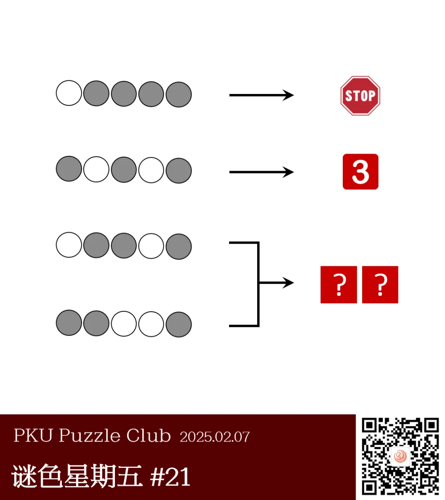
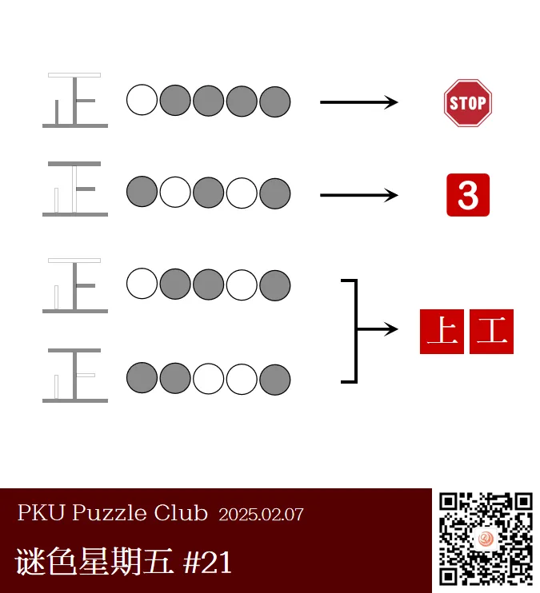

{/* truncate */}

<AnswerCheck answer={'上工'} />

## 提示

    
提示 01

    我们平时计票用的计数法是什么呢？

    
提示 02

    将右边的每个提示图片翻译成一个汉字。第一行右侧的图片翻译为“止”。

## 解析

<Solution author={'Gary'}>
谜题的正确答案是：**上工**。

标题提示了本题的主题为以画正字计数的方法。左侧的圆代表提取”正“的若干笔画形成一个新的字。
第一行提取第 2、3、4、5 画得到”止“；第二行提取第 1、3、5 画得到”三“。答案行分别提取得到“上”和“工”得到答案“上工”。

</Solution>

### 作者的话

    
作者的话（By Gary）

    本题在各处收到了很多的好评，十分感谢各位的支持！
    这题其实诞生于一段时间以前了，只是现在才拿出来，所以不是故意设置成“上工”这个十分《应景》的答案的
    （在这里也祝大家新的一年学习工作顺顺利利）。
    一开始这道题其实使用数字表示提取的笔画数，在此也感谢 Winfrid 老师的修改，用黑白圆圈的方式让这道题变得更加简洁。

### 补充点评

    
补充点评（By 同同）

    虽然用圆圈来表示需要提取的笔画确实比数字更美观，但是似乎变得更容易产生误会了……

    

        
        <ImgCaption>两种颜色的圈圈？还有太鼓达人高手！</ImgCaption>
    

