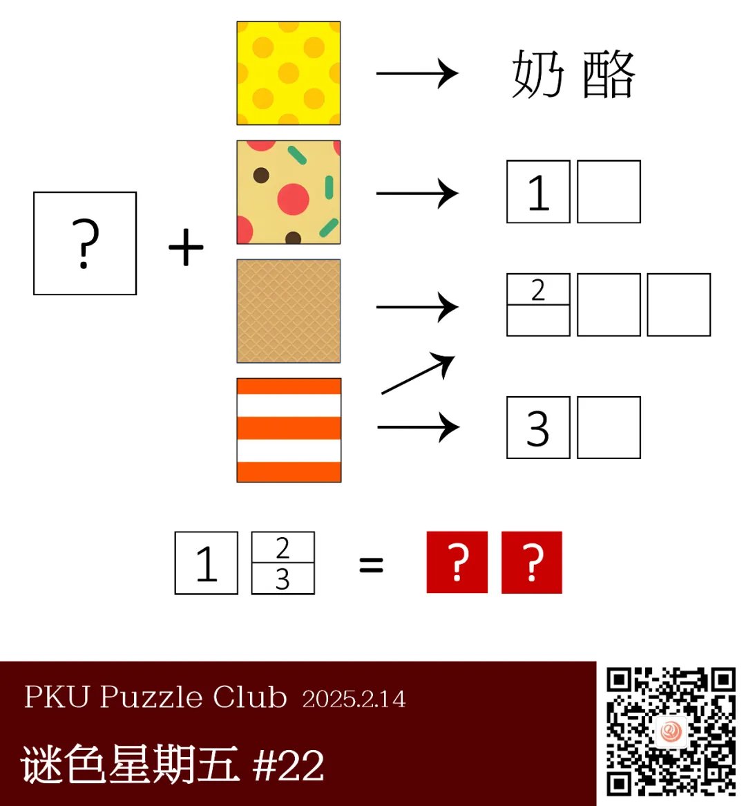
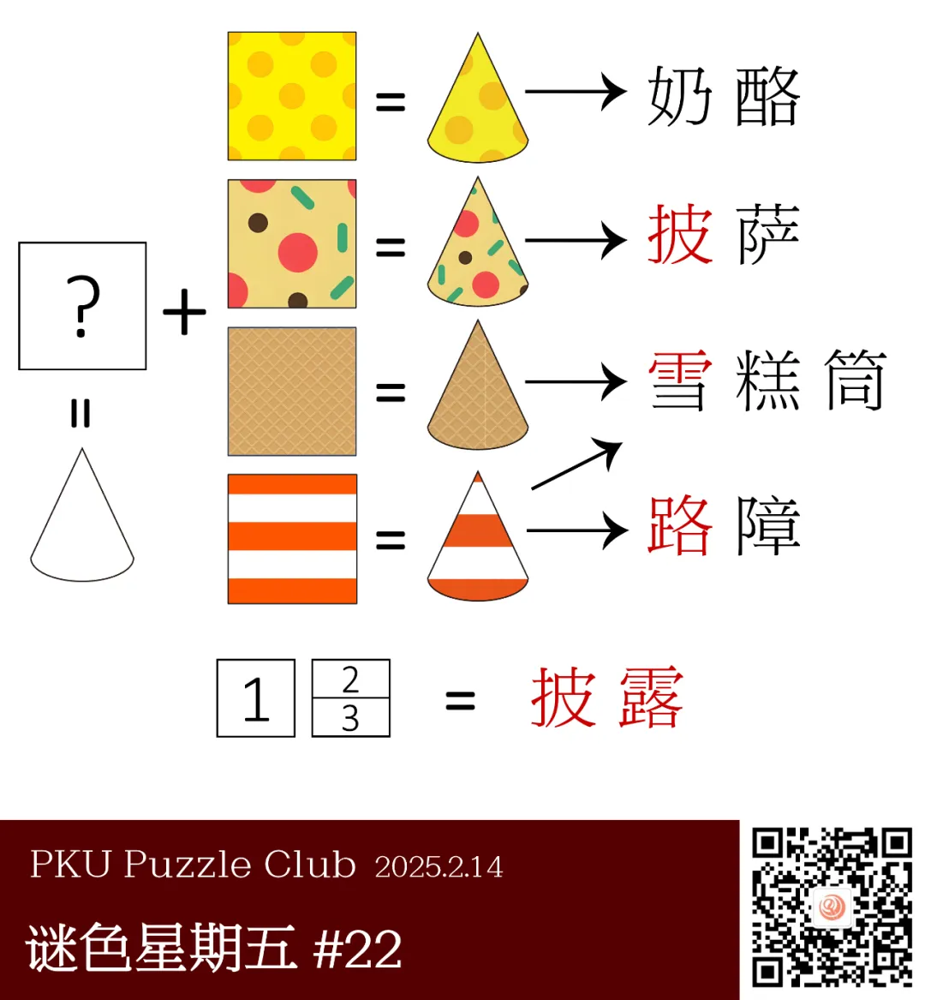

{/* truncate */}

## 提示

<AnswerCheck answer={'披露'} />

    
提示 01

    对于同一个形状，若贴上不同的纹理图案，就可能代表不同的含义。

    
提示 02

    左侧的问号代表扇形。

## 解析

<Solution author={'Orthos'}>
谜题的正确答案是：**披露**。

根据图中第一行“奶酪”的提示，可以很容易看出给出的图案是右侧答案的纹理，由此也容易推断出第二行的答案应该是“披萨”。
此时注意左侧的问号，问号与右侧纹理相加后才能得到答案，结合标题“剪切墙纸”，
不难猜测左侧的问号实际代表了一个形状，容易想到，奶酪与披萨的公共形状应是一个扇形。

接下来观察三四行的纹理，或许部分读者会将第三行的答案确定为“华夫饼”，但这样会导致第四行找不到一个合理的答案。
实际上，若尝试画出一个扇形并将纹理贴上，就会发现这个扇形同样也可以是圆锥体的投影，
那么两个答案分别是“雪糕筒”与“路障”——这种锥形的路障也被称为“雪糕筒”。

由此，提取出三个需要的部分，可以得到最终的答案“披露”。

</Solution>

### 补充点评

    
补充点评（By 同同）

    食品种类最丰富的一题。答案示例“蛋糕”也同样满足本题扇形图形的特点。

    本题从路障筒指向“雪糕筒”的箭头是最后添加上去的。根据来自第三行和第四行的双重信息可以唯一确定“雪糕筒”这一词。
    这被认为是本题巧妙设计之一。不过这种锥形路障的这一名称我也是头一次听说，还真是长见识了。

    “披萨”一词翻译上的不同（“比萨”，“匹萨”等等）导致本题第二行的中文词对应存在多重性。也许添加笔画数之类的限制信息会更好。

