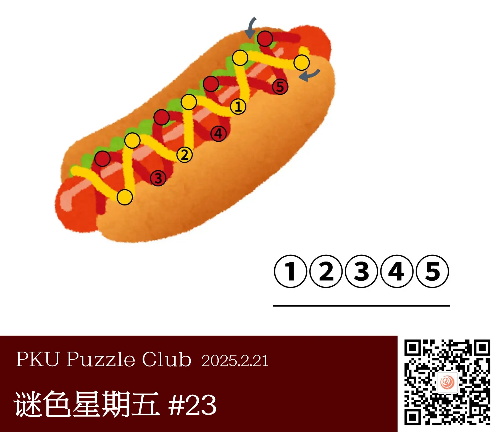
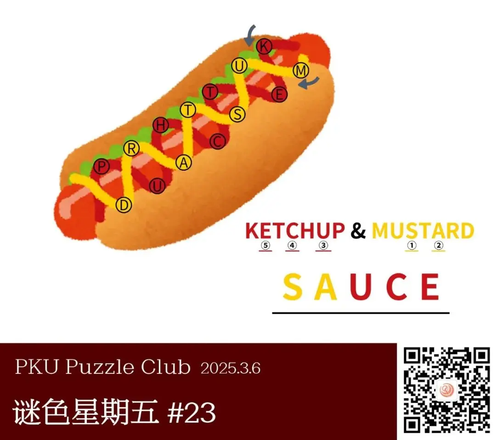
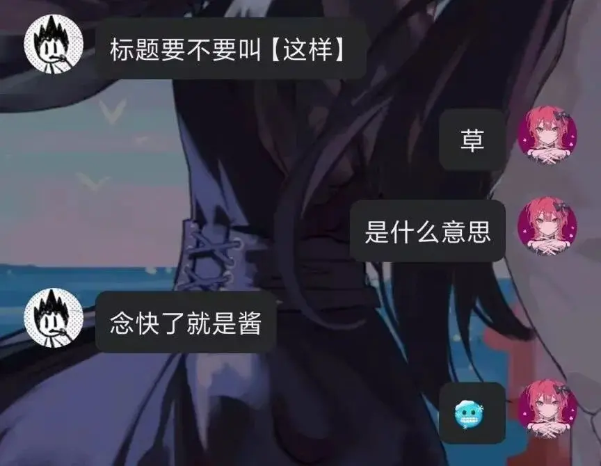

{/* truncate */}

<AnswerCheck answer={'sauce'} />

    
提示 01

    红黄分别对应常与热狗搭配的两种酱料名称。

<Solution author={'同同'}>
谜题的正确答案是：**sauce**。

图片上画了一个热狗。最常用于搭配热狗的酱是红色的番茄酱 ketchup 和芥末酱 mustard。按指示顺序填入图示圆圈中，再按照序号提取即可得到本题的答案 sauce，正是浇在热狗上的、红色和黄色的“酱料”。

比上一期更有食欲的一集。这个热狗色泽鲜艳，花花绿绿的看着口水都流下来了。这也是答案示例 tasty 的来源。

原定的标题其实只是简单的“热狗”而已，不过题目作者希望标题使用“这样”，理由如下：

    
    <ImgCaption>不评价</ImgCaption>

不管怎么样，为了防止大家被冻伤，最后决定提供一些场景上下文变成了现在的版本。

考虑过标题要不要用“是——这样吗？”，后来想想还是算了。
</Solution>