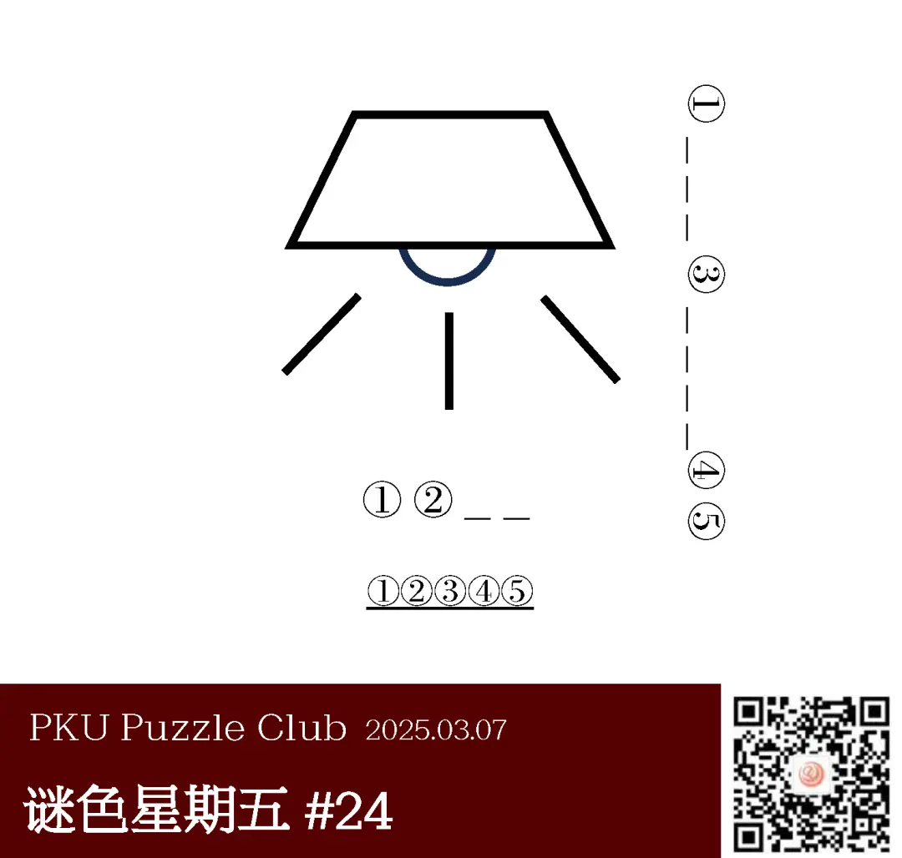
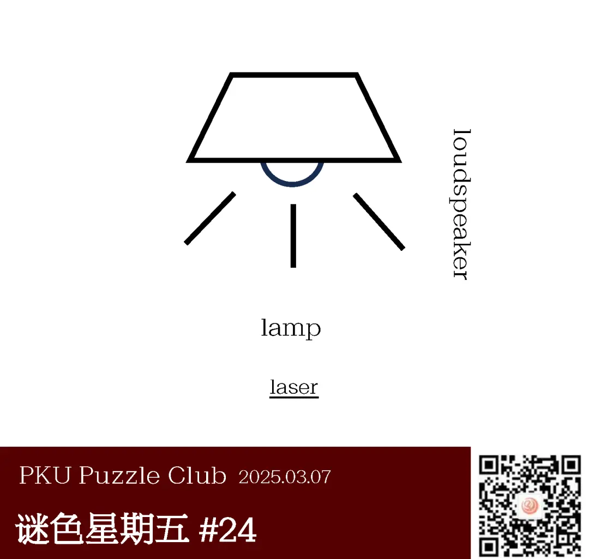
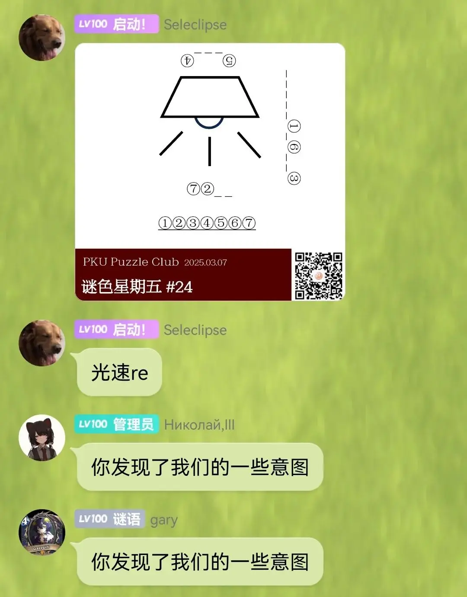
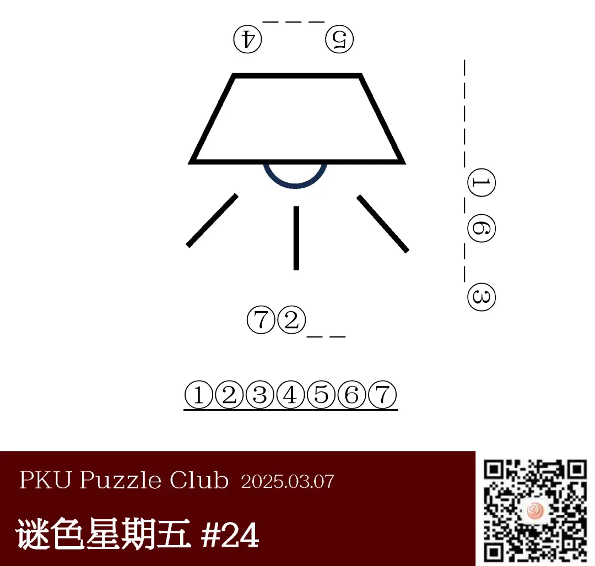

{/* truncate */}

<AnswerCheck answer={'laser'} />

    
提示 01

    从不同角度看图形可以得到不同结果，且单词首字母均为 L。

<Solution author={'changgong'}>
谜题的正确答案是：**laser**。

本题所利用的小 trick 在于从不同角度看相同的图像可以得到不同的结果。从上往下看得到的图像是灯泡，单词为 lamp，从右侧看得到的结果是扩音器，单词为 loudspeaker。根据不同位置处的序号提取可以得到本题的答案为 laser。非常神奇，三个单词的首字母是相同的。

这道题的初始版本想到的其实是 Logitech 的商标作为横向答案，winfrid 老师发现其实更像扩音器，而巧合的是也是 L 字母开头。内部讨论的时候，col 老师和 orthos 老师也给出了很多可能的解，比如 sunrise 和 yuanbao，最终同同老师在示例答案中加入了 ingot（元宝），更是给这道题填了一笔，变成了如今的形式，希望能给大家带来乐趣。
</Solution>

    
补充点评（By 同同）

    题目发表后很快就在相关群里看到了 Seleclipse 老师以 ingot 为其中一个小题答案的 re。不仅反爆出了我们的部分出题意图，还最终制成了完整的题目，真是太好了！

    

    

        
        <ImgCaption>re 的题目，与原题的思路完全一致。大家可以尝试一下</ImgCaption>
    

