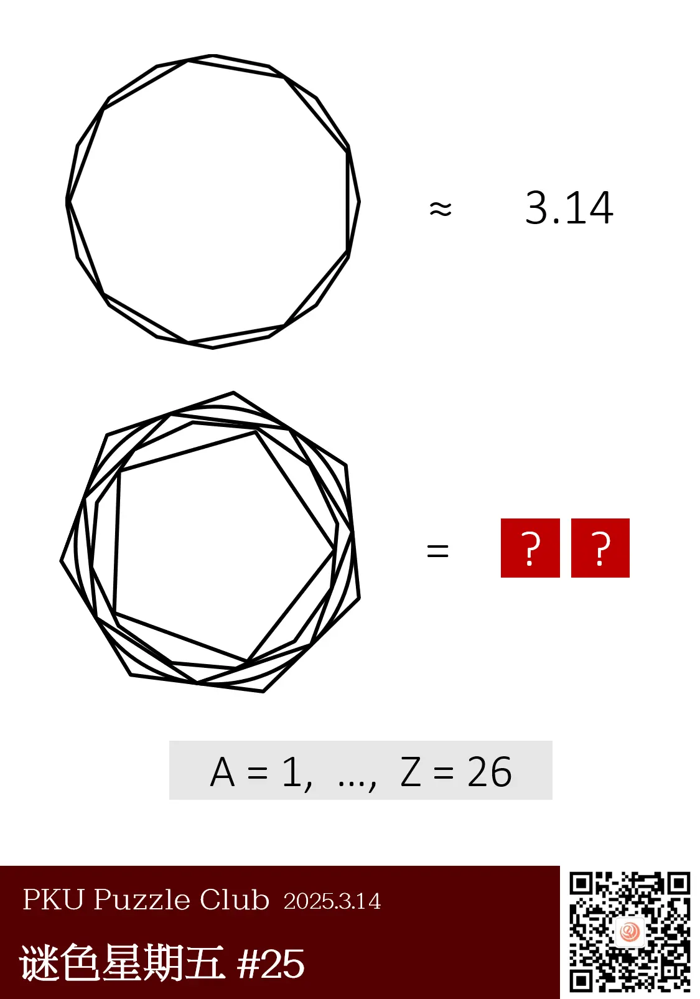
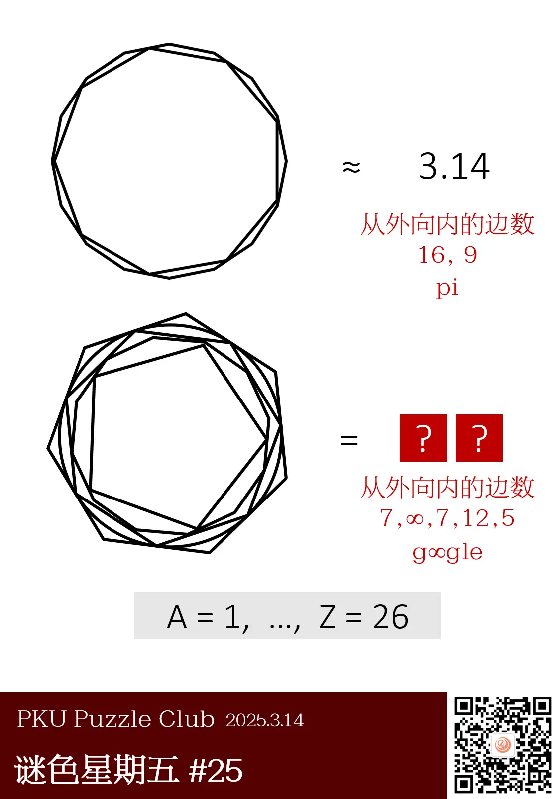
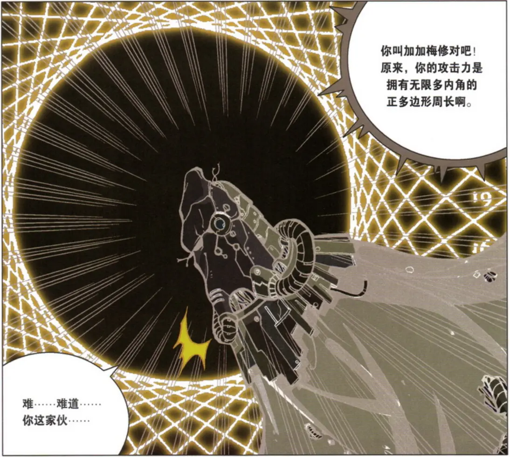

{/* truncate */}

<AnswerCheck answer={'谷歌'} />

    
提示 01

    第一行的左侧，从外向里分别是正 16 边形、正 9 边形。右侧是 pi，而 p 和 i 分别是第 16 和第 9 个字母。

    
提示 02

    圆可以视作正 ∞ 边形。

<Solution author={'Winfrid'}>
谜题的正确答案是：**谷歌**。

图中第一行是两个多边形内接，具体来说，是一个九边形内接于正十六边形。右侧给出的 3.14 则暗示着 pi。而根据题面最下方的提示，p 是第 16 个字母，i 是第九个字母，正好和左边多边形的边数对应。

第二行从外而内分别是正七边形、圆、正七边形、正十二边形、正五边形。如何处理圆呢？其实，圆可以视作正 ∞ 边形。因此可以得到的字符串是 `g∞gle`，也即“谷歌”。
</Solution>

    
作者的话（By Winfrid）

    题目发布当天是 3 月 14 日，也就是 pi day！因此，题面出现了 pi，也出现了圆。

    标题和推文简介都与《重返未来：1999》中的角色 37 相关。

    
补充点评（By 同同）

    似乎是一道老题，不过反响还不错。经典老题就是好。

    说到正无穷多边形，想起中学时看的《幻想数学大战》里亦有记载：

    

        

        <ImgCaption>
            无限魔王军第四集团军团长——加加梅修

            攻击力为无限多内角的（单位）正多边形，也就是（单位）正无穷多边形的周长
            
            答案就是 π
        </ImgCaption>
    

