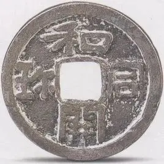

{/* truncate */}

<AnswerCheck 
    answer={{
        '安定': {
            type: 'CORRECT',
        },
        'zhen': {
            type: 'WRONG',
            message: '这个字单独使用好像确实是 zhen1 没错，但是似乎用在这个词语中时有些争议……',
        },
        'bao': {
            type: 'WRONG',
            message: '确实有说法认为在这个词语中“珎”字应读 bao3，同寳、宝，但是现在的输入法里不认可这个读音……',
        }
    }}
/>

    
提示 01

    橙色和紫色的箭头分别代表不同的规则，第一行右侧的图片代表的二字词组为“嘲笑”。

    
提示 02

    青色方框表示的字是“青”。

<Solution author={'Gary'}>
谜题的正确答案是：**安定**。

本题的规则为：紫色箭头将汉字部件拼至位于中间的方格形成一个汉字，橙色的箭头表示箭头两侧的汉字可以组词。第一行位于绿色方格中的词语是“嘲笑”，对应右侧的图片。第二行左侧中心方块表示的汉字应为“案”，由此得到左侧红色方块代表的是“安”；第二行右侧青色方框内的汉字应为“青”，由此得到右侧红色方块代表的是“定”。提取得到答案“安定”。
</Solution>

    
作者的话（By Gary）

    这题的灵感来源是：

    

        
        <ImgCaption>
            築[きずく] [kizuku]，嘲[あざける][azakeru]，憩[いこう][ikou]

            答案是ずけい（zukei，图形）
        </ImgCaption>
    

     

    

        
        <ImgCaption>题目来源与作者的解析</ImgCaption>
    

    当时将这道题搬运到谜协群中没有很大的反响，原因可能是大家对日语还不太熟悉。但是这个点子在我看来十分有趣，于是 REMIX 了一下，将拼字和组词结合，得到了这道题目（有趣的是我忘记了原本的题目但十分巧合的使用了“嘲”这个字）。

    
补充点评（By 同同）

    标题和同开珎指的是一种铜钱，在唐朝时由日本流入中国。铜钱的特点是上下左右各有一个字，中间镂空。似乎现在需要在上下左右中五个位置各填入一个字的谜题都可以叫和同开珎这个名字。

    

        
        <ImgCaption>铜钱和同开珎。图片来源于360百科</ImgCaption>
    

    传统的和同开珎谜题一般要求中间的字和上下左右四个字都能组词，就是这里的黄箭头。紫箭头进行拼字的设计可以说是小小的创新。

    上期的答案示例是“女子”。两个字既可以组成有意义的词，也可以拼成“好”字，是对这道题黄箭头组词和紫箭头拼字两种操作同时存在的暗示。

    关于“珎”字的读音：如果在字典里查找这个字，似乎只能搜到 zhen1 的读音，同“珍”字。不过关于“和同开珎”这个词里“珎”字的读音似乎颇有争议。有说法认为这里的“珎”为“寳”（bao3，同宝）字之省略，因而应该读 bao3。似乎后一种说法目前更受支持一些。不过不管是哪种读音，首次在输入法中打出 `hetongkaizhen` / `hetongkaibao` 的时候都不会跳出珎这个字。

    如果按上期的提交示例提交 zhen 或提交 bao，可以收到自动回复信息。（算是一个小彩蛋！）

