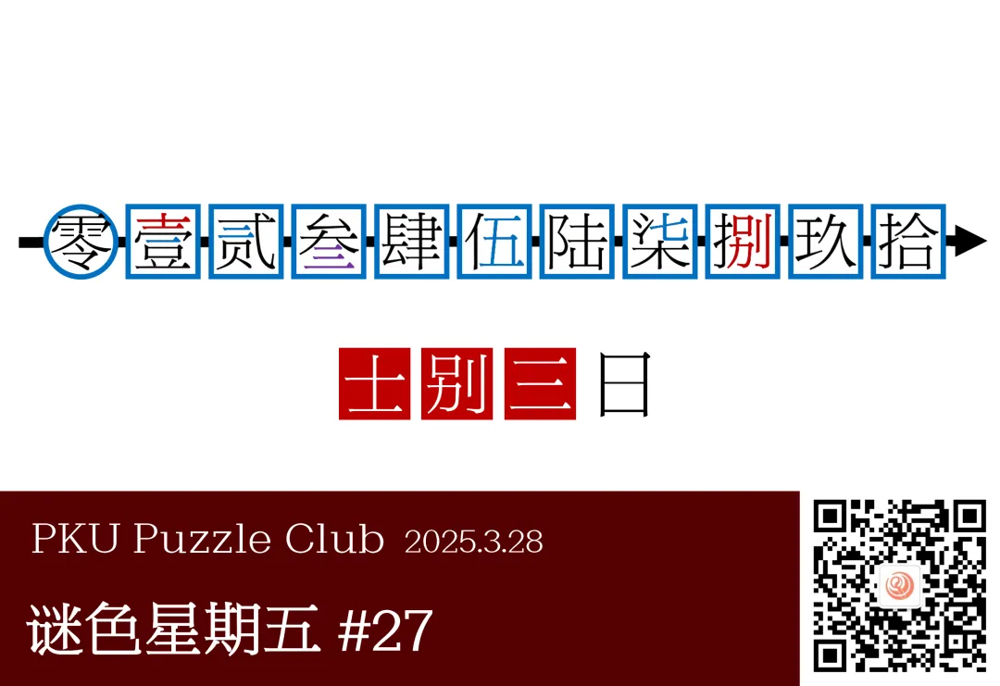

{/* truncate */}

<AnswerCheck answer={'士别三日'} exampleAnswer={'白虹贯日'} />

## 提示

    
提示 01

    图示的箭头其实是数轴，蓝色部分都是数字。

## 解析

<Solution author={'Orthos'}>
谜题的正确答案是：**士别三日**。

本题的主题是汉字中的数字。箭头与大圆（零）暗示这是一条数轴，而所有蓝色的部分都是数字。
蓝色方框代表一个大写数字，蓝色的色块则是与大写数字相对应的小写数字，其中涉及的壹、贰、叁、伍、柒均是大写数字中也包含小写数字的例子。
标题的“以大见小”也是在提示这一点。提取出红色部分对应部位得到答案“士别三日”（紫色的色块代表既是数字提示，也需要进行提取）。

评注：红色标记 + 蓝色标记 = 紫色标记，表示将同时起到两种作用。这类设计似乎在各种谜题中常常使用到，大家或许可以留意一下。

</Solution>
