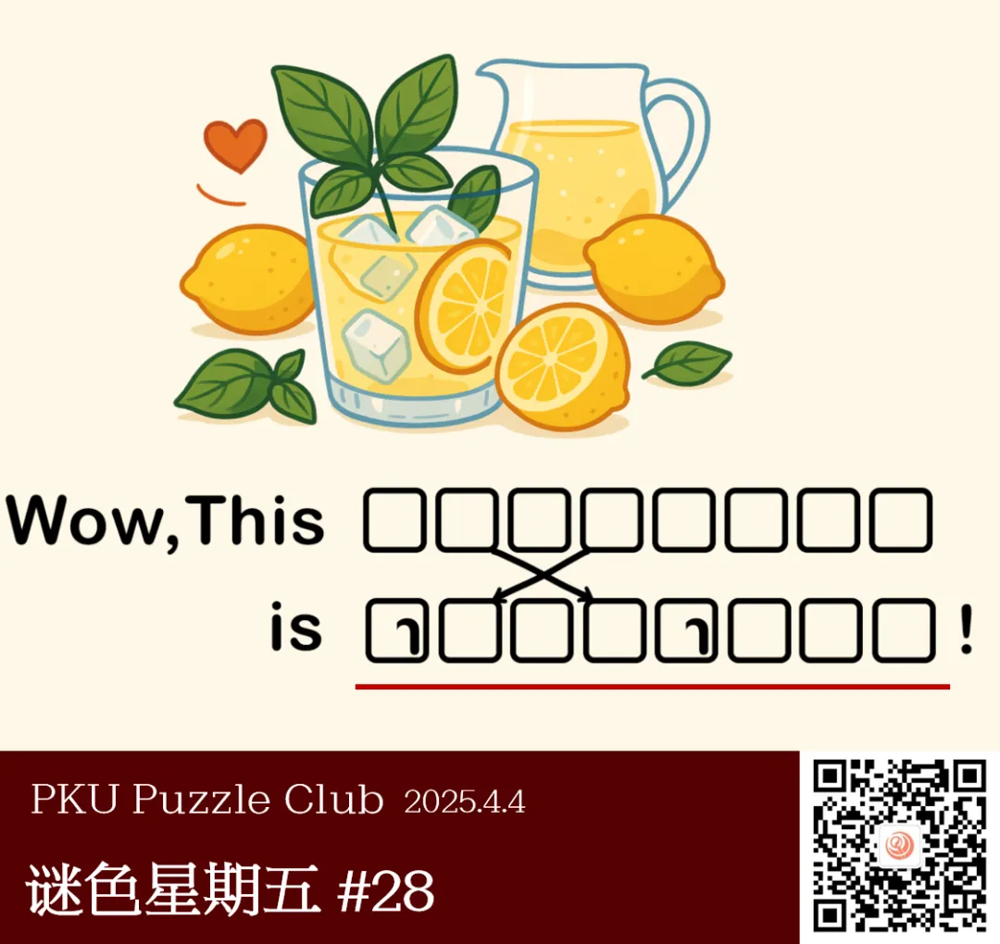

{/* truncate */}

<AnswerCheck answer={'homemade'} exampleAnswer={'beverage'} />

## 提示

    
提示 01

    本题需要根据上面的图片，在方框中填入两个合适的单词来补全句子。

    
提示 02

    第一个单词是“柠檬水”。上下两行未做特殊说明的格子里内容相同。

## 解析

<Solution author={'鱼左、Winfrid'}>
谜题的正确答案是：**homemade**。

题面给出了一个柠檬水的图片。需要根据上面的图片，在方框中填入两个合适的单词来补全句子。

很自然地联想到，第一个单词应该是 lemonade（柠檬水），
而第二个单词相比第一个单词，l 和 n 都各自加了一笔变成 h 和 m，第二个字母和第四个字母则调换了位置。
经过简单的推测，会发现上下两行里未做特殊说明的格子内容相同，因此第二行的单词是 homemade。

</Solution>

### 作者的话

    
作者的话（By 鱼左）

    

        
        <ImgCaption>太可恶了到底是谁一直在找这种巧合啊</ImgCaption>
    

