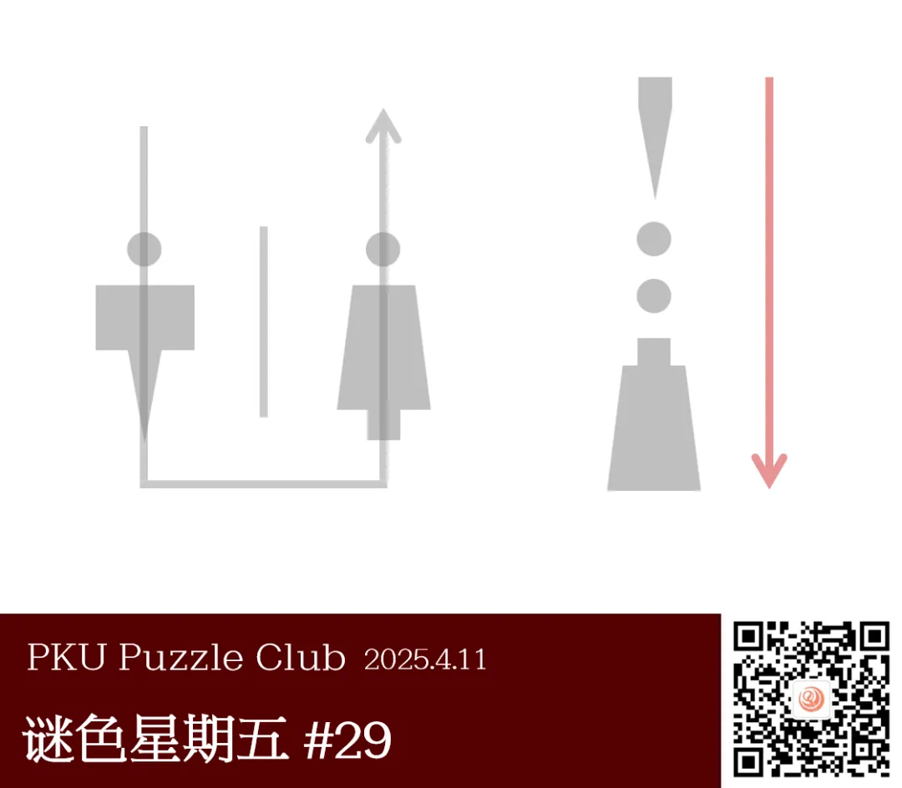
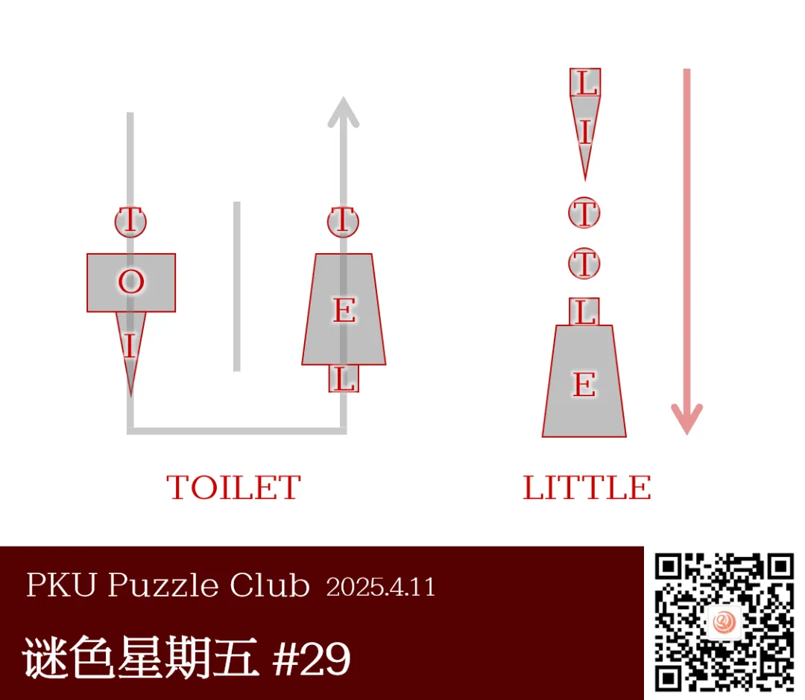

{/* truncate */}

<AnswerCheck answer={'little'} exampleAnswer={'public'} />

## 提示

    
提示 01

    右侧的图形是由左侧的图形经过拆分和重组得到的。左侧的图形含义是“厕所”。

## 解析

<Solution author={'Winfrid'}>
谜题的正确答案是：**little**。

左侧给出了男性和女性的标识，每个标识都由三个图形造成，并且用一根箭头加以贯穿。
其实，这两个标识共同构成了厕所的标识，也即 `TOILET`。从而，正好每一种图形能够对应一种字母！
得到它们的对应关系之后，右侧的图形组合也可以拆成六个图形，根据图形与字母的对应关系转换为字母，即可得到答案是 `LITTLE`。

</Solution>

### 补充点评

    
补充点评（By 同同）

    如果只是一男一女并排站着，很容易导致只想到 man 和 woman 两个词。
    因此，讨论之后，修改图片在男女两小人中间加上了一道竖线，就更像是男女厕所的标志了。

    标题的“全球共识”指卫生间标志图案在全球各地都由相同的元素组成，也暗含“公共”卫生间之意。

    答案示例 public 也是英语词组“公共”卫生间 public toilet 的第一个词。（虽然好像并不会特地强调 "public" toilet？）

