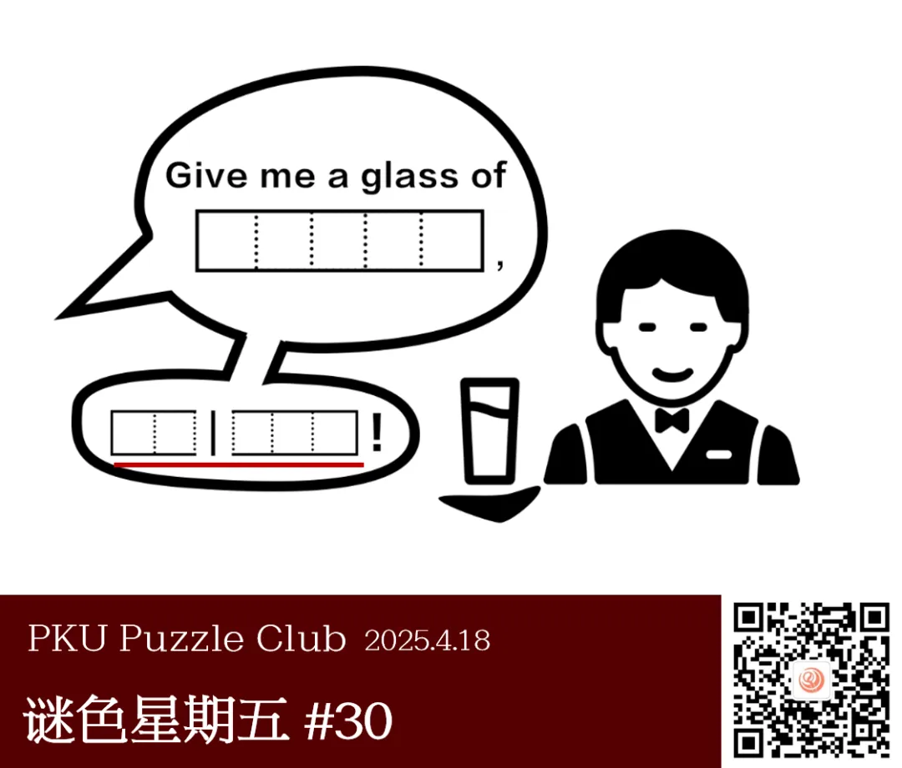
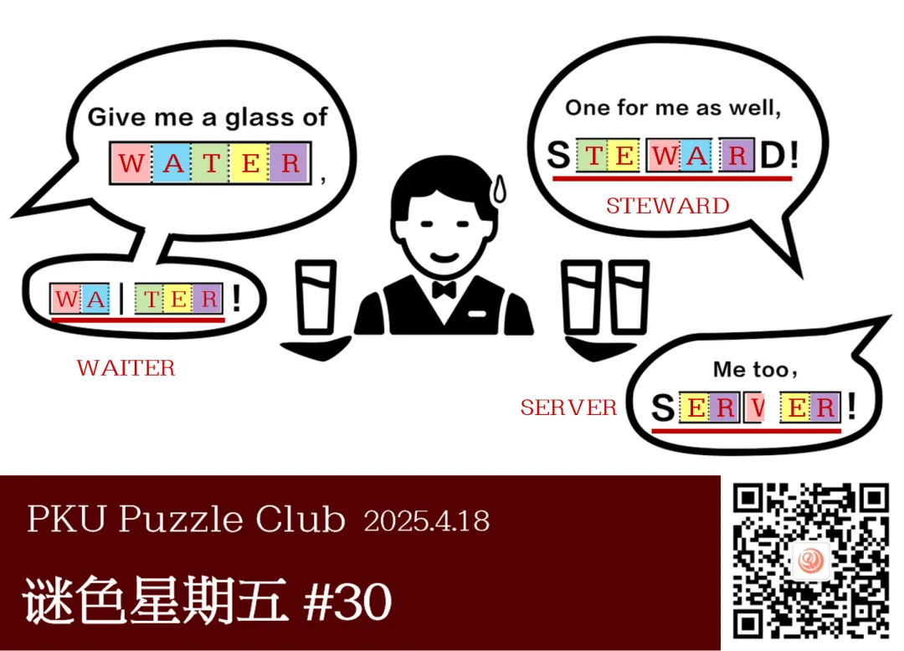
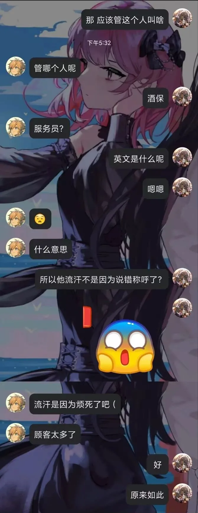

{/* truncate */}

<AnswerCheck
  answer={{
    waiter: {
      type: 'MILESTONE',
      message: ,
    },
    steward: {
      type: 'MILESTONE',
      message: ,
    },
    server: {
      type: 'CORRECT',
    },
  }}
  exampleAnswer={'please'}
/>

## 提示

    
提示 01

    他们点的东西是 WATER。根据这个，可以得到其它未知的单词。

    
提示 02

    注意文本框的边缘形状，这提示了你需要截取哪一段字母。

## 解析

<Solution author={'同同'}>
谜题的正确答案是：**server**。两个里程碑答案分别是：**waiter** 和 **steward**。

图片中可以看到餐厅服务员正在为一名顾客提供饮品。
比较对话框中两个单词的长度以及单词中字母的对应关系，可以在方框中填入合理的单词 WATER 和 WAITER。

对于第二个对话框，注意观察单词方框的边缘，可以发现新的单词是对 WATER 截取了相应片段后再拼合而成。
选取单词 WATER 中合适的相应片段即可拼成单词 STEWARD。

第三个方框中需要额外注意 W 字母被截取了一半，因此在相应位置填入 V，即可得到正确答案 SERVER。

waiter，steward，server 三个单词都有服务员、侍者的意思，所以这里 steward 其实并不是人名。
不过 steward 作服务员似乎特指飞机、火车等的乘务员、服务员，所以场景也许是在飞机上等候服务员提供饮料吧。

</Solution>

### 补充点评

    
补充点评（By 同同）

这一期的谜色星期五是首次使用“里程碑”的形式进行互动，不知大家体验如何？
“里程碑”的形式在各种谜题中都很常见，是指完整解答谜题中重要的中间答案。
一般来说正确提交的里程碑虽然并非最终的正确答案，但不会记为错误答案且能够得到来自出题者的确认或进一步提示。

在谜色星期五板块中，此后使用“里程碑”的题目也将会在推送开头处进行提示。提交里程碑答案的方法与常规的答案提交方法相同。

这道谜题采用这种互动的形式，使得对话内容一点一点地呈现，故事性很强，感觉非常有创意！是一道非常有趣的谜题！

  

  <ImgCaption>题目作者关于漫画剧情的解说，以防大家并未完全正确地理解漫画内容（</ImgCaption>

