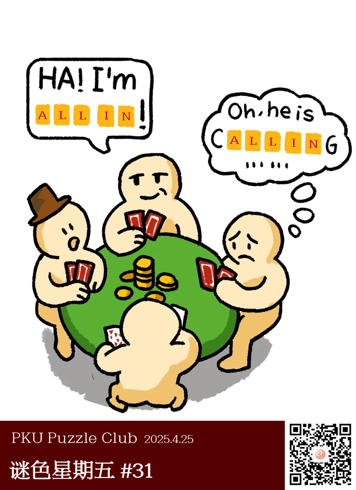

{/* truncate */}

  <ImgCaption>（和题目无关）这场扑克比赛十分严格，要求不穿衣服扎马步进行，才不是懒得画了。</ImgCaption>

<AnswerCheck answer={'all in'} exampleAnswer={'TeX as'} />

## 提示

    
提示 01

    需要在两组黄色格子里填入相同的五位字母，补全语义。

    
提示 02

    图中的游戏是德州扑克。

## 解析

<Solution author={'同同、鱼左'}>
谜题的正确答案是：**all in**。

图片上四个人在玩的游戏是德州扑克，这里涉及到了常见的两个扑克术语：all in（全押）和 calling（投注），所以答案是 all in。

实际上，这里其实是个特殊情况：由于上一人投注的金额大于下一人，所以这时候 calling 相当于 all in 了。（这里是 Deepseek 说的，鱼左不会德州扑克）不过因为说“I’m all in”很酷，所以这道题的主角没有说 calling。

其实图中的主角一只手放在桌下，是想误导大家想“Cheating”方向去的。鱼左很坏。

</Solution>

### 补充点评

    
补充点评（By 同同）

提交样例 TeX as 是为了提示这是德州（Texas）扑克的对局。
不过为了形式上和正确答案 all in 一致，只得把一个正常的单词拆写成 3+2 词组的形式。
TeX 似乎可以指一系列排版工具，例如 LaTeX 就是其中一种。但是 TeX as 这个词组本身自然是没有任何含义，完全就是一种 orme shoe 答案。
不过既然是答案示例，想必也不会有人太在意，能够注意到合写的 texas 就算是提示到位了。

这期的标题和摘要当然是 neta 自明日方舟目前最受欢迎的愚人节活动“泰拉投资大师课”。
看到本期答案的时候实在无法忍住，必须要夹带点私货才行。

