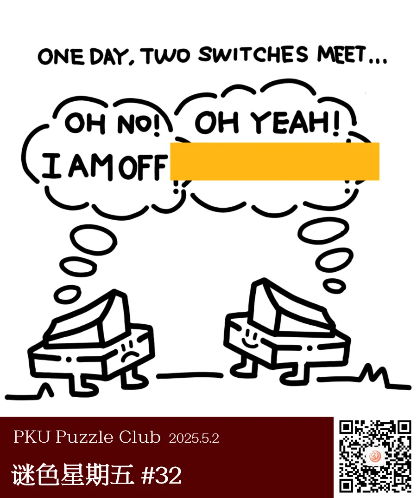
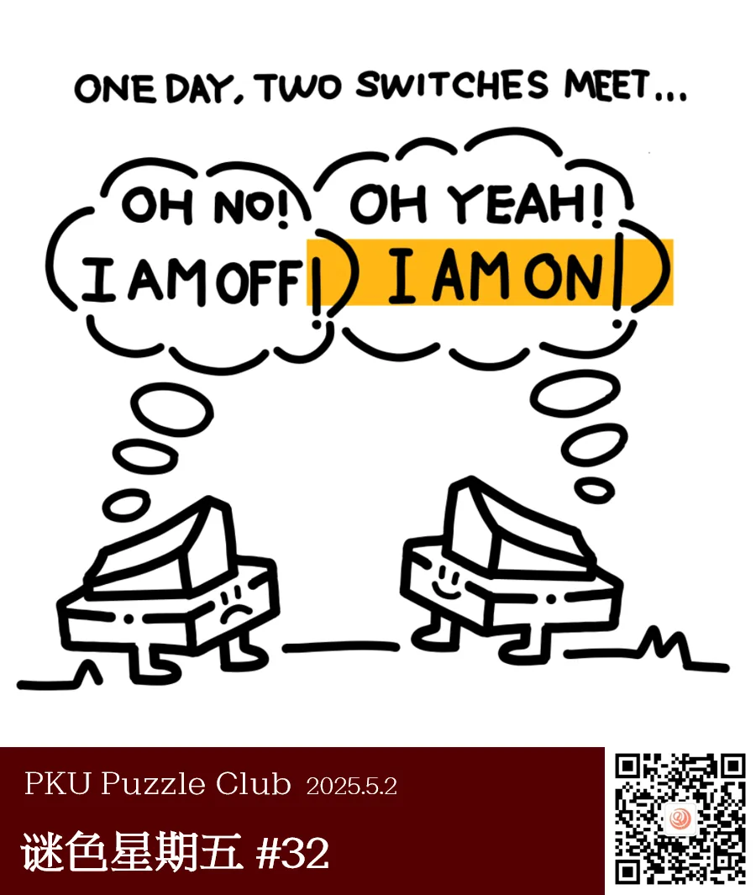
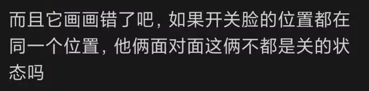
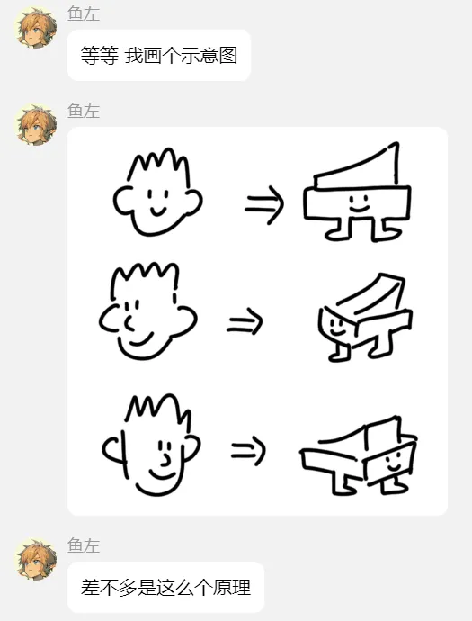

{/* truncate */}

<AnswerCheck answer={'diamond'} exampleAnswer={'instead'} />

## 提示

    
提示 01

    答案框除了对话之外，还遮住了一些内容。

## 解析

<Solution author={'鱼左、Gary'}>
谜题的正确答案是：**diamond**。

通过左边的角色的话语以及两个角色的外形判断其为开关，右边的开关处于“开”的状态，因此他说的话是“I AM ON!” 。
注意到黄色框实际遮住了两个感叹号和云朵框的一部分，每个感叹号和云朵框的弧线组成了字母 D，因此答案为 DIAMOND。

</Solution>

### 补充点评

    
补充点评（By 同同）

事实上，关于右边的开关究竟是开是关，似乎有一些争议……

关于这一质疑，我们的出题人进行了如下解释……

  

  <ImgCaption>算是小猪佩奇原理的应用？</ImgCaption>

