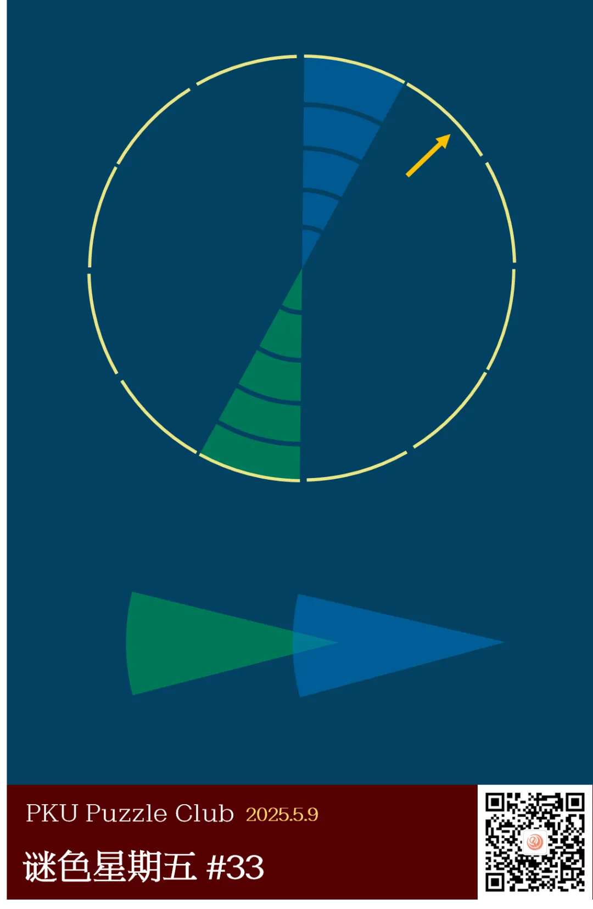
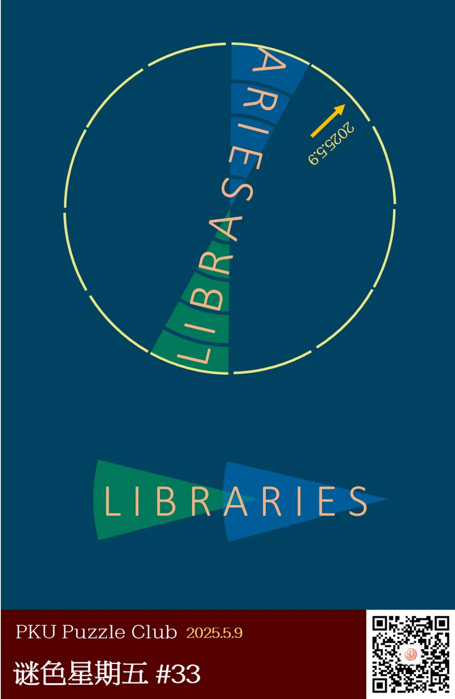
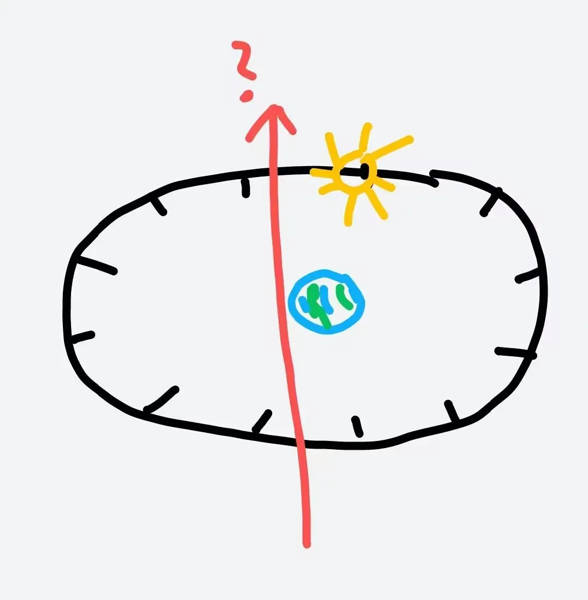

{/* truncate */}

<AnswerCheck answer={'libraries'} exampleAnswer={'extractor'} />

## 提示

    
提示 01

    箭头的颜色和下方日期均为金色，结合标题“夜观天象”暗示了这道题的主题为星座，箭头指向的是今天日期对应的位置。

    
提示 02

    两个扇形重叠，意味着要将这两个扇形代表的英文单词首尾拼接。

## 解析

<Solution author={'Gary'}>
谜题的正确答案是：**libraries**。

由标题“夜观星象”以及题目背景颜色为深色初步推断本题的主题与星空有关，结合圆被十二等分推测为十二宫。
黄色箭头结合本题中的黄色日期推断黄色箭头所指的是金牛宫，从而绿色和蓝色的扇形指的分别是天秤宫（libra）和白羊宫（aries）。
结合两个扇形有重叠的部分将两个部分拼合去掉重复的 a 得到 libraries。

此题为 pnku3 中废稿。
在出一道名为《书架》的题的时候，发现 aries 与 libra 正好可以凑成 libraries，随后指出这两个星座在十二宫中正好位置相对，于是有了此题。
当时的版本中当时的日期正好在白羊座末尾，所以有了这个初始版本，但是由于题目还没有完全打磨便延期到了现在这个版本。

</Solution>

### 补充点评

    
补充点评（By 同同）

啊可恶到底是谁在一天到晚注意这些巧合.jpg

原来这么精妙的巧合点子竟然是 P&KU3（中）废稿吗，所以我可以期待正式的比赛中会出现设计得更加精妙的谜题对吗！
所以我的 P&KU3（中）什么时候端上来（

本来觉得大家看到一个周期 12 个的要素会更容易想到月份、时间而不是星座，而且正巧五月份的上一个月 April 也是五个字母，感觉会很有误导性。
不过看大家作答情况似乎能认出是星座的还不少。

答案示例的 extractor 也具有着和 libraries 一样的性质，单词前五个字母 extra 和后五个字母 actor 各自能组成单词。
extractor 词义暗含这一性质是本题的提取方式。

