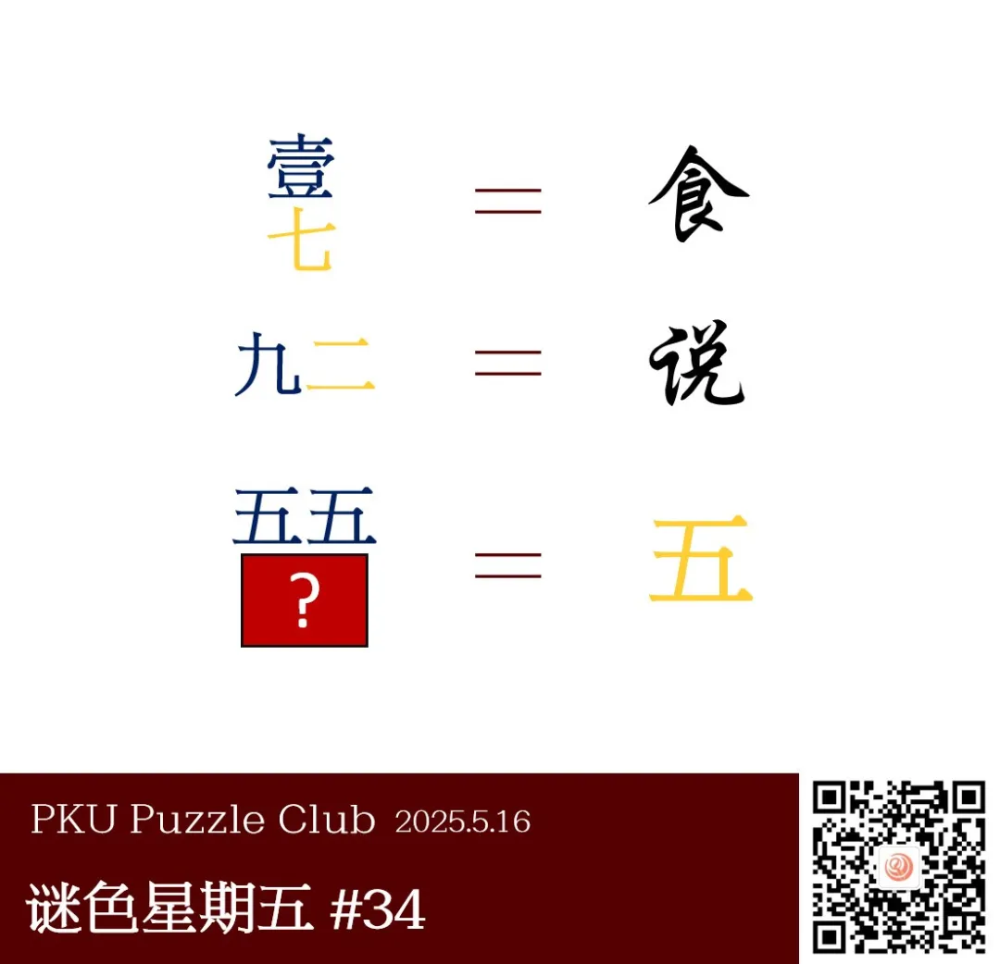

{/* truncate */}

<AnswerCheck answer={'共'} exampleAnswer={'工'} />

## 提示

    
提示 01

    每个蓝色的汉字数字表示一个英文字母，数字提示了这个字母在字母表中的次序。注意区分大小写。

    
提示 02

    每个黄色的汉字数字表示一个八卦卦名，数字提示了卦序。将每个等号左侧的字符部件拼接可以得到等号右侧的汉字。

## 解析

<Solution author={'樵子若木'}>
谜题的正确答案是：**共**。

观察前两行，可以发现等号左侧数字的排列结构与右侧汉字的结构相同。
由此可以初步推测，等号右侧的汉字可以拆分为更小的部件，而等号左侧的每个数字则对应一个部件。

这样可以提取得到：

- 前两行黄色的数字分别对应“艮”与“兑”，它们都是八卦的卦名
- 蓝色的数字分别对应 A 与 i，它们都是英文字母
  - 汉字数字的大小写提示了英文字母的大小写情况
  - 第一行虽然也可以拆解成“人”和“良”，但在这种情况下，同种颜色数字对应的汉字间就没有规律了
  - 同时数字指示了卦名和字母分别在先天八卦与字母表中的次序。

这样在第三行中，黄色数字五对应“巽”，蓝色小写数字对应 e。
字形相减可得到本题答案“共”。

</Solution>

### 作者的话

    
作者的话

这道题的灵感来源于 p&ku3 上里的时光穿梭机。当时这道题给我眼前一亮的地方，在于其中拼凑汉字的多种巧妙方法。
我出的这道题也借用了英文字母作为汉字偏旁拼凑汉字的点子。

在题目发布之后，有一些玩家反馈本题里八卦的次序存在争议。这一点在出这一道题目时就已预料到。
本题中参考的八卦次序是先天八卦次序，即”一乾、二兑、三离、四震、五巽、六坎、七艮、八坤“，
除此之外还有”坎一、坤二、震三、巽四、中五、乾六、兑七、艮八、离九“的后天八卦次序。
此外，也有玩家想到了将八卦符号转化为二进制提取数字作为顺序的点子。

我个人的想法是，一方面，可以通过前两行的内容确定所采取的次序；
另一方面，本题在得到”黄色数字对应八卦卦名“这一线索后，仅通过字形也可确定第三行中的黄色数字五为”巽“，避免了用顺序提取卦名的争议。

### 补充点评

    
补充点评（By 同同）

本题也可以说是一道“列表题”。标题中的“中西合璧”指的是本题需要使用中国文化中的八卦列表，和英文（“西”）的字母表。
答案示例的“工”可以和“共”组词成为中国传说中的一个人名。

选择此题时其实相当担心大家对八卦相对陌生比较难以想到，但是根据反馈似乎都还可以接受。

