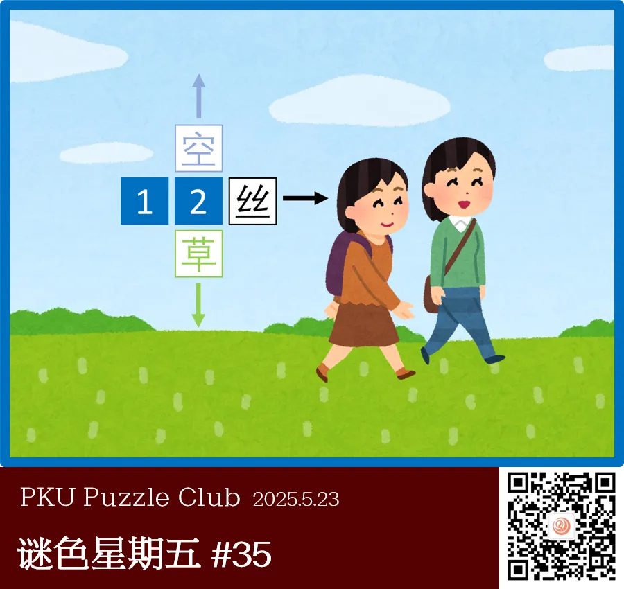
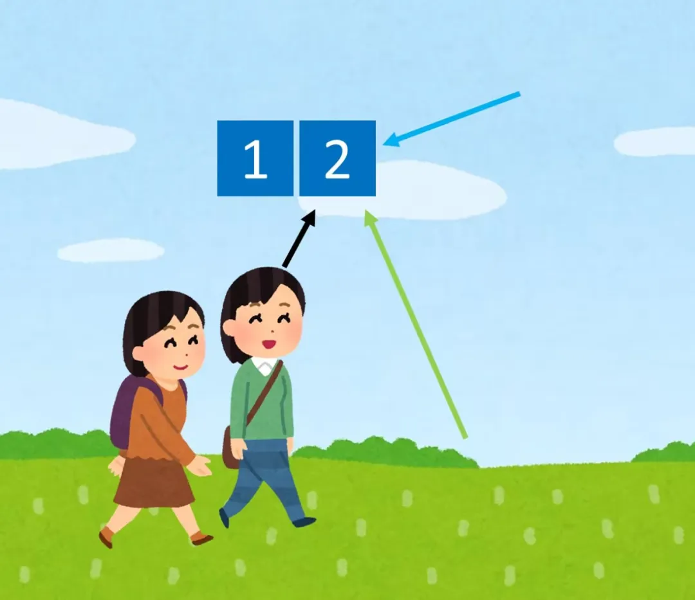

{/* truncate */}

<AnswerCheck answer={'踏青'} exampleAnswer={'清明'} />

## 提示

    
提示 01

    本题类似于和同开珎。2号方框代表的字可以和周围的字组词，与空、丝、草组词时，分别代表三种不同颜色的东西。

    
提示 02

    注意题目图片周围的方框与答案方框均为青蓝色，这表示需要提交的答案是整个画面代表的内容。

## 解析

<Solution author={'Orthos'}>
谜题的正确答案是：**踏青**。

首先根据题目方框的排布方式，可以想到本题类似于和同开珎，需要进行组词。
注意三个箭头的颜色不同，天空是蓝色，小草是绿色，发丝是黑色。
有一种颜色可以同时代表这三种颜色，即青色——青空、青草、青丝——于是能知道 2 号方框代表的字是“青”
（实际上“青”也是题目标题的字谜“晴日出游”的谜底，晴-日=青）。

接下来需要找到一个青字结尾的词语。答案框的颜色和题目图片最外围的颜色一致，这表示答案应是整个图片所代表的词语。
该图片描绘了两人外出踏青的场景，因此答案为“踏青”。

</Solution>

### 补充点评

    
补充点评（By 同同）

本题最初的想法其实只是“青丝”、“青空”、“青草”中三种不同的颜色——黑，蓝，绿——同时由同样的“青”字代表。
这是很有趣的共同点，但是在具体的实现上，我们实在没能找到更好的方案。

如果只是采用有颜色的箭头指向的方法来表示，那信息量实在是太少，不能明确地指向颜色相关的信息，而且“青丝”和“青空”都不是能很快想到的词；
而用现在版本的和同开珎式，也导致仅靠组词就能定出“青”，而没有把“青可以是三种颜色”这一发现很好地传达给大家。

  

  <ImgCaption>第一版题图，只使用指示的箭头提示</ImgCaption>

而且，从反馈中来看，从“青”到“踏青”的提取也有较大的障碍。通过在图片周围附加蓝色边框的形式强调提取感觉已经给出了一定强度的指示，不过确实是不太显眼。

总之，感觉最初的想法确实很有趣，但是没能找到最好的展现形式确实很遗憾。

