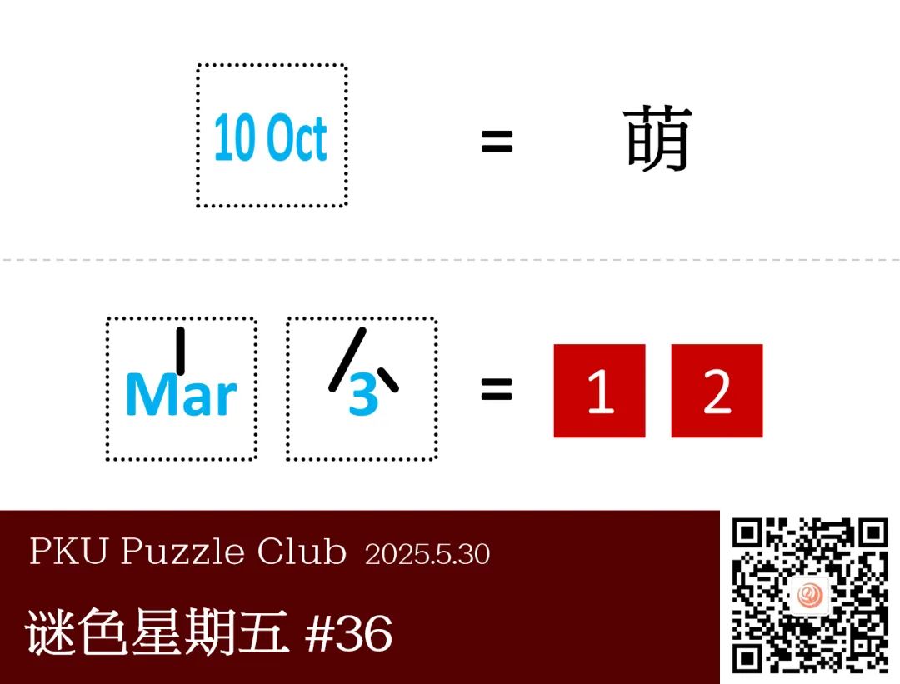
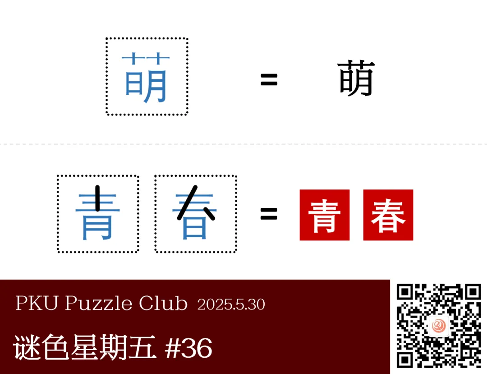
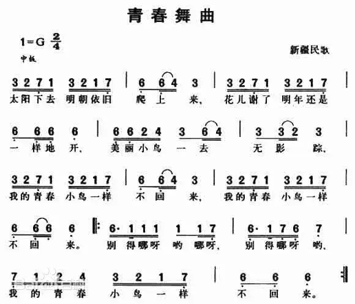
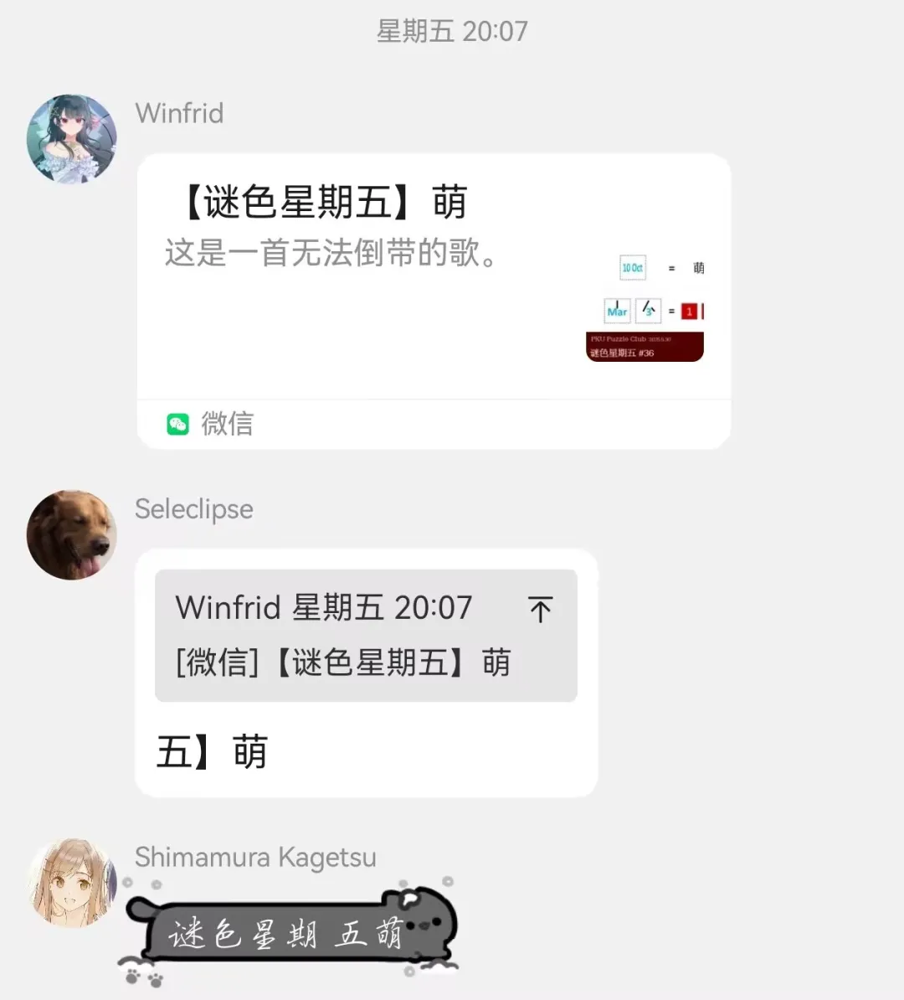

{/* truncate */}

<AnswerCheck answer={'青春'} exampleAnswer={'日月'} />

## 提示

    
提示 01

    10 Oct 表示 十日 十月。

## 解析

<Solution author={'Gary'}>
谜题的正确答案是：**青春**。

观察“萌”的字形特征和左边日期，可以得到“萌”字恰巧由竖着的“十日”与“十月”并排得到。
根据该规则得到下边等式左侧的日期可以转化为竖着的“三月”与“三日”，在此基础上添加黑色线条得到“青春”。

</Solution>

### 作者的话

    
作者的话

这题灵感来源于这个答案本身，当时观察到时觉得这两个字特别工整，但是只发现了月和日的相对关系。
后续 Winfrid 老师提出了“三月三日”的这个想法，孔明七星老师提出了“萌”作为提示线索，所以这题其实也算是一道“拼好题”吧——

### 补充点评

    
补充点评（By 同同）

十月十日->萌 已经是大家熟知的字谜了，但是“三月三日”动点手脚可以变成“青春”两字这一思路还是头一回见。
旧题新整，还是别有一番趣味的。

  
  <ImgCaption>真正的出题高手，瞬间就能发现无人在意的华点</ImgCaption>

注意到今年的十月十日恰好是周五，所以有提出过要一直拖到十月十日再出这道题，不过最后还是早早地给大家端上来了。

看到“青春”两个字，脑海里就响起了一首古老的歌曲，所以最初的标题写的就是“小鸟一样”。
不过因为过于暴露了，所以就简单改成了没有额外信息的“萌”。

  
  <ImgCaption>以防大家不知道是哪首歌（</ImgCaption>

但是似乎造成了一些奇妙的后果（？）

  
  <ImgCaption>awmc</ImgCaption>

