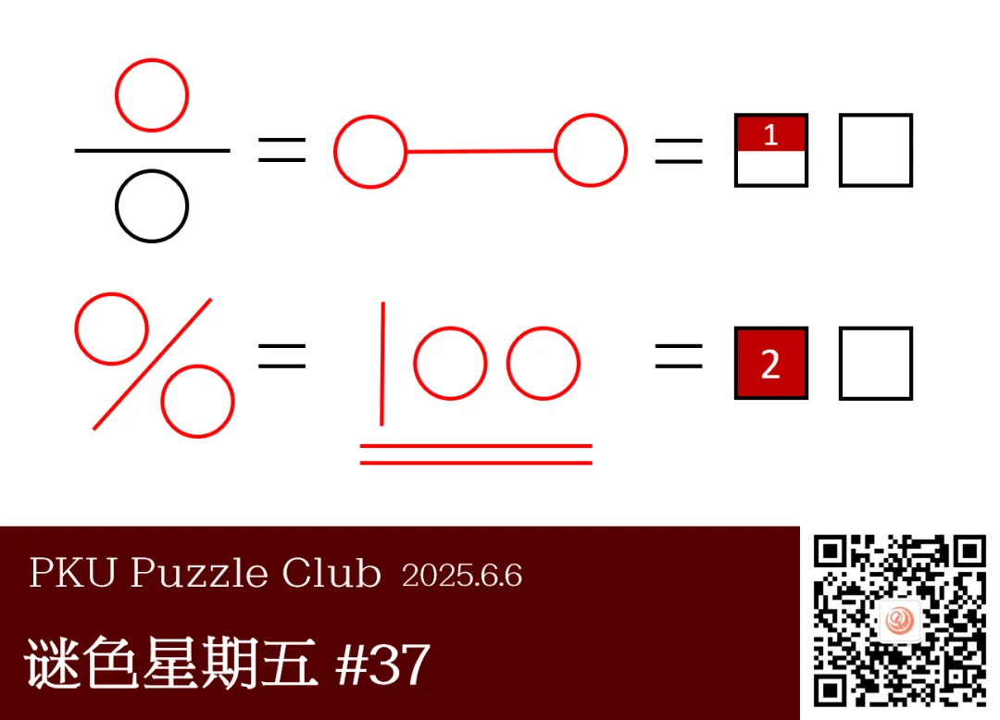

{/* truncate */}

<AnswerCheck answer={'八百'} exampleAnswer={'高考'} />

## 提示

    
提示 01

    每行两组图形中的红色部分可以用同样的两个字来描述。

    
提示 02

    第一行左侧图形是一个分数，右侧图形是一个化学模型；
    第二行左侧图形是一个数学符号，右侧图形与考试有关。

## 解析

<Solution author={'孔明七星'}>
谜题的正确答案是：**八百**。

每行的两个图形中的红色部分都可以用同样的两个字表示。
第一行中，左侧为分数的分子，右侧为化学中分子的球棍模型，方框中填入“分子”；
第二行中，左侧为百分号，右侧为试卷上的一百分，方框中填入“百分”。
按顺序读出红色部分得到答案“八百”。

</Solution>

### 补充点评

    
补充点评（By 同同）

这道题在设计答案提取的时候纠结了挺长时间，还是最后注意到推送日期正好是高考的前一天于是选定的“八百”。
不过中高考应该几乎没有人能考到“八百”分就是了（

