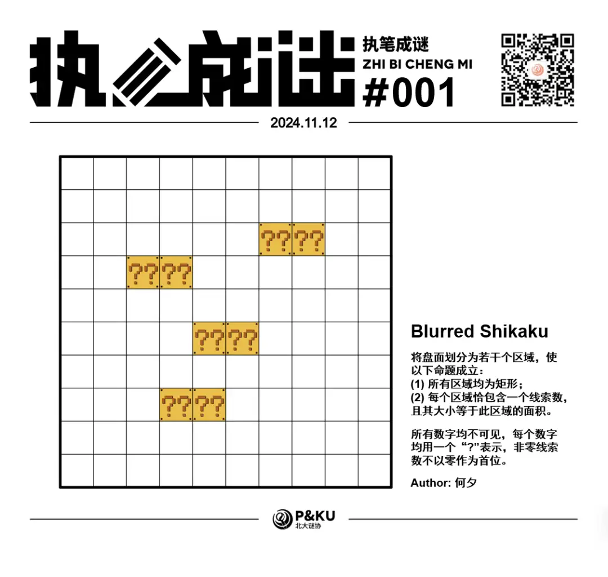
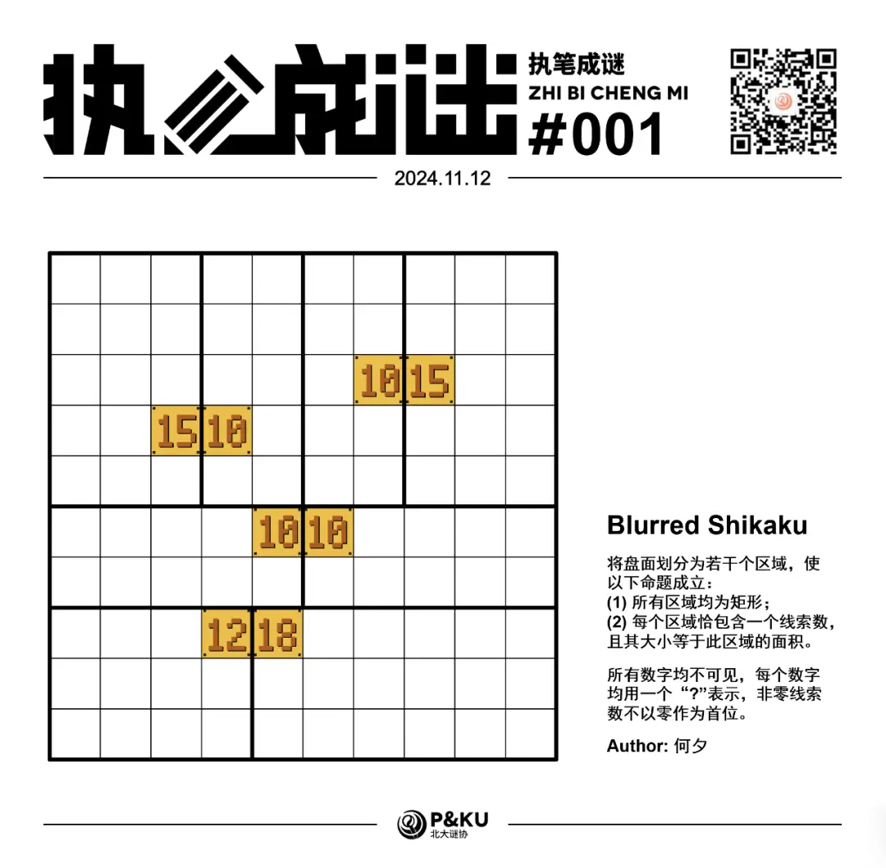

何夕老师为大家带来了一套由其编写的纸笔谜题，主题为 Blurred Vision。
**在这一套谜题中，每道题目都有若干线索不可见**，你需要在解题的同时，确定这些线索。

今天是该系列的第一题，纸笔类型为 Shikaku。

{/* truncate */}

## Shikaku 规则

将盘面划分为若干个区域，使以下命题成立：

1. 所有区域均为矩形；
2. 每个区域恰包含一个线索数，且其大小等于此区域的面积。

所有数字均不可见，每个数字均用一个“?”表示，非零线索数不以零作为首位。

<AnswerCheck
  answer={'15101018'}
  mitiType="zhibi"
  instructions="依次输入从左上到右下的对角线穿过的每个区域的面积，面积均用两位数字表示"
  exampleAnswer="10101505..."
/>

## 解答

<Solution author={'Orthos'}>
  

</Solution>

## 总结

相比于普通的 Shikaku 谜题，在 Blurred Vision 中，提示数不再可见。
但在本题中，依然存在可入手的地方，可以发现提示数均为 2 位数字，这意味着每个区域大小至少为 10，
对答案产生了较大的限制，而数字彼此两两相邻，则明确划分了不同区域间的界限。
两者相辅相成，让这个看似模糊不清的盘面也能够得出唯一的解答，可谓是非常精巧的设计。
