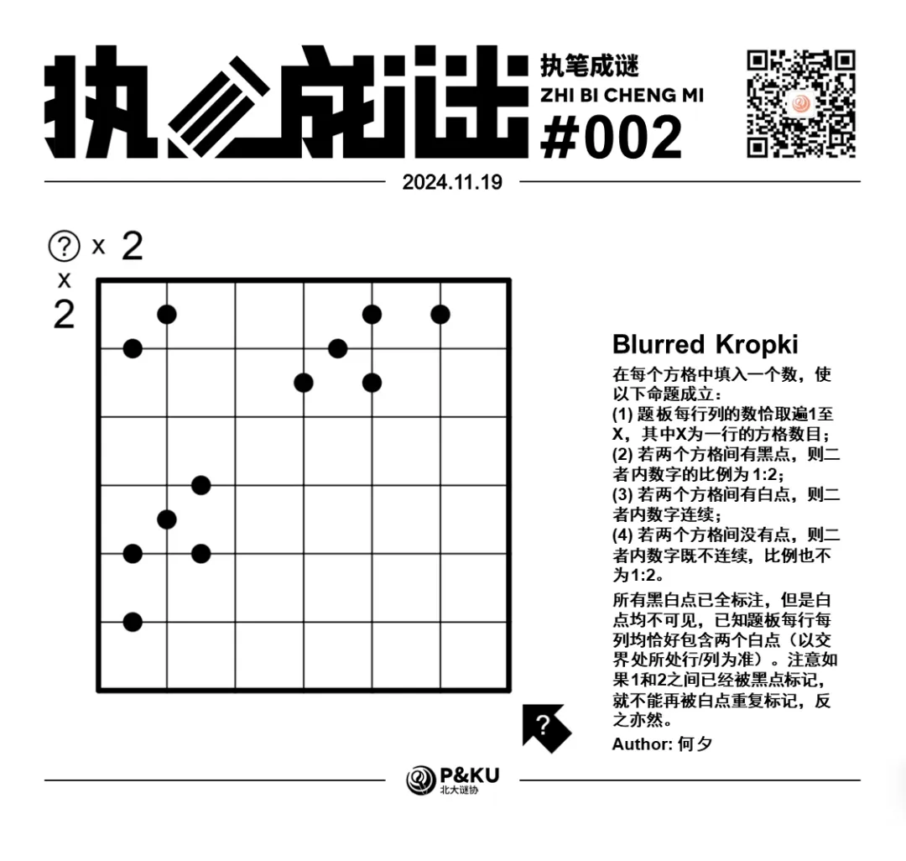
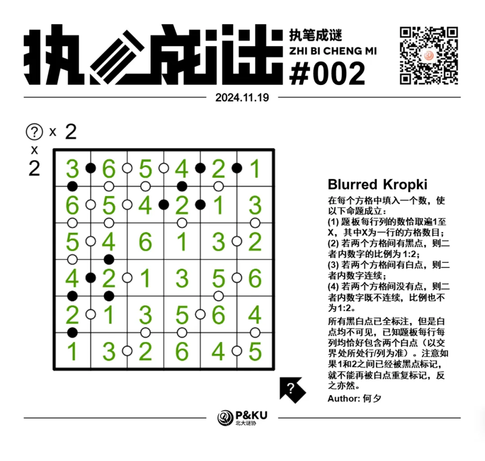
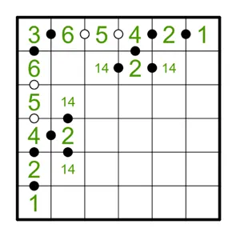
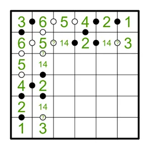
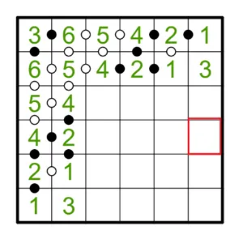
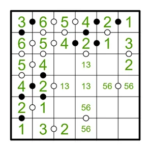
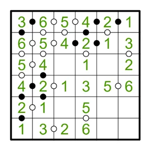
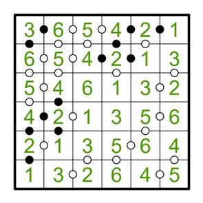

何夕老师为大家带来了一套由其编写的纸笔谜题，主题为 Blurred Vision。
**在这一套谜题中，每道题目都有若干线索不可见**，你需要在解题的同时，确定这些线索。

今天是该系列的第二题，纸笔类型为 Kropki。

{/* truncate */}

## Kropki 规则

在每个方格中填入一个数，使以下命题成立：

1. 题板每行列的数恰取遍 1 至 X，其中 X 为一行的方格数目；
2. 若两个方格间有黑点，则二者内数字的比例为 1:2；
3. 若两个方格间有白点，则二者内数字连续；
4. 若两个方格间没有点，则二者内数字既不连续，比例也不为 1:2。

所有黑白点已全标注，但是白点均不可见，已知题板每行每列均恰好包含两个白点（以交界处所处行/列为准）。注意如果1和2之间已经被黑点标记，就不能再被白点重复标记，反之亦然。

<AnswerCheck
    answer={'563653'}
    mitiType="zhibi"
    instructions="依次输入从右下到左上的对角线上方格包含的数字" 
/>

<Solution author={'Soliloquies'}>

    
查看步骤解析

    首先最简单的道理是，如果有两个连续的黑点，那么肯定是 1-2-4 序列（方向不定），以及 5 是不能处于黑点两侧。
    同时整个盘面对对角线对称，因此推理也是对称的。
    首先观察第一行第一列，均只相差两个白点，放置完之后思考可能的序列，只有 3-6-5-4-2-1 一种。而后我们可以通过黑点信息得到下图。

    

    
    

    而后由于第二行 6 和 3 之间是两倍关系，如果第二行第二列是 3，那么它和上面以及左边的 6 一定有黑点标记（全标）。
    但是没有，因此第二行第二列是 5。

    

    
    

    同理我们可以根据第五列 2 和 14 候选数之间没有黑点确定得到如下盘面。

    

    
    

    而后计算红框标注的格子，结合第四行/第四列的白点位可以得到下盘。

    

    
    

    考虑第三行/第三列，6 一定在第三个或者第五个格子，因此第四个格子不能是 3。同理 3 和 6 不能在没有黑点的地方相邻，得到如下盘面。

    

    
    

    算算第六行/第六列的白点数，很接近了！最后试试看两种可能情况得到最终结果。

    

    
    

**总结**

在本题中，除了已经给出的黑点和未显示的白点以外，“全标条件”也是非常重要的信息。
这意味着没有出现黑点的地方不能是相邻的 24 以及相邻的 36。
这种技巧有时也被称为**负面规则（Negative Rule）**。
类似的条件在一些数独题型中都有应用，例如连续数独（Consecutive Sudoku）、VX数独（VX Sudoku）、
钟面数独（Clockface Sudoku）、排序数独（Rossini Sudoku，有时又被称为罗西尼数独）等。具体的操作就交给各位自己探索啦～
</Solution>
