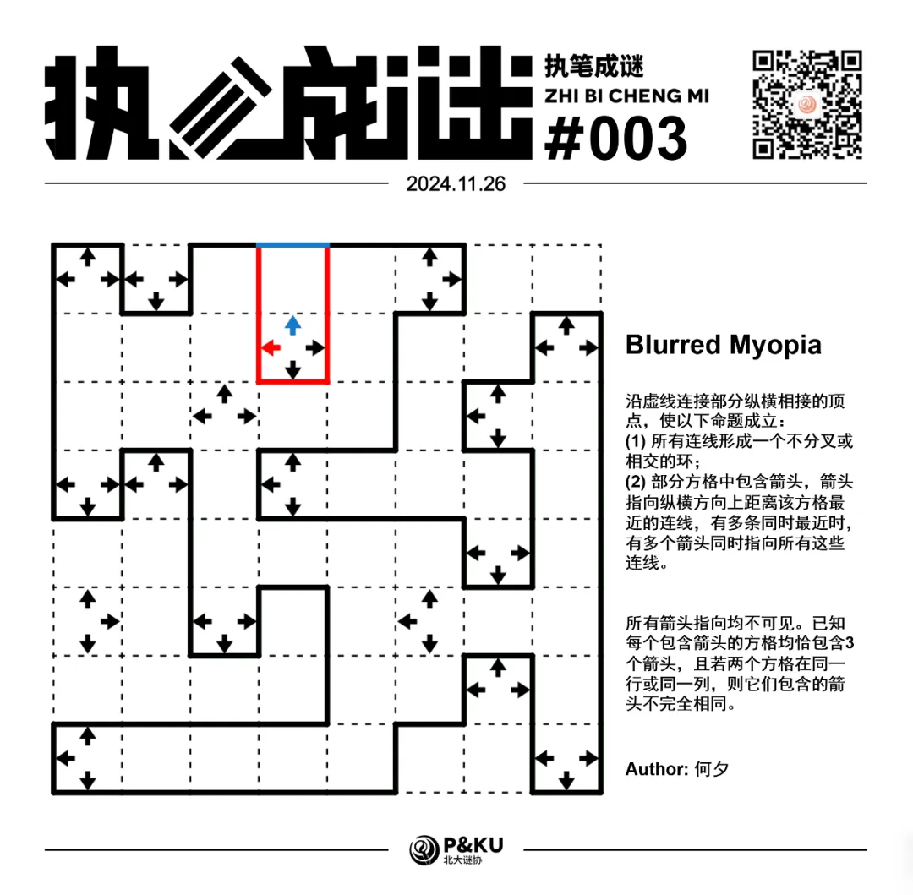

何夕老师为大家带来了一套由其编写的纸笔谜题，主题为 Blurred Vision。
**在这一套谜题中，每道题目都有若干线索不可见**，你需要在解题的同时，确定这些线索。

今天是该系列的第三题，纸笔类型为 Myopia。

{/* truncate */}

## Myopia 规则

沿虚线连接部分纵横相接的顶点，使以下命题成立：

1. 所有连线形成一个不分叉或相交的环；
2. 部分方格中包含箭头，箭头指向纵横方向上距离该方格最近的连线，有多条同时最近时，有多个箭头同时指向所有这些连线。

在本题中，所有箭头指向均不可见。
**已知每个包含箭头的方格均恰包含 3 个箭头，且若两个方格在同一行或同一列，则它们包含的箭头不完全相同**。

## 做题链接

你可以[在 penpa 网站上进行尝试](https://swaroopg92.github.io/penpa-edit/#m=edit&p=7ZXfb9owEMff+SsmP/shcQINeeu6shfWrYOpqqIIGUhL1IA7J1knI/73ni+RgsnxMqlbHybLp8vHh+/842vKn7XUGY+gBRH3uA8tCAV24Y2xe22b51WRxR/4ZV1tlAaH86+TCX+QRZkNkjYqHezNODa33HyOEyYYb3vKzW28N19iM+NmBkOM+8Cm4PmMC3CvO/cOx6131UDfA//G+h7jIfj34K9yvSqyxWzWTPUtTsycM5vpI/7eumyrfmWsmQS/V2q7zC1YygqWU27y53akrNfqqW5j/fTAzeX5goOuYOs2BVuvV3CzjqN6p29Q7jg9HGDjv0PBizixtf/o3KhzZ/Ee7A1aH+19vGdiBNMISOZsKBMXJA58Eodn8JDEQ0FjupIRHT0KaEynjDwa0ymjiMRjepW+F9Ic7ivNqb2F45jgoQi0czgzbgK0n9B6aIdopxhzjfYO7RXaEO0IYy7sqf/xvXijchIxwmema8O/+50OEnilWKmKRVnrB7kCxeEjBqICtqu3y0w7qFDquch3blz+uFM6I4cszNaPVPxS6fXJ7C+yKBzQPMoOau6JgyoND8PRt9RavThkK6uNA44eEWembFe5BVTSLVE+yZNs227NhwH7zbAnAexv+P8v4J/9BdhD8N6b4N9bOXh/lSbFD5jQP1BS5y3vSR14T9Q2YV/XQAlpAz1VN6C+wAH2NA7sjMztrKdKt1Wdit2m6undpjqWfJIOXgE=)

<AnswerCheck
  answer={'31031033'}
  mitiType="zhibi"
  instructions="依次输入从左上到右下的对角线上方格的四条边中处于环中的边的条数"
  exampleAnswer="1234..."
/>

## 解答

<Solution author={'Soliloquies'}>
  

</Solution>

### 步骤解析

查看步骤解析

<Carousel arrows infinite={false}>
    <CarouselInner>
        首先角上的未知箭头一定能至少确定两个。同时，左上角有个类似于数回中两个相邻 3 的结构。
        （同时根据同行同列箭头指向不重复可以得到一些额外信息：

        

            
        

    </CarouselInner>
    <CarouselInner>
        此时不妨观察**第 4 行第 1 列（简记为 R4C1，后同）**，假设它的“近视距离”不是相邻的边（即至少隔一个格子），
        那么我们很快就会得出如下矛盾（两个红色问号格子箭头指向一致）：

        

            
        

    </CarouselInner>
    <CarouselInner>
        于是依旧有类似于数回的相邻 3 定式（此处还需要简单列举第 4 行第 2 列的近视情况），得到下图：

        

            
        

    </CarouselInner>
    <CarouselInner>
        此时注意一下 R3C3 的“近视情况”，我们至少可以得到如下几步：

        

            
        

    </CarouselInner>
    <CarouselInner>
        

            
        

    </CarouselInner>
    <CarouselInner>
        注意右下角有一个类似于数回中两个对角 3 的定式，得到下图：

        

            
        

    </CarouselInner>
    <CarouselInner>
        在经过一些短 Trial 显而易见的矛盾之后，可以得到如下部分：

        

            
        

    </CarouselInner>
    <CarouselInner>
        

            
        

    </CarouselInner>
    <CarouselInner>
        对 R3C7 和盘面最上方的线头进行简要分析（类似于数回的 3），并且进一步沿伸得到盘面的下半部分：

        

            
        

    </CarouselInner>
    <CarouselInner>
        

            
        

    </CarouselInner>
    <CarouselInner>
        最后对 **R4C4** 进行分析，得到下图：

        

            
        

    </CarouselInner>
    <CarouselInner>
        此时离答案很近了，但是很不幸在最后一步出现了多解。在此代表出题人向各位读者表示歉意。两种答案如下：

        答案 1
        

            
        

    </CarouselInner>
    <CarouselInner>
        答案 2
        

            
        

    </CarouselInner>

</Carousel>

