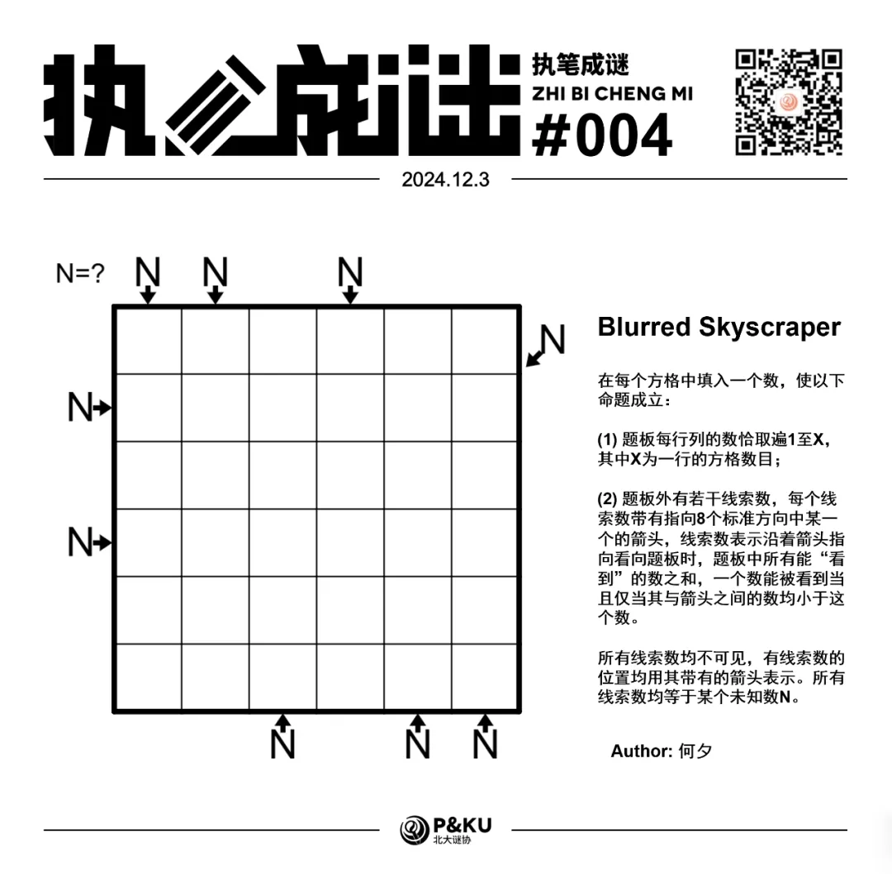
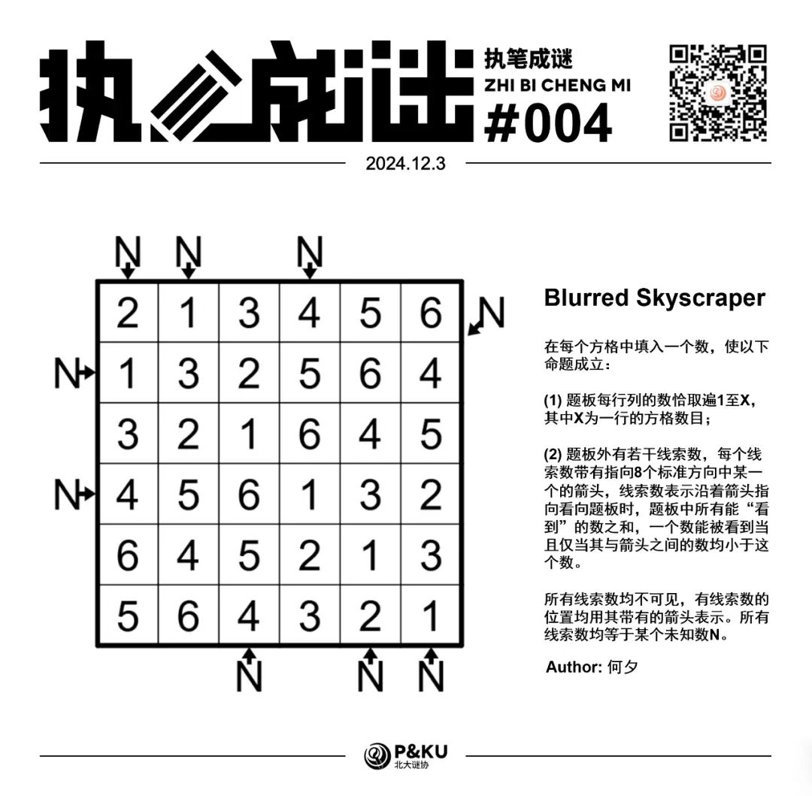

何夕老师为大家带来了一套由其编写的纸笔谜题，主题为 Blurred Vision。
**在这一套谜题中，每道题目都有若干线索不可见**，你需要在解题的同时，确定这些线索。

今天是该系列的第四题，纸笔类型为 Skyscraper (Diagonal, Sum)。

{/* truncate */}

## Skyscraper 规则

在每个方格中填入一个数，使以下命题成立：

1. 题板每行列的数恰取遍 1 至 X，其中 X 为一行的方格数目；
2. 题板外有若干线索数，每个线索数带有指向 8 个标准方向中某一个的箭头，线索数表示沿着箭头指向看向题板时，题板中所有能“看到”的数之和，一个数能被看到当且仅当其与箭头之间的数均小于这个数。

所有线索数均不可见，有线索数的位置均用其带有的箭头表示。**所有线索数均等于某个未知数 N**。

## 做题链接

你可以[在 penpa 网站上进行尝试](https://swaroopg92.github.io/penpa-edit/#m=edit&p=7VZda+NGFH33ryh6nof50OgLStmkSV9St2lSQjDGyI52Y1a2trLdLTL+73vujEb2SAqlhbL7UIyHe4/m3LmfI+3+OOR1wRKWMpUwzgR+KpRQONOhNn/e/h7X+7LIvmPvDvvXqobA2C+3t+x9Xu6KyazdNZ8cmzRr7lnzUzYLVMACaf5z1txnx+bnrHlgzQMeBUwAu4MkAiYh3lgx4ZCfzAZCry0qCJ1CjizvGWJe19XnxXRxZaFfs1nzyAI66crQSQw21Z9FYG0YfVVtlmsClvke4exe15/aJ7vDS/Xx0O4V8xNr3r3tsDo7TKL1l6S+v21w5O9qXa/KYnH3H7ibzk8nJP43OLzIZuT772cxOYsP2RHrNDsGMiLq9Psf4A1DVumpME+f8VSleBqxXoqDkAOOh7Ach8NROKLdQ9sRHQlXerAQdKYe4lIBVyO4fgOPR3CEe2uClmZ9RJZYo8z6o1m5WbVZ78yeG6RHpCGTHBmUaG0eMSkSK4uESQWHSVacScoMyZgoqZEOkjW4UcuNwI3gmJFjyK2dCHYoIUZOmYxbmzFsxqKVBeTWfkS4O4u4zgfYD1ubEueq9lwBf2TrDwdXWK5IcRa3XJEmDHorx5CtHZFGkK3PItWQrU3KCfRzTjj24BaBgsA4yFaBdxxWrYLjqL5GEeQHYrMKgiOnrAKOcBwBjnQcCY50HAmOdBxJEaJFrKJsuEahuijHUeAox1HgKMdR4KiOQ7lDbFbRNpFGocqGjhOCQ11vFXBCx8E1KsOOQ1Vx2QmRHSqRUag3tONocLTjaHC042hwdMdBdrTLjkZ2qPikmGp6GfUS4sXjueNZo3brzqE+7ELoPKDsdMFR4ru8UU1dSaihumpTR/l94JXRq4KXRC8HNCJddmh2usR3eaOadiWhdumqTZ3oGomauutR6mq/e73m83rHK71XORrrhOPCeDLXxrVZQ7NG5jqJ6Ur+R5f25RX9726uv3VnJjHd3g8T/jX1+WSGT4pgV5WL3aF+n6/wejRfHHgDAtseNsui9qCyqj6V662/b/1hW9XF6CMCi5cPY/uXVf3Ss/45L0sPsF9QHmRf9B60r/EWv9DNW8hDNvn+1QMu3viepWK79x3Y576L+ce8d9rmHPNpEvwVmD9ehoKF/3+vfbXvNSoC/9YugG/NHdO/VT06/IBH5h/o6Jy3+GDUgQ+Gmg4czjXQkdEG2p9uQMMBBziYcWBvjDlZ7U86edUfdjpqMO901OXIz+aTLw==)

<AnswerCheck
  answer={'546666'}
  mitiType="zhibi"
  instructions={
    
      依次输入从左下到右上↗的对角线经过的方格包含的数字
    
  }
  exampleAnswer="1234..."
/>

## 解答

<Solution author={'何夕'}>
  

</Solution>

### 步骤解析

查看步骤解析

<Carousel arrows infinite={false}>
    <CarouselInner>
        首先想必各位都能意识到我们需要决定 N 的取值。
        观察最上方的 3 个箭头，意味着我们需要考虑至少存在 3 个首个数字不同的，同时和相同的递增数列。
        同时注意最后一位必须是 6。此处我们大概列举一下：

        

            
        

        因此 N 的取值只能是 11，13 或者 15。
    </CarouselInner>
    <CarouselInner>
        首先看 N=11 的情形，我们先通过交换部分列的顺序，让 6 按下图的方式排布以便分析。
        显然第一及第六列的箭头如图所示，且必然会看到 5，因此这两列的分解方式必然是 56。
        但此时第二列无论哪个方向都无法恰看到和为 11 的数。故这种情形不成立。

        

            
        

    </CarouselInner>
    <CarouselInner>
        接下来看 N=13 的情形。我们同样先通过交换部分列的顺序，让 6 按下图的方式排布。
        第一、二、五、六列只能从图示的方向看到和为 13 的数，且由于第一及第六列能看到 5，故必然以 2 开始。
        由于只有一种包含 5 的分解方式，故第二及第五列不能看到 5。此时第一及第六行的 4 只能放在灰色格子中。
        但剩余的分解方式均包含 4，且均不以 4 开始，故这两列无法看到和为 13 的数，这种情形也不成立。

        

            
        

    </CarouselInner>
    <CarouselInner>
        因此 N 只能为 15。我们同样先通过交换部分列的顺序，让 6 按下图的方式排布。
        对于从上方看到 1356 的那一列，3 必然出现在第二行，故看到 2346 那一列的 3 只能出现在第三行，那一列的数字排布只能是 213465。
        由此得到下图。

        

            
        

    </CarouselInner>
    <CarouselInner>
        假设从上放看去 1356 位于第三列，则得到下图，此时最后一列的三个箭头中一个会首先看到 3，无法成立。

        

            
        

    </CarouselInner>
    <CarouselInner>
        由此得到 1356 位于第一及第六列，456 位于第三及第四列。通过简单分析并可能地再次交换第三及第四列得到下图。

        

            
        

    </CarouselInner>
    <CarouselInner>
        接下来回到原来的盘面。

        

            
        

    </CarouselInner>
    <CarouselInner>
        对于圆中的数字，只能是 135 中的某一个。
        由于它需要是某种分解方式中的首位，故其只能为 1，分解方式为 1356，由此得到第一、二、六列的顺序。
        对于正方形中的数字，其只能是 246 中的某一个。由于其不能被看见，故其为 2。
        由此得到前四列的顺序。最后通过剩余的两个箭头即可填完盘面。

        

            
        

    </CarouselInner>

</Carousel>

