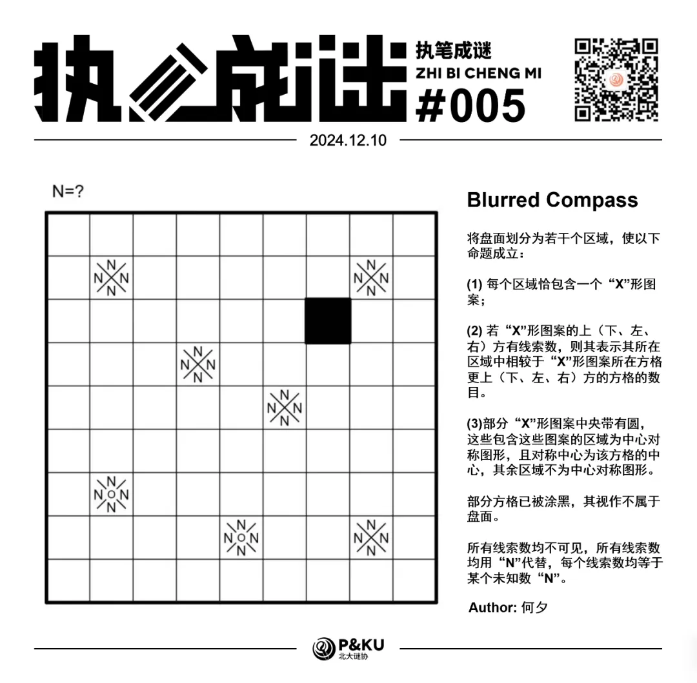
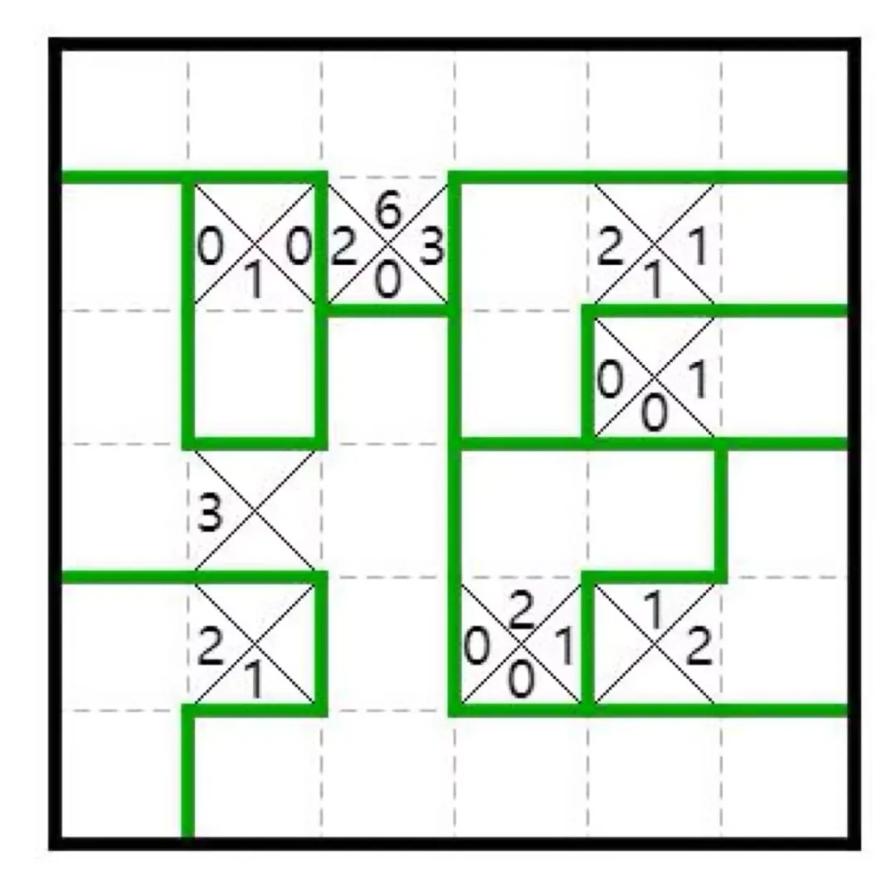
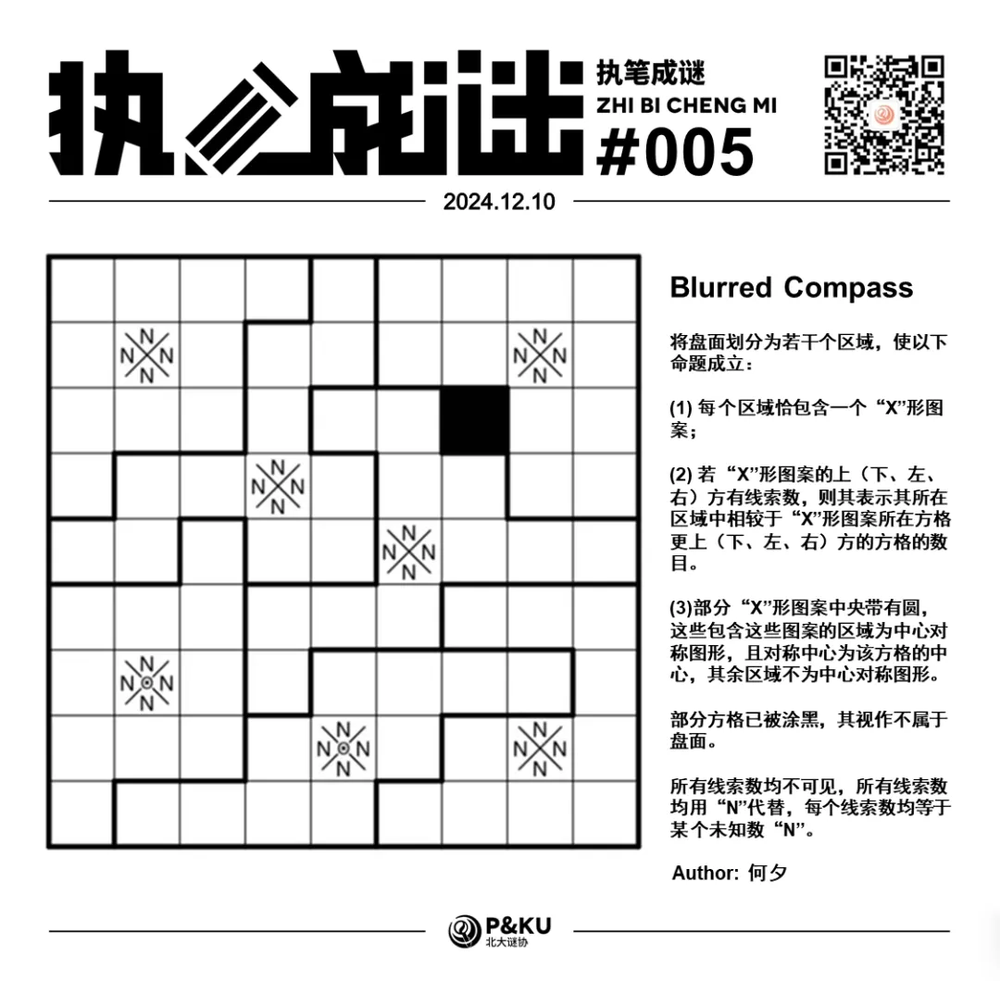

何夕老师为大家带来了一套由其编写的纸笔谜题，主题为 Blurred Vision。
**在这一套谜题中，每道题目都有若干线索不可见**，你需要在解题的同时，确定这些线索。

今天是该系列的第五题，纸笔类型为 Compass。

{/* truncate */}

## Compass 规则

将盘面划分为若干个区域，使以下命题成立：

1. 每个区域恰包含一个 “X” 形图案；
2. 若 “X” 形图案的上（下、左、右）方有线索数，则其表示其所在区域中相较于 “X” 形图案所在方格更上（下、左、右）方的方格的数目。下图是一个例子：
   

3. 部分 “X” 形图案中央带有圆，这些包含这些图案的区域为中心对称图形，且对称中心为该方格的中心，其余区域不为中心对称图形。

部分方格已被涂黑，其视作不属于盘面。

**所有线索数均不可见，所有线索数均用 “N” 代替，每个线索数均等于某个未知数 “N”。**

## 做题链接

你可以[在 penpa 网站上进行尝试](https://swaroopg92.github.io/penpa-edit/#m=edit&p=7VVNb5tMEL77V1R73gNfHwu3JI3fi5s2jasoQsjCNolRsDdd4E2E5f+emQUVBqjUS1QfqjWjmWd3Z5/B+wzFzypRKQ9g2IIb3IRhC0M/wsGf0Y5lVuZp+IlfVOVOKnA4/zqf88ckL9JZ1K6KZ8c6COtbXv8XRsxknFnwmCzm9W14rL+E9R2v72CKcQewRbPIAve6c+/1PHpXDWga4N+AH4AP7gO48m112UTfwqhecoZnXOqd6LK9/D9lLQeMN3K/zhBYJyUUUuyyl3amqLbyuWrXmvGJ1xcDqnhKS9XuqKLbUEVvSLWtBaluMrXJ09XiA+gG8ekEr/w7EF6FEXL/0bmic+/CI/MMFjrg34RHsCYgpmsBFrEbzQxDk4YWDW0SOg4NXRp6NPT7oWeTzJ5NMns2yezZJLMX0L0B3RvQvQHZ6wtSry9Ivb4gmX1BMgtar6D1ClqvoPUKl866g1lBw+BXCH/UA/xRDhLzeXfpmYNbCOJjaQQRyJAgpoEHU0j/qwMI2fYgYDHXl8bSdgl3ite2tp+1NbR1tV3oNdfa3mt7pa2jrafX+Hgr//De9m9s8zo+iE5kCd3++sM9LySeRdBhWSHzVVGpx2QDPUM3YGgLgB2q/TpVBMqlfMmzA12XPR2kSienEEy3T1Pr11JtB9lfkzwnQPM5IVDT/QhUKmhtvThRSr4SZJ+UOwL02iDJlB5KSqBMKMXkORmctu9qPs3YG9NPZMP7df59vv7C5wtfv3FuzeDc6OibK9Wk7AGeUD6gkwpv8ZHIAR/JGQ8cKxrQCVEDOtQ1QGNpAzhSN2C/EThmHWocWQ1ljkeNlI5H9cUexbN3)

<AnswerCheck
  answer={'111111121212111111'}
  mitiType="zhibi"
  instructions="依次输入从左上到右下的对角线上的每个方格所在区域的面积；面积均用两位数字表示，属于同一个区域的不同格子仍需要分别输入"
  exampleAnswer="10101505..."
/>

## 解答

<Solution author={'何夕'}>
  

</Solution>

### 步骤解析

查看步骤解析

<Carousel arrows infinite={false}>
    <CarouselInner>
        容易观察到 N=4，无论 N 大 1 还是小 1 都能在盘面第一行迅速导致矛盾。

        在 N=4 的情形下，对盘面位于边上方格归属进行分析，容易得到下图（图中被线连接的方格属于同一区域，标有相同字母的方格属于同一区域。

        

            
        

    </CarouselInner>
    <CarouselInner>
        对于 A 区域，它在左方及上方延伸出的方格为了到达盘面边上的方格，必须在两个被虚线框出的部分之中之中。因此左上方的区域形状被确定下来。

        

            
        

    </CarouselInner>
    <CarouselInner>
        对于右上方的区域，若两个 X 格中任意一个不属于它，都会导致其无法向对应方向继续延伸至 4 格。由此右上方区域也被确定下来。

        

            
        

    </CarouselInner>
    <CarouselInner>
        对于左下方的区域，在考虑对称后有下图。

        

            
        

    </CarouselInner>
    <CarouselInner>
        剩余区域边界容易得到正确答案——

        

            
        

    </CarouselInner>
    <CarouselInner>
        PS. 如果在做题过程中不小心忽略了区域旋转对称的要求，会出现第二个解如下。

        

            
        

    </CarouselInner>

</Carousel>

