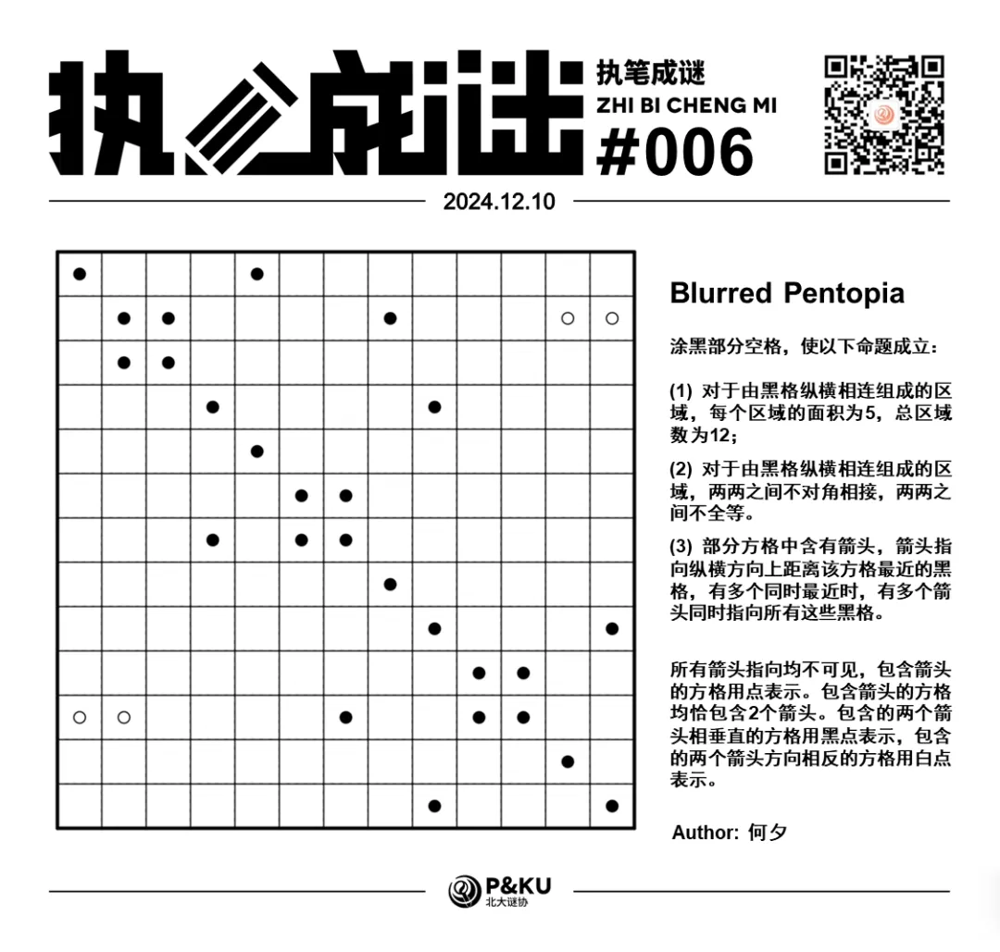
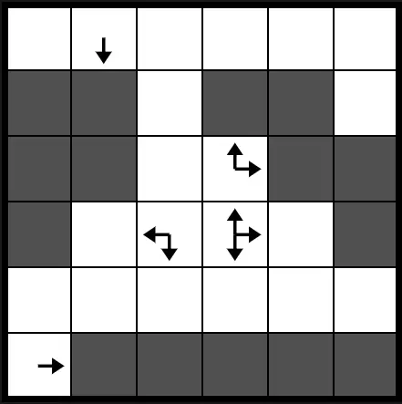
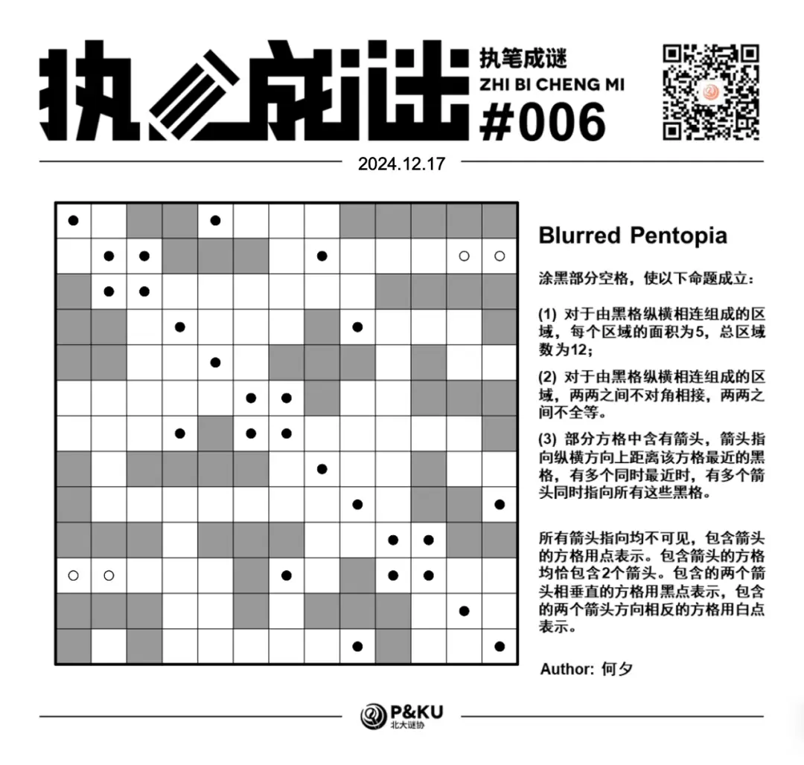

何夕老师为大家带来了一套由其编写的纸笔谜题，主题为 Blurred Vision。
**在这一套谜题中，每道题目都有若干线索不可见**，你需要在解题的同时，确定这些线索。

今天是该系列的第六题，纸笔类型为 Pentopia。

{/* truncate */}

## Pentopia 规则

涂黑部分空格，使以下命题成立：

1. 对于由黑格纵横相连组成的区域，每个区域的面积为 5，总区域数为 12；
2. 对于由黑格纵横相连组成的区域，两两之间不对角相接，两两之间不全等。
3. 部分方格中含有箭头，箭头指向纵横方向上距离该方格最近的黑格，有多个同时最近时，有多个箭头同时指向所有这些黑格。

下图是一个例子（不过不满足“总区域数为 12”的规则）：

在本题中，所有箭头指向均不可见，包含箭头的方格用点表示。包含箭头的方格均恰包含 2 个箭头。
包含的两个箭头相垂直的方格用黑点表示，包含的两个箭头方向相反的方格用白点表示。

## 做题链接

你可以[在 penpa 网站上进行尝试](https://swaroopg92.github.io/penpa-edit/#m=edit&p=7ZbPb5swFMfv+Ssmn33A5kcCt65tdsm6dclUVQhFJKENKok7A+tElP+9zw8kArxcKlXroSI8vXzsPH/t+IvJ/5SxTriwzceecIsLuFxb4i0cB2+ruRZpkSXBF35RFlulIeH8x3TKH+IsT0Zh0ysaHSo/qG559S0ImWCcSbgFi3h1Gxyq70E159UcmhgXwGZ1JwnpdZveYbvJLmsoLMhvIPfrn91Duk71OkuWs5r8DMJqwZkZ5yv+2qRsp/4mrNFhvq/VbpUasIoLmEy+TZ+blrzcqKey6SuiI68uzsu1W7kmreWarC+3mc87y/Wj4xGW/RcIXgah0f67TSdtOg8OEG8wCoz3wYHZHpSRMFgtcD5HhcyxSOw6NHZJ7NFFPFNEDLEpMsRjQRYZSxL79JA+LVBYE5pLelWEHNPcoUUKxz7D6XUUHj0rMaGnJSZn6vhn5uX7JJeWme9w7aVl5ktwQeuUgl5nKej1lDatXzq0fulS48JOnuJ+lhgXsN15ZWO8wmhhdDHOsM81xjuMlxgdjB72GRvDvNlS7yQntD18PlOX+9nylpZoFMKBxXKVLfNSP8RrePzieQZPWGD7crdKdAdlSj1n6b7bL33cK52QTQYmm0eq/0rpTa/6S5xlHVCf0B1U7/wOKjScEiffY63VS4fs4mLbAScnSqdSsi+6Aoq4KzF+inuj7do5H0fsH8M7hHcK7ny+DfyntwHzF1gf7QH20eTg7lWatD5gwv1ASZc3fGB04ANLmwGHrgZKGBto39uAhvYGOHA4sDMmN1X7Pjeq+lY3Qw3cboY6NXwYjV4B)

<AnswerCheck
  answer={'BBWWWBWBBWBWB'}
  mitiType="zhibi"
  instructions={
    
      依次输入从左下到右上↗的对角线上方格的颜色，黑/白色用 “B/W” 表示
    
  }
  exampleAnswer="BWB..."
/>

## 解答

<Solution author={'何夕'}>
  

</Solution>

### 步骤解析

查看步骤解析

<Carousel arrows infinite={false}>
    <CarouselInner>
        首先介绍两个常用结论：

        一、由五个方格纵横相连形成的图案共有 12 种情形，其中经过旋转及翻折后相同的视作一种。每个形状都有一字母与之对应。对应关系如下：

        

            
        

    </CarouselInner>
    <CarouselInner>
        二、对于在盘面中放置不得纵横或对角相接的图案的谜题，实际上是要求每一个图案覆盖的顶点之间不重合。
        比如在本题使用的 12 个图案中，有 11 个消耗 12 个顶点，只有 P 消耗 11 个顶点，共计消耗 143 个顶点。

        

            
        

    </CarouselInner>
    <CarouselInner>
        接下来开始解题。容易得到下图。注意到图形之间不能对角相接，故位于对角线上对角相接的两个方格不能同时涂黑。

        

            
        

    </CarouselInner>
    <CarouselInner>
        出于篇幅的原因，这里直接假设下图中正方形处涂黑。实际上如果这里不涂黑的话，会立即得到左上方许多位置无法涂黑，最终发现无法放置所有图形。
        为了使第二行第三列的黑点成立，需要出现与之纵横相接的黑格，由此得到下图。

        

            
        

    </CarouselInner>
    <CarouselInner>
        接下来考虑左上方的黑点，得到下图。

        

            
        

    </CarouselInner>
    <CarouselInner>
        由于 N 已经出现，假设下图中正方形处涂黑，两个延伸之后形状均为 W，得到矛盾。

        

            
        

    </CarouselInner>
    <CarouselInner>
        接下来我们默认下图正方形处涂黑，延伸后得到下图。两个图形只能一个是 F，一个是 W。

        

            
        

    </CarouselInner>
    <CarouselInner>
        但是如果左下的是 W 的话，会立即发现它左侧的黑点无法成立，因此只能左侧的是 F，右侧的是 W，且 F 左侧的黑点有两个纵横相接的方格被涂黑。

        

            
        

    </CarouselInner>
    <CarouselInner>
        接下来我们再次默认下图中正方形处被涂黑，由于 F 已经出现，其形状只能为 Y，得到下图。

        

            
        

    </CarouselInner>
    <CarouselInner>
        接下来分析两圆处的涂黑情形。假若均不涂黑，其下方的黑格只能延伸成 W 或 N，但均已出现；
        假若恰涂黑一个，则或导致这个区域还要再延伸至大小为 6 才能黑点成立。因此两处均被涂黑，该区域为 X。

        

            
        

    </CarouselInner>
    <CarouselInner>
        随后分析右上角区域形状。如果它为 L 则会导致左侧黑点无法成立，因此其形状只能为 I。

        

            
        

    </CarouselInner>
    <CarouselInner>
        通过简单的分析，右侧区域必须放置两个图形。由此得到下图，其中红色方格及蓝色方格恰涂黑一组。由于 Y 已经出现，故应当涂黑蓝色方格。

        

            
        

    </CarouselInner>
    <CarouselInner>
        最后从上到下依次确定每个图形的形状，得到答案。

        

            
        

    </CarouselInner>

</Carousel>

