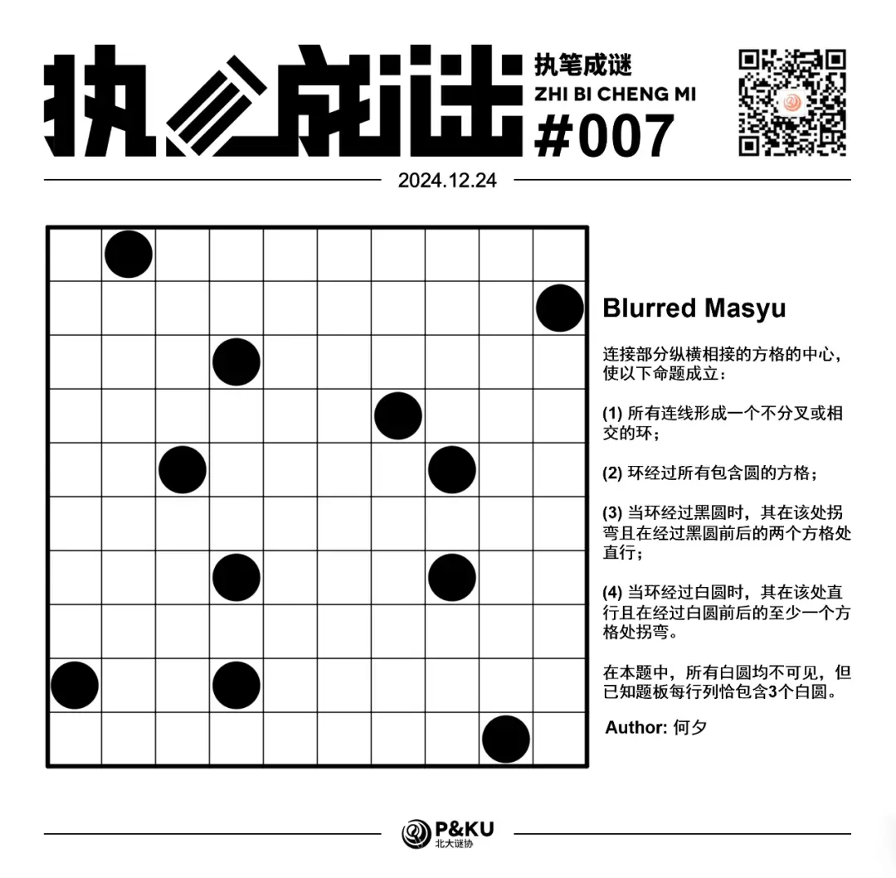
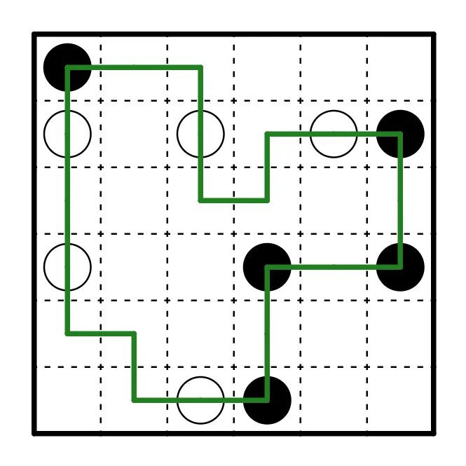
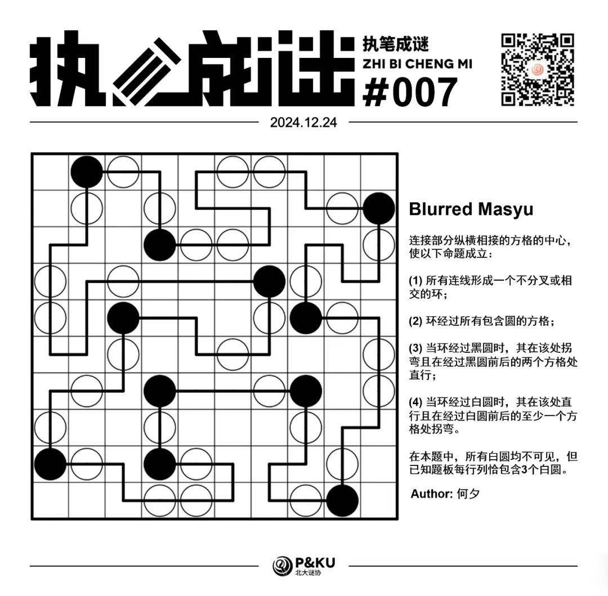

何夕老师为大家带来了一套由其编写的纸笔谜题，主题为 Blurred Vision。
**在这一套谜题中，每道题目都有若干线索不可见**，你需要在解题的同时，确定这些线索。

今天是该系列的第七题，纸笔类型为 Masyu。

{/* truncate */}

## Masyu 规则

连接部分纵横相接的方格的中心，使以下命题成立：

1. 所有连线形成一个不分叉或相交的环；
2. 环经过所有包含圆的方格；
3. 当环经过黑圆时，其在该处拐弯且在经过黑圆前后的两个方格处直行；
4. 当环经过白圆时，其在该处直行且在经过白圆前后的至少一个方格处拐弯。

下图是一个例子：

**在本题中，所有白圆均不可见，但已知题板每行列恰包含 3 个白圆。**

## 做题链接

你可以[在 penpa 网站上进行尝试](https://swaroopg92.github.io/penpa-edit/#m=edit&p=7VVNb5tMEL77V1R73gNfHwu3JI3fi5s2jasoQsjCNolRsDdd4E2E5f+emQUVBqjUS1QfqjWjmWd3Z5/B+wzFzypRKQ9g2IIb3IRhC0M/wsGf0Y5lVuZp+IlfVOVOKnA4/zqf88ckL9JZ1K6KZ8c6COtbXv8XRsxknFnwmCzm9W14rL+E9R2v72CKcQewRbPIAve6c+/1PHpXDWga4N+AH4AP7gO48m112UTfwqhecoZnXOqd6LK9/D9lLQeMN3K/zhBYJyUUUuyyl3amqLbyuWrXmvGJ1xcDqnhKS9XuqKLbUEVvSLWtBaluMrXJ09XiA+gG8ekEr/w7EF6FEXL/0bmic+/CI/MMFjrg34RHsCYgpmsBFrEbzQxDk4YWDW0SOg4NXRp6NPT7oWeTzJ5NMns2yezZJLMX0L0B3RvQvQHZ6wtSry9Ivb4gmX1BMgtar6D1ClqvoPUKl866g1lBw+BXCH/UA/xRDhLzeXfpmYNbCOJjaQQRyJAgpoEHU0j/qwMI2fYgYDHXl8bSdgl3ite2tp+1NbR1tV3oNdfa3mt7pa2jrafX+Hgr//De9m9s8zo+iE5kCd3++sM9LySeRdBhWSHzVVGpx2QDPUM3YGgLgB2q/TpVBMqlfMmzA12XPR2kSienEEy3T1Pr11JtB9lfkzwnQPM5IVDT/QhUKmhtvThRSr4SZJ+UOwL02iDJlB5KSqBMKMXkORmctu9qPs3YG9NPZMP7df59vv7C5wtfv3FuzeDc6OibK9Wk7AGeUD6gkwpv8ZHIAR/JGQ8cKxrQCVEDOtQ1QGNpAzhSN2C/EThmHWocWQ1ljkeNlI5H9cUexbN3)

<AnswerCheck
  answer={'NYNYYYYYYN'}
  mitiType="zhibi"
  instructions={
    
      依次输入从左上到右下↘的对角线上方格是否被环经过，是/否用 “Y/N” 表示
    
  }
  exampleAnswer="YNY..."
/>

## 解答

<Solution author={'何夕'}>
  

</Solution>

### 步骤解析

查看步骤解析

<Carousel arrows infinite={false}>
    <CarouselInner>
        首先正常开局，图中绿色表示不是白圆的部分（无论是由于不满足白圆要求或是其所在行列已经有三个白圆）。

        

            
        

    </CarouselInner>
    <CarouselInner>
        注意到在 Masyu 中靠边的连续四格中无法出现三个白圆。
        因为这要门导致连续三个白圆被串在一起，要么导致下图这种情形，其中中间的圆两端均无法拐弯。

        

            
        

    </CarouselInner>
    <CarouselInner>
        对图中每条边进行分析，知其最靠边的白格必包含白圆。得到下图：

        

            
        

    </CarouselInner>
    <CarouselInner>
        第 7 行第 4 列（简记为 R7C4，下同）的黑圆不能向左延伸，否则会形成小环，由此得到下图：

        

            
        

    </CarouselInner>
    <CarouselInner>
        如果 R4C7 的黑圆向上延伸，会立即导致下图所示情形。此时第二行只有两个位置可以放白圆，不成立。

        

            
        

    </CarouselInner>
    <CarouselInner>
        由此知应为下图所示情形。

        

            
        

    </CarouselInner>
    <CarouselInner>
        接下来再假设 R3C4 的黑圆向下延伸。此时第二行的白圆无论放在第 4 列还是第 6 列都会导致左上方出现小环，矛盾。

        

            
        

    </CarouselInner>
    <CarouselInner>
        接下来按照 Masyu 规则简单分析得到下图：

        

            
        

    </CarouselInner>
    <CarouselInner>
        对白圆的位置进行分析得到下图：

        

            
        

    </CarouselInner>
    <CarouselInner>
        为了让中间的线能够连到周围的大环上，R5C3 的黑圆就不能向左延伸，由此得到下图：

        

            
        

    </CarouselInner>
    <CarouselInner>
        对白圆所在位置进行分析，得到下图：

        

            
        

    </CarouselInner>
    <CarouselInner>
        为了第 5 行可以再放置一个白圆，这行的线头需要继续向下延伸，得到最终答案：

        

            
        

    </CarouselInner>

</Carousel>

