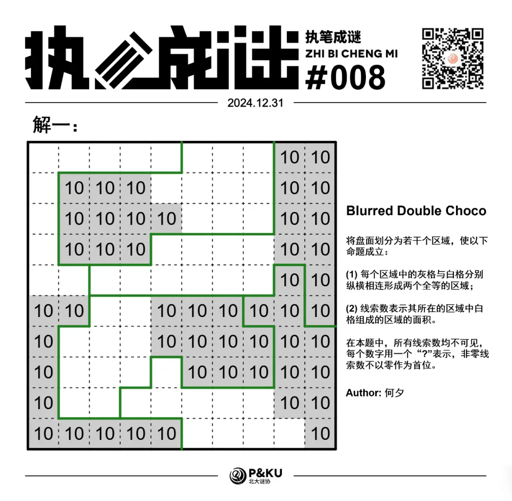

何夕老师为大家带来了一套由其编写的纸笔谜题，主题为 Blurred Vision。
**在这一套谜题中，每道题目都有若干线索不可见**，你需要在解题的同时，确定这些线索。

今天是该系列的第一题，纸笔类型为 Double Choco。

{/* truncate */}

## Double Choco 规则

将盘面划分为若干个区域，使以下命题成立：

1. 每个区域中的灰格与白格分别纵横相连形成两个全等的区域；
2. 线索数表示其所在的区域中白格组成的区域的面积。

下图是一个例子：

**在本题中，所有线索数均不可见，每个数字用一个“?”表示，非零线索数不以零作为首位。**

## 做题链接

你可以[在 penpa 网站上进行尝试](https://swaroopg92.github.io/penpa-edit/#m=edit&p=7ZbfT9s6FMff+1dc+dkPdtz0R14QY7AXxrYLE0JRhdISoCJtWNoOlKr/O+eHpxIfT7rSpI1JV23sk4/tc45jfxOvvm2KptTW4N+NNNTw69sRXcloQJfxv4v5uiqzf/ThZn1fN2Bo/enkRN8W1ars5b7XpLdtx1l7qNsPWa4SpemyaqLbL9m2/ZipWb2YzpVuz6FdaQcNp2BZpRMwj/fmJbWjdcTQGrDP0DZwA/YV2LN5M6vK61Mmn7O8vdAKo72j4WiqRf29VOyD7jkDANV8WT57uNrc1A8b381Odro9jOWLUXy+mLrPF03OFy2RL0/jl9Mtb+7i6Y4nux08938h4essx9y/7s3R3jzPtsqNVOa0cmOq+ilXA66GVKUJV44r7jkwXFmuuMuAxw143JAHDPtcsesRjxvxuDG3jbnNGm60hlut4WZrfrSzf2s4gDWcvDWck7W+v/Xcep54v4n3m3C6NuEMbeL7O3/vvB/n4zof1/m4fT8+9X5T7zf1/VLfL/V+/TOz/qHZAfqFBTjzC5CrgwPYAjgTXExcjADhwoQIgoUI4gYIFy9EMMsQyYiYa4hgmiGS7nEThEjmhZsjRPDUQySnjRsoRDIv3Fghkr5owwkmvdFGFCzmT86dNqtgctFpE4cMN7RgkbG40UOGm16wyNxQDILJ1SGRhAwFI1gkZxSSYJFnhQILGYotZCg8wSJzQ0EKFomBQhUs8kwjoiAxdxgI22ZbKK+oPKEyofICXry6dVS+p9JQmVJ5Sn2Oqbyk8ojKPpUD6jPEV/d/fLnzG+Y3pJM7Pip0f+nfxya9HE4salVX16tNc1vM4MtLBxr4wgJbbhbTsumgqq4f8dzQgfO7Zd2U0SaE+OGO9J/WzU3g/amoqg7gI1oH8Rmig9YNHBBe3RdNUz91yKJY33fAtFjDcW51P3/seiqX624C66KbYvFQBNEW+znveupZ0ZU7PEr+fxz8U8dBXAPz1t4bby0d2r51E9U+4Ij8gUZl7rlQOnChaQwoZQ00omygobgBSX0DFBIH9hOVo9dQ6JhVqHUMJeSOoV4rPp/0XgA=)

<AnswerCheck
  answer={{
    '2222332421': {
      type: 'CORRECT',
      message: '恭喜你完成了这道纸笔谜题！',
    },
    '1222332421': {
      type: 'CORRECT',
      message: '恭喜你完成了这道纸笔谜题！',
    },
  }}
  mitiType="zhibi"
  instructions={
    <markdown>
      依次输入<u>从上到下每一行</u>的分割次数（若左右相邻的两格不属于同一区域，则该行分割次数 +1）
    </markdown>
  }
  exampleAnswer="122222"
/>

## 解答

<Solution author={'怎苏昂'}>

</Solution>

### 步骤解析

查看步骤解析

<Carousel arrows infinite={false}>
    <CarouselInner>
        首先根据所有面积都是两位数，可以得到灰色格子的块面积至少是 10。相对应的，所有白色格子的块面积也至少是 10。至少有如下的形状：

        

            
        

    </CarouselInner>
    <CarouselInner>
        其中，左下角的块可以看作一个边长是 5 的 L 形加上一个面积为 1 的小块。而为了保证其它白色方块不被分割为面积小于 10 的块，L 形必须被放置在左上角。

        同时根据左上角灰色的 10 块，是一个 3x3 的方块多出来了一块。类似于拼拼图可以得到两种情况：

        情况 1

        

            
        

    </CarouselInner>
    <CarouselInner>
        情况 2

        

            
        

    </CarouselInner>
    <CarouselInner>
        最后注意剩余白色块面积至少为 10，类似于拼拼图一样可以得到最终的两个解：

        

            
        

    </CarouselInner>
    <CarouselInner>
        

            
        

    </CarouselInner>

</Carousel>

（上一期出现了多解，代表作者在这里向各位致歉）

## 总结

Double Choco 是一个比较有趣的题型。
在本题中，对于大面积的块的分析依赖于块本身的最大长度和宽度，以及 3x3 的集中区域分析。
通过这些就可以大致确定另外一种颜色的块所处的位置，拼凑得出最终的解。
