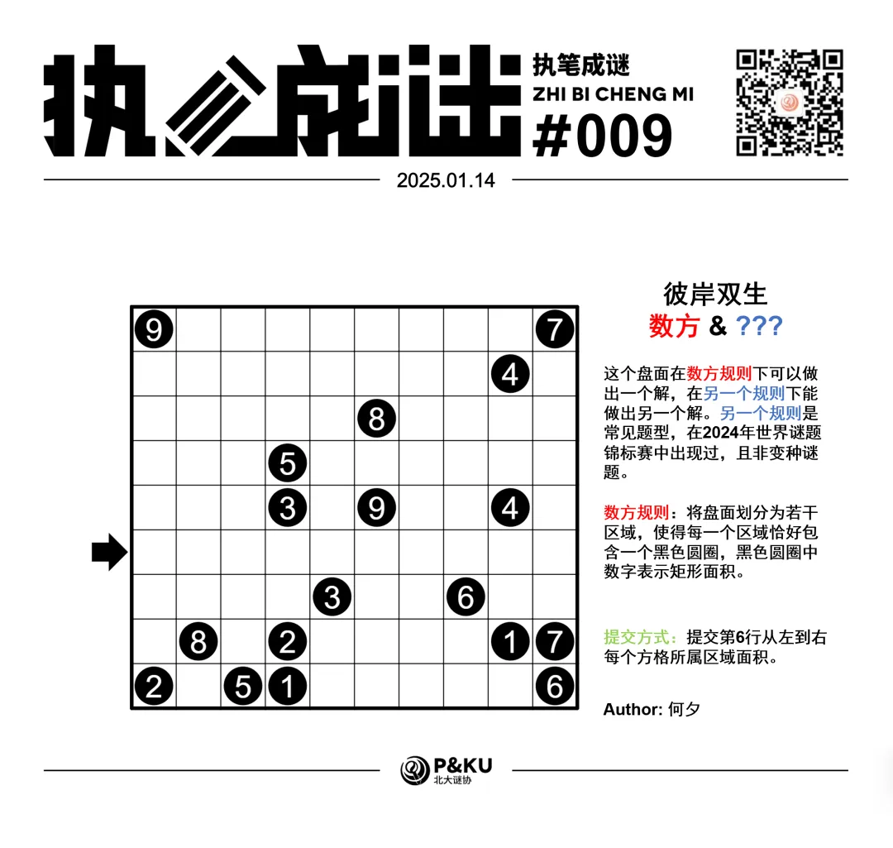
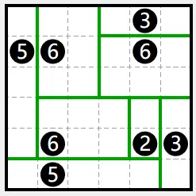
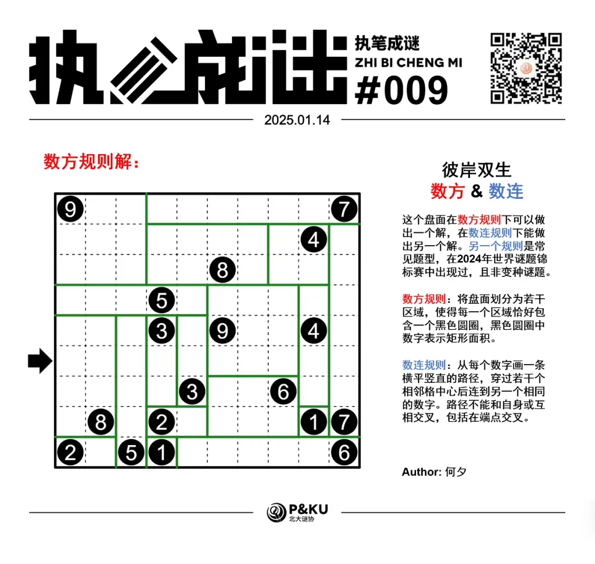
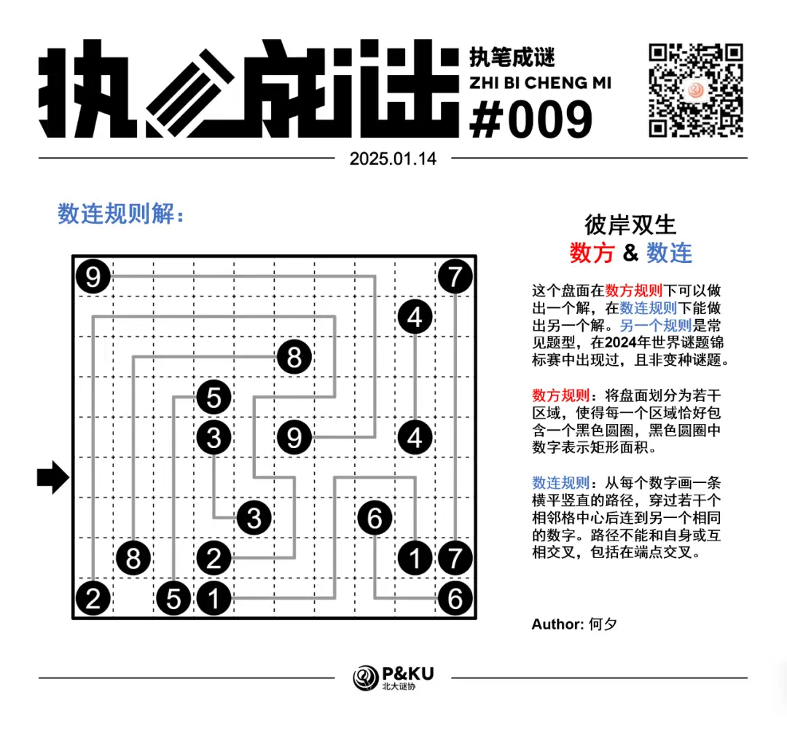

何夕老师为大家带来了一套由其编写的纸笔谜题，主题为 Hidden Twins（彼岸双生）。
**在这一套谜题中，每道题目在原规则盘面能得到一个解的同时，在另一个规则下能得到另一个解，**
你需要在解出原题之后，确定被隐藏的规则，并且以隐藏的规则再解一遍。

今天是该系列的第一题，原规则盘面的纸笔类型为**数方**。

{/* truncate */}

## Shikaku 数方规则

将盘面划分为若干区域，使得每一个区域恰好包含一个黑色圆圈，黑色圆圈中数字表示矩形面积。如下所示是一个已经完成的盘面例子：

另一个规则能保证在 2024 年世界谜题锦标赛中出现过。
你可以查看 [2024 年世界谜题锦标赛题型的英文版说明链接](https://ectoplsm.github.io/wpc-unofficial.org/pdfs/WPC%202024.pdf)。

## 做题链接

你可以[在 penpa 网站上进行尝试](https://swaroopg92.github.io/penpa-edit/#m=edit&p=7ZRLj9owEMfvfIrKZx9i8oDkBlvohdLHUq1WUYQCZJdoA946SbcK4rvvzARt7CQ99LAqhyowmvzs8Ywd/yf/WcYq4UJwn9tjbnEBj+N68GJxf4Q/6/Ks0iJLgg98UhZ7qcDh/Mt8zh/iLE8GIc4Q3IoGp8oPqgmvPgUhGzJOf8EiXn0LTtXnoFry6haGGBfAFuAJxofgzhr3jsbRu6mhsMBf1v4I3HtwY6Xky3q6ntYrfQ3CasUZJppSOLrsIH8lrI6j9608bFIEm7iA3eT79Pkykpc7+VRe5orozKtJXe+sp167qRfdul70eurFbWC921Rts2S9eIdy/eh8hnP/DgWvgxBr/9G448a9DU5gl8GJ2TaG+nCa9cdhzhDBqAGuh8BpgDdGMG7AWCBwG+BTiK0BCtGyCItitFXFcNQKEraFxNOJ30otHFoHrlZDKDnejzdCK2tbEi7tWo9y3dYeRL1vfR2PjuatHjhBQed4D+coLEzicvM2wuCcpgzJruD0eWWT/UjWIuuSXdCcGdk7sjdkHbIezRnh9/urL6xX+U7lhLZN3cJ8vOtm0SCEFsVyma3zUj3EW9AbdTCQFLBjedgkykCZlM9ZejTnpY9HqZLeIYTJ7rFv/kaqXWv1lzjLDFA3ZAPVncNAhYK2oL3T9TPIIS72BtBaiLFScizMAorYLDF+ilvZDs2ezwP2m9E/xNvg/O///6r/4zewrq1HXFs5dH2l6tU+4B75A+2V+YV3lA68o2lM2JU10B5lA22LG1BX3wA7Egf2B5Xjqm2hY1VtrWOqjtwxla74MBq8Ag==)

<AnswerCheck
  answer={{
    '8853399947': {
      type: 'CORRECT',
      message: '恭喜你完成了这道纸笔谜题（的一半）！',
    },
    '2853221117': {
      type: 'CORRECT',
      message: '恭喜！你找到了这道纸笔谜题的另一半！',
    },
  }}
  mitiType="zhibi"
  instructions={
    
      依次输入第六行从左到右每个格子所属“区域”对应的数字
    
  }
  exampleAnswer="555553"
/>

## 隐藏规则

    
隐藏规则

    **数连（Numberlink）**

    从每个数字画一条横平竖直的路径，穿过若干个相邻格中心后连到另一个相同的数字。路径不能和自身或互相交叉，包括在端点交叉。

## 解答

<Solution author={'怎苏昂'}>

</Solution>

### 步骤解析

查看步骤解析

<Carousel arrows infinite={false}>
    <CarouselInner>
        题目本身难度不高，对于数方规则，容易确定右下角的 6 和 7 和左上角的 7 均为一格宽的长度，因此有下图：
        

            
        

    </CarouselInner>
    <CarouselInner>
        然后因为左上角的 9 不能是 1x9（延伸出的长度最多为 8），故只能为 3x3。同理有左下角的 5 往上延伸出 1x5 的矩形。
        

            
        

    </CarouselInner>
    <CarouselInner>
        而后通过找一些边角格子的归属，可以得到最终答案。
        

            
        

    </CarouselInner>
</Carousel>

### 步骤解析 隐藏规则

  
查看步骤解析

  <Carousel arrows infinite={false}>
    对于数连同样较为容易，只需找“在不分割两个数字于两侧”的情况下的最短路径即可完成。
    <CarouselInner>
      

        
      

    </CarouselInner>
  </Carousel>

## 后记

本题是执笔成谜第二季 Hidden Twins 的灵感来源。
最早源于我提出的一个灵感：是否存在一个盘面，在数方和数连的意义下能够分别得出两个解？
最开始这个想法只是因为这两个题型类型不同（数方属于分区类，数连属于连线类）
随后不久何夕老师就给了一个平凡的解，如下所示。（还可以无限延伸下去。）

  

之后何夕老师将这个点子完整地出成了这一整套题目。
并且由于数字成对出现，我们认为注意到这一点就可以猜出第二种规则是数连规则，于是将数连规则“藏起来”，取名为彼岸双生。

此外，通过后台发现有人认为是 Fillomino，但是 Fillomino 至少能给出不止一个解（而且很多）。如下给出可能的两个解：

  

希望这套奇妙的隐藏规则机制可以给正在看这份解析的你带来快乐。如果您有什么想说的，欢迎在评论区留言，我们一起讨论！
