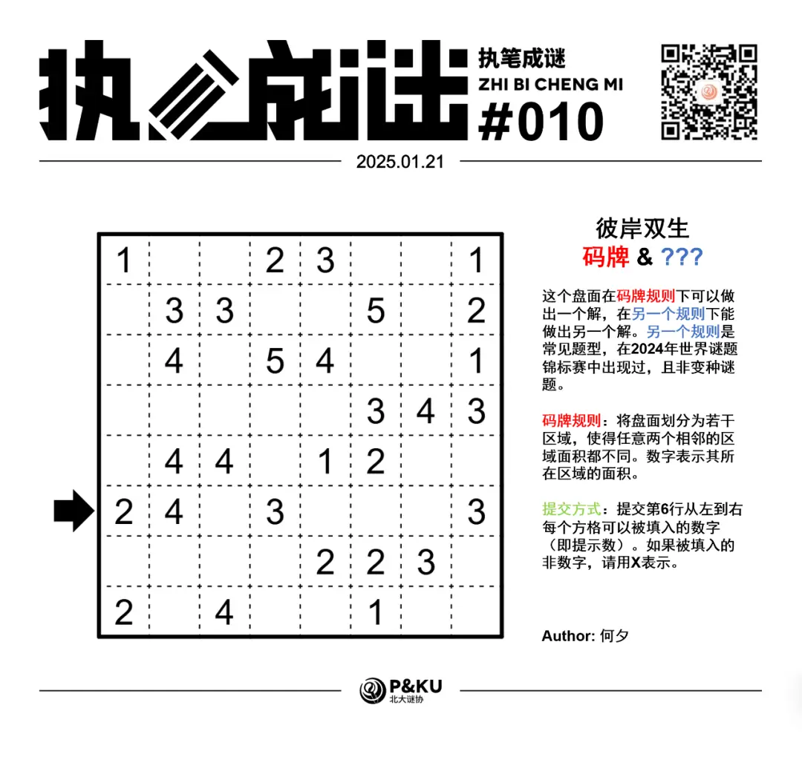
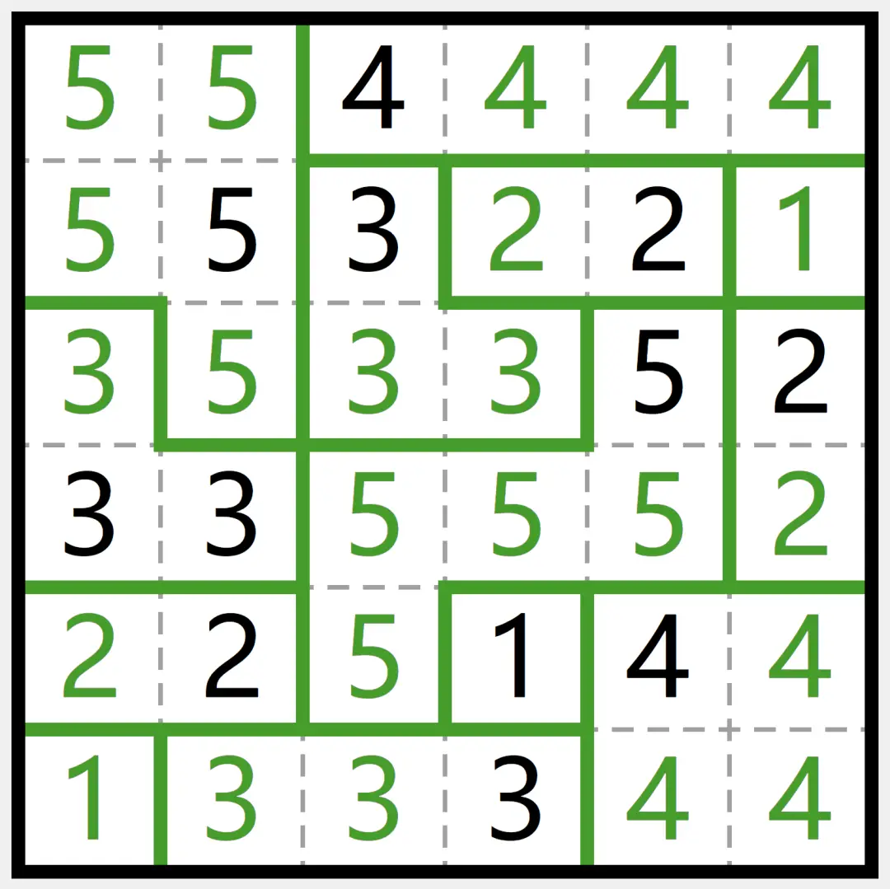
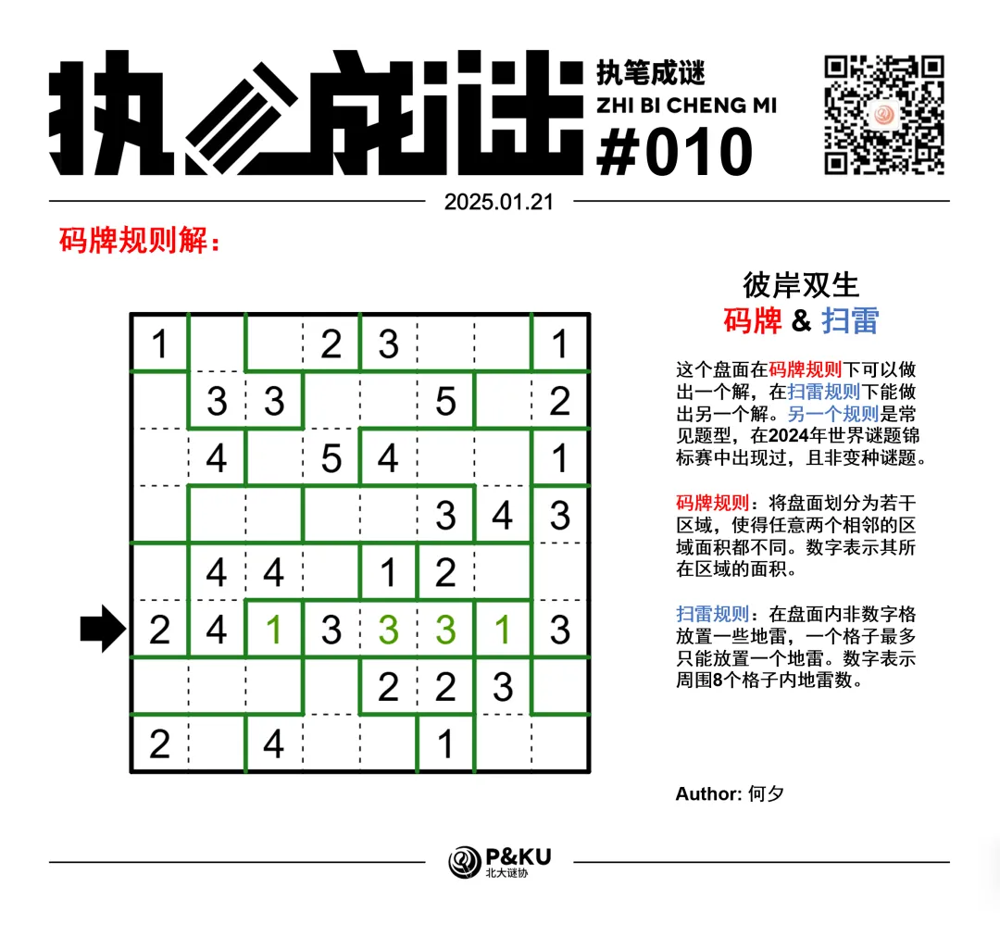
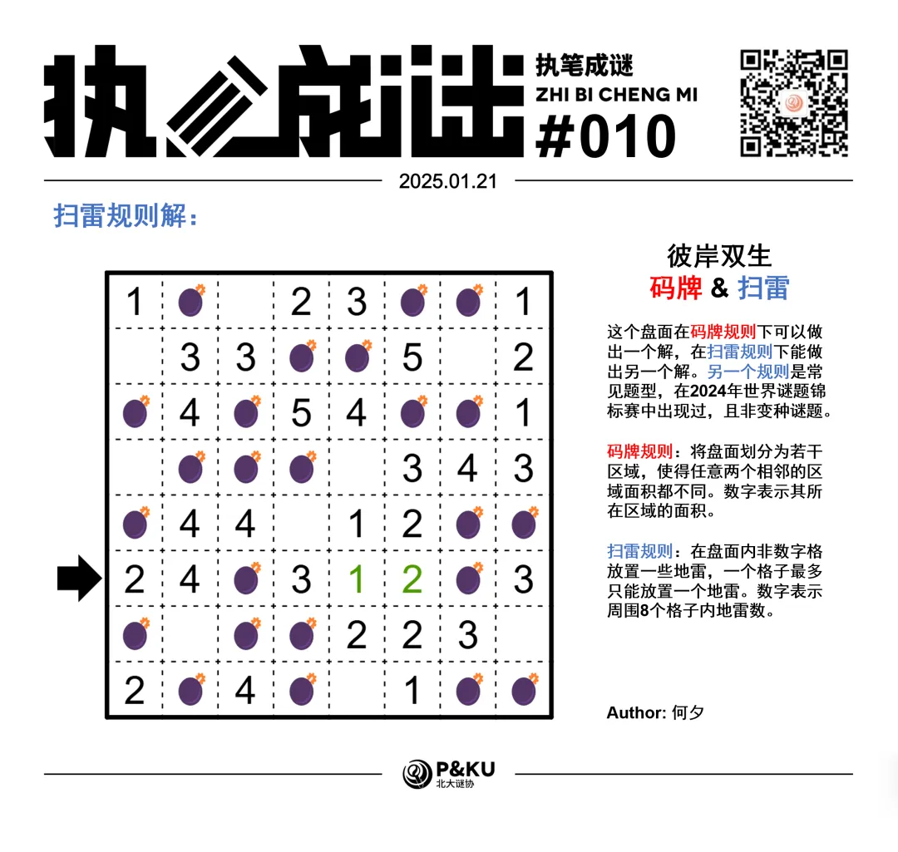
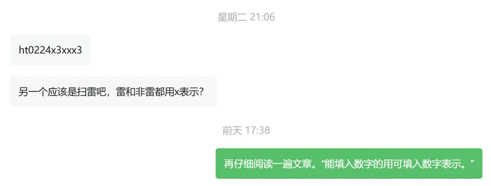

何夕老师为大家带来了一套由其编写的纸笔谜题，主题为 Hidden Twins（彼岸双生）。
**在这一套谜题中，每道题目在原规则盘面能得到一个解的同时，在另一个规则下能得到另一个解，**
你需要在解出原题之后，确定被隐藏的规则，并且以隐藏的规则再解一遍。

今天是该系列的第二题，原规则盘面的纸笔类型为**码牌**。

{/* truncate */}

## Fillomino 码牌规则

将盘面划分为若干区域，使得任意两个相邻的区域面积都不同。数字表示其所在区域的面积。下图是一个已经完成的例子：

另一个规则能保证在 2024 年世界谜题锦标赛中出现过。
你可以查看 [2024 年世界谜题锦标赛题型的英文版说明链接](https://ectoplsm.github.io/wpc-unofficial.org/pdfs/WPC%202024.pdf)。

## 做题链接

你可以[在 penpa 网站上进行尝试](https://swaroopg92.github.io/penpa-edit/#m=edit&p=7VVLb5tAEL77V1R73gPLwwZucRr34rpN4yqKELKwTWIU7E15NBWW/3tmBrfsLvTQQ9ocKsR4+JjHN979lvJbnRQpD7jPHZ9bXMDl+BZ3XBt+Hbqt87XMqjwN3/GLutrJAhzOP81m/D7Jy3QUYYTgVjw6NkHYXPPmQxgxm3G6BYt5cx0em49hs+DNDbxiXAA2B08wboN71bm39B69yxYUFviLsw/uHbhJUcjn1XQ1baHPYdQsOcNGU0pHl+3l95S1efS8kft1hsA6qWCacpc9nd+U9VY+1udYEZ94c9HyvRng63R80W35ojfAF8dAvpus2OTpav4KdIP4dIL//QsQXoURcv/auX7n3oRHsIvwyOzg56Tt4jDHRgDW6hfgIOAowNhIcc0I1zWBCQKeAlBbpYtHRV0F8I0Uj1KUiDExVXhMTB4T4qGkTDwjwqcaSoRPNVSAUpQuPjFVqAfURQUoRakR0PhKW2EJExGEKFWEMFdCCHNAYVtmjG1OJGx9Alh4Qct/B8sfYEWP6xqCdzOKsMkuYc/wxiH7nqxF1iM7p5grsrdkL8m6ZMcUM8Fd90f7UiX5SnQiO6BTrrvGf/c5HkVwSLJS5quyLu6TDSiezlAQNWCHer9OCw3KpXzKs4Melz0cZJEOvkIw3T4Mxa9lsTWqPyd5rgHtN0GD2rNLg6oCDiblmbaShuyTaqcByiGmVUoPlU6gSnSKyWNidNt3M59G7AejO3Lg/3X/f4H+1RcI18B6a3p/a3Ro+8piUPsAD8gf0EGZn/Ge0gHvaRob9mUN6ICyATXFDVBf3wD2JA7Yb1SOVU2hIytT69iqJ3dspSo+ikcv)

<AnswerCheck
  answer={{
    '24133313': {
      type: 'CORRECT',
      message: '恭喜你完成了这道纸笔谜题（的一半）！',
    },
    '24X312X3': {
      type: 'CORRECT',
      message: '恭喜！你找到了这道纸笔谜题的另一半！',
    },
  }}
  mitiType="zhibi"
  instructions={
    
      依次输入第六行
      从左到右每个格子可以被填入的数字（即提示数）。如果被填入的非数字，请用 X 表示
    
  }
  exampleAnswer="133344"
/>

## 隐藏规则

    
隐藏规则

    **扫雷（Minesweeper）**

    在一些空格里放一枚地雷。数字表示在所有与此格接触的格中的总雷数。

## 解答

<Solution author={'怎苏昂'}>

</Solution>

### 步骤解析

查看步骤解析

码牌部分：

<Carousel arrows infinite={false}>
    <CarouselInner>
        对于基础的码牌 (Fillomino) 规则，区域的延伸是一个重要的技巧。
        比如右上角的 2 必须向左延伸一格，左下角的 2 不能往上延伸，因为面积为 2 的区域不相邻。类似的技巧我们可以得到如下图：
        

            
        

    </CarouselInner>
    <CarouselInner>
        注意到相同的相邻数字一定属于同一个区域，相邻的不同数字一定属于不同区域，结合上述区域的延伸，可以得到
        

            
        

    </CarouselInner>
    <CarouselInner>
        考虑最右上角的 5，必须占用 5 格，因此必须从左侧延伸出去。之后考虑左上角的 4 的“最大可及区域”，得到
        

            
        

    </CarouselInner>
    <CarouselInner>
        考虑红色格子，与完整的 1，3 相邻，因此不能是 1，3。但也不能是 2，只能跟左边的 4 相接。
        

            
        

    </CarouselInner>
    <CarouselInner>
        最后对剩下的区域分类讨论，可以得到最终结果：
        

            
        

    </CarouselInner>
</Carousel>

### 步骤解析 隐藏规则

查看步骤解析

扫雷部分：

<Carousel arrows infinite={false}>
    <CarouselInner>
        注意到盘面所有数字都小于 8 ，且提交答案格式处的文字暗示“可能会填入数字以外的内容”，可以猜测隐藏规则是扫雷。

        首先是最基础的技巧：如果周围能放入雷格数等于提示数，那么都是雷。反之，如果周围雷数已经达到目标，那么周边剩余就都不是雷。得到下图：
        

            
        

    </CarouselInner>
    <CarouselInner>
        然后对于扫雷有一些基础定式。基础原则如下图所示：红色是 AB 之间的公用格，绿色表示 A 独占格子，蓝色表示 B 独占格子。
        如果 B - A = （B 独占格子数），那么可以得出蓝色格子全部是雷，绿色格子全不是雷。
        下面给了个例子，供参考。
        

            
        

    </CarouselInner>
    <CarouselInner>
        在本题中也有很多类似的例子。举例（黄色表示需要关注的部分，红色和蓝色表示含义同上）：
        

            
        

    </CarouselInner>
    <CarouselInner>
        

            
        

    </CarouselInner>
    <CarouselInner>
        利用上述类似技巧就可以完成本题。后续步骤交给读者。如果有不会的也欢迎来我们的群聊一起讨论！
        

            
        

    </CarouselInner>

</Carousel>

## 后记

我们在后台还注意到很多朋友进行了错误的提交。

需要注意隐藏规则的提交方式和原规则是一致的！
上期我们的提交方式表达的是：“对于能够填入数字的，提交能填入的数字。”
因此对于非雷格，填入周围 8 格雷数。

希望这套奇妙的隐藏规则机制可以给正在看这份解析的你带来快乐。
如果您有什么想说的，欢迎在评论区留言，我们一起讨论！
