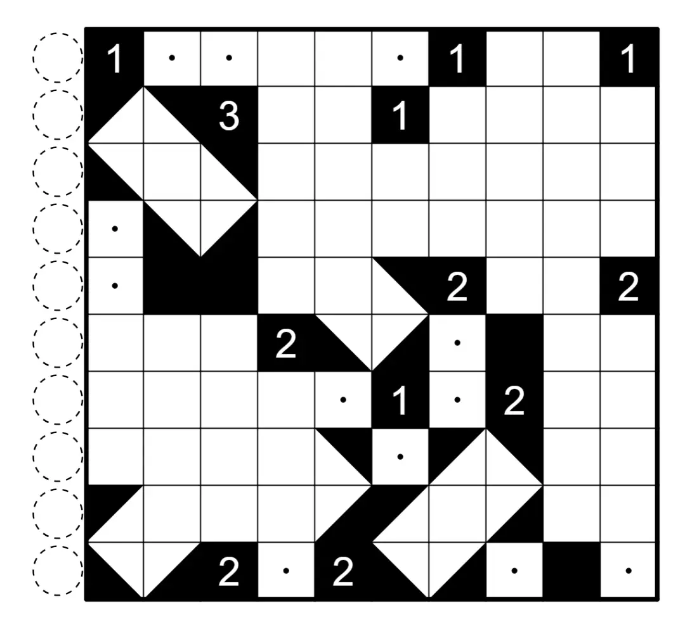

何夕老师为大家带来了一套由其编写的纸笔谜题，主题为 Hidden Twins（彼岸双生）。
**在这一套谜题中，每道题目在原规则盘面能得到一个解的同时，在另一个规则下能得到另一个解**，
你需要在解出原题之后，确定被隐藏的规则，并且以隐藏的规则再解一遍。

今天是该系列的第三题，原规则盘面的纸笔类型为**摇啊摇**。

{/* truncate */}

## 摇啊摇规则

在一些空格内放置等腰直角三角形，使得所有留白的区域都是横平竖直或者对角方向的长方形。
一个空格内最多放置一个等腰直角三角形，黑格里的数字表示与此格相邻的等腰直角三角形数。

下图是一个已经完成的例子：

**另一个规则能保证在 2024 年世界谜题锦标赛中出现过**。
你可以查看 [2024 年世界谜题锦标赛题型的英文版说明链接](https://ectoplsm.github.io/wpc-unofficial.org/pdfs/WPC%202024.pdf)。

你可以[在网站上进行尝试](https://swaroopg92.github.io/penpa-edit/#m=edit&p=7ZbPbts4EMbvfoqCZx5Ekfpj3bJp0kuaNk0WQSAYgewosRHZysp2s5Dhd883JNWYEgsU7aFBURgmxz+OyW+GHErr/7ZFU3IhuAi4THnAYXEVxVyJlEci0d/Afq4Wm6rM3vGj7WZeNzA4/3R6yu+Lal2Ocus1Ge3acdZe8PZDljPBOAvxFWzC24ts137M2KxeTheMt5cYZ1xh4Mx4hjBPYEbGvNbjZB2bcRHAPoedmL/dwJwtmllV3p5hFORzlrdXnNFi/+h/k8mW9deSWTH02wgAWM+Lx8LC9fauftxaNzHZ8/ZIy20vO6W0gFUqrVJrGqVk9ZXaqH5Z6bTYIPfr+eLJJ3c82e+R9i8QfJvlpP3fVzN9NS+zHZOSZYozOdadCnUXBaYzY2Nlush0xlMExlUIYXszLMLU9NLMIZKut/5JjB6Ln9vFtWIaoDBIhgNIkANIWs7kAaA5cvHtVHbnjhwSciDBOZ267h9auksoCJdQGM7COiDXh0LrEXdmhCmyHdobCpbGwJ2NZyrx0djrm3h9x15fEXidRej3ln7vyO8de7wR5amONdTtFY4Yb6Vu3+s20G2k2zPtc4KshGHCQ9rlEDeDCnkYYW6yI3BKJ9kJeGp5mnBJGwgbPZfCcPRcUorJluCUWLIVOKWT7Bickhhi8Wst4Vi3SguJOcSwTGARshXOBNlKQBQOLdm4CcPE8gQ8tTyNIcpw9BBlOHqIslyCK8sVeGx5DE5FQXYCTgI7TsI7fwqom4cC7eanBHTrUmKsHp2wTiclstNPCe7iosQLJCDWu5LQtfCDF4ep4MMD/nMHYLgTPTk5NpOeQv1P9CfQySjHA5Kt6+p2vW3uixmue/38xI0Ottoup2XjoKqun6rFyvVbPKzqpvQOESzvHnz+07q5683+XFSVA8wbgYNM0Tto0+CpdPC7aJr62SHLYjN3wMETzJmpXG1cAZvClYhHdG+15WvM+xH7n+lvLunN5e/bx296+6AtCN7aVfLW5OjTWzfe0gf2VD+ot8otHxQ6+KCkacFhVYN6Chu0X9tAw/IGHFQ42HeKnGbt1zmp6pc6LTWodlrqsODzyegF)。

<AnswerCheck
    answer={{
        '3222424223': {
            type: 'CORRECT',
            message: '恭喜你完成了这道纸笔谜题（的一半）！'
        },
        '5599457904': {
            type: 'CORRECT',
            message: '恭喜你找到了这道纸笔谜题的另一半！'
        },
    }}
    instructions={<markdown>依次输入从上到下<u>每一行</u>的空格数。对于多位数，只提交个位</markdown>}
/>

    
隐藏规则

    **美术馆（Akari）**
    
    在一些空格内放置一个灯泡，以照亮所有空格。
    格子里的灯泡可以照亮所有从此格横竖能够直接连接到且不被黑格阻挡的空格，包括此格本身。
    任意两个灯泡不能互相照亮。黑格里的数字表示与之相邻的所有格中的灯泡个数。

<Solution author={'怎苏昂'}>
**摇啊摇部分**

对于摇啊摇（Shakashaka）规则，一些基础技巧已经于[此文章](https://mp.weixin.qq.com/s/9UGeXhHbHCHv-u4iAL35mA)中有所表述
（如三角形黑边必须与黑边相接，90 度补全），如果有需要的朋友们可以去观看。依次通过如下步骤求解一部分。

    
查看步骤解析

    

    

    

    

    

    
    

    此时观察绿色的两个格子，必定是要么同时有三角形，要么同时没有三角形。
    考虑到数字 3 已经提示有三角形，那么另外一个数字 1 的三角形分布也可以确定。

    

    

    
    

    最后这题依赖于基础技巧即可解答。

    

    
    

**美术馆部分**

    
查看步骤解析

    首先和 3 对角相邻的四个格子不能有灯（否则根据不能互相照亮的规则，3 周围凑不齐三盏灯。）

    

    
    

    而后的大致步骤如下：

    

    

    

    

    

    
    

</Solution>
