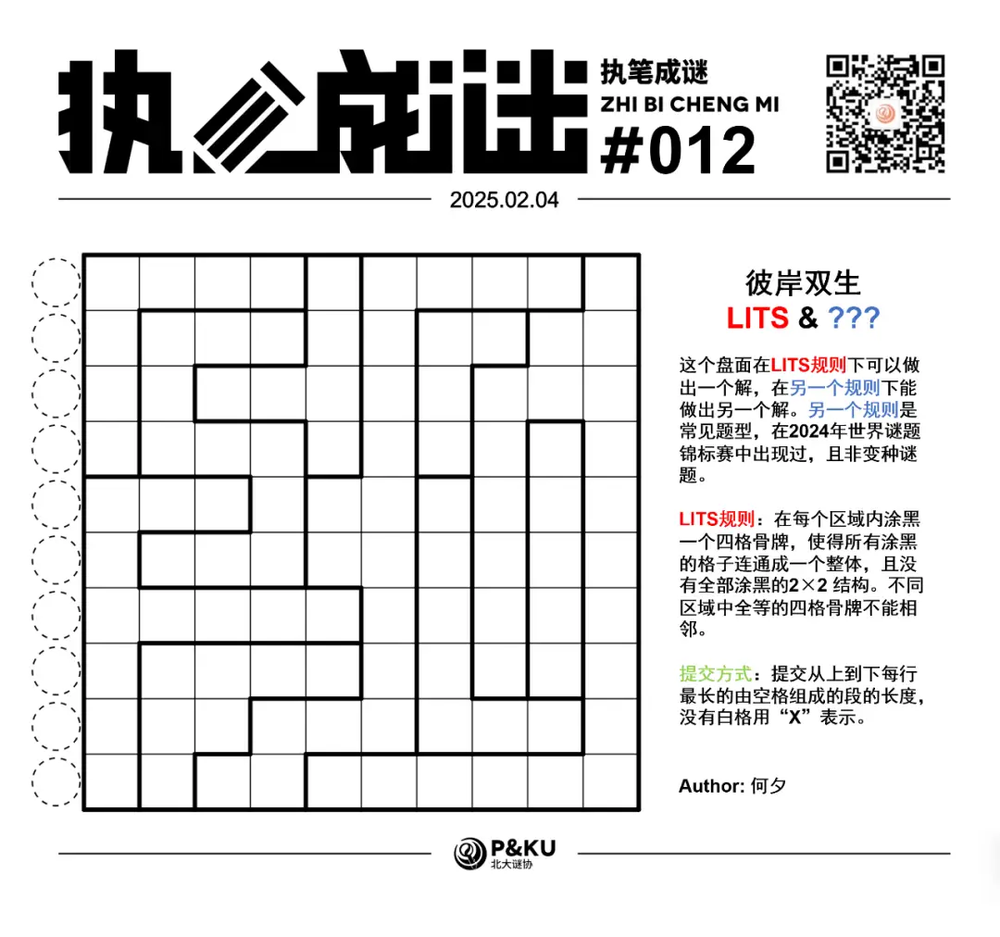
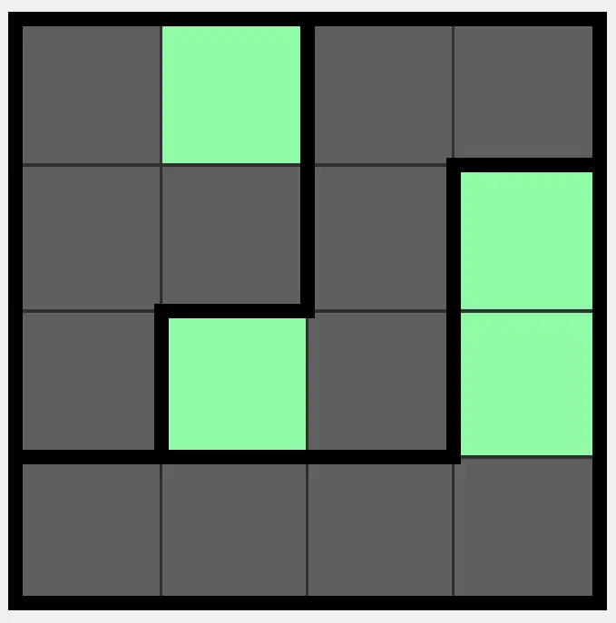
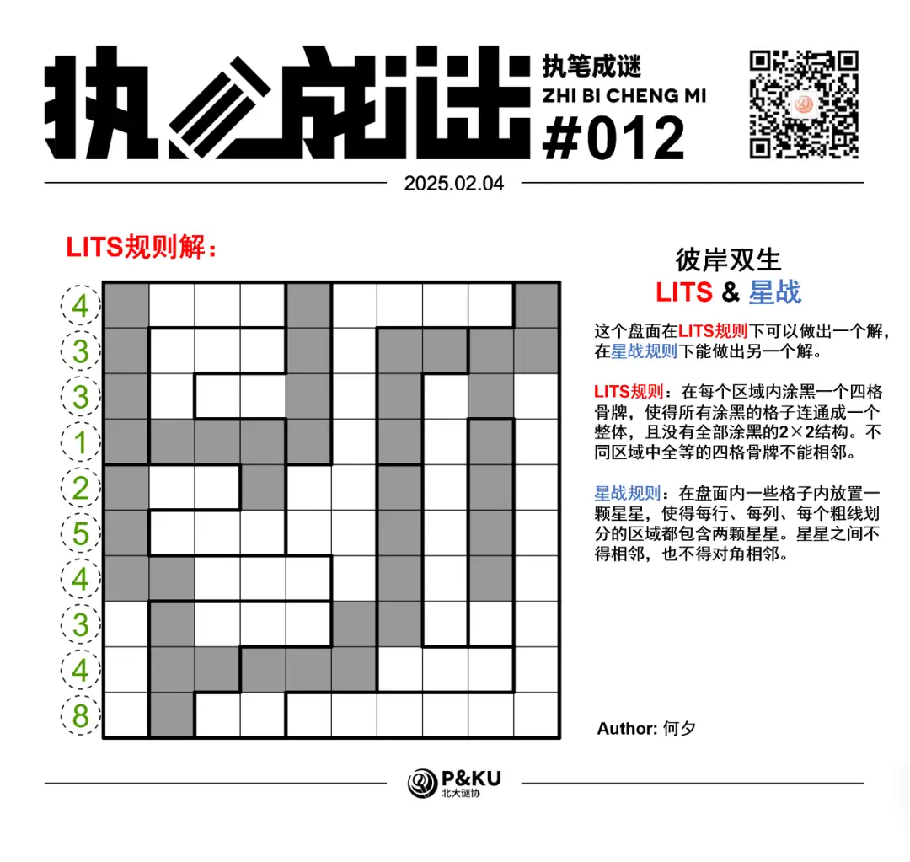
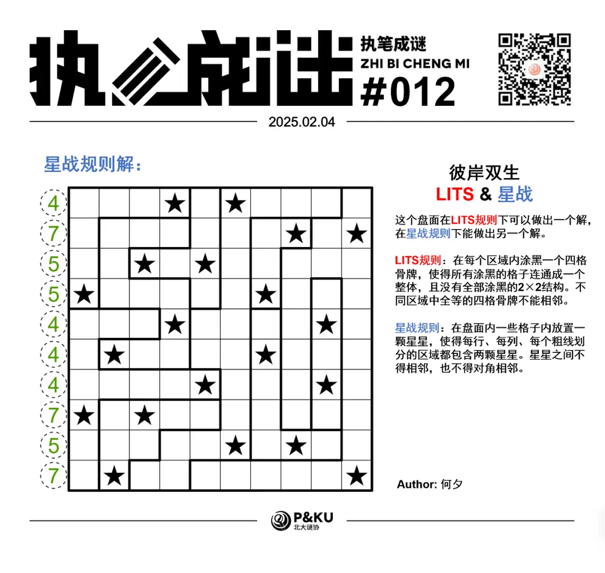

何夕老师为大家带来了一套由其编写的纸笔谜题，主题为 Hidden Twins（彼岸双生）。
**在这一套谜题中，每道题目在原规则盘面能得到一个解的同时，在另一个规则下能得到另一个解，**
你需要在解出原题之后，确定被隐藏的规则，并且以隐藏的规则再解一遍。

今天是该系列的第四题，原规则盘面的纸笔类型为**LITS**。

{/* truncate */}

## LITS 规则

在每个区域内涂黑一个四格骨牌，使得所有涂黑的格子连通成一个整体，且没有全部涂黑的 2×2 结构。
不同区域中全等的四格骨牌 (L,I,T,S 形状) 不能相邻。下图是一个已经完成的例子：

另一个规则能保证在 2024 年世界谜题锦标赛中出现过。
你可以查看 [2024 年世界谜题锦标赛题型的英文版说明链接](https://ectoplsm.github.io/wpc-unofficial.org/pdfs/WPC%202024.pdf)。

## 做题链接

你可以[在 penpa 网站上进行尝试](https://swaroopg92.github.io/penpa-edit/#m=edit&p=7VZNb9tGEL3rVxQ874H7xSV5S9O4FzdpahdBIAgGbSuxENlMKakpaPi/583uoyVK7CVA0aAoBO0+PY5m38zOLHfzx67plkprpXNlS5UrIOV8oZwuldchfnN+Llfb9bL+Qb3Ybe/aDkCpN2dn6kOz3ixnc1otZo99VfdvVf9zPc90pjKDr84Wqn9bP/a/1P2F6i/wKFMO3HkyMoCvAH2C7+JzQS/Tc50Dv05Y/vYe8GbV3ayXV+d4CubXet5fqkzW+TH+W2B23/65zKhDft+099crIa6bLYLZ3K0+88lmd9t+2tFWL55U/+JIrqxCuZZyCZNcQRNyJYp/WG61eHpC2n+D4Kt6Ltp/38NyDy/qR4yv46jj+L5+zKyBG4fFDgVmLkyxxaRtmLStJm11PmmszbS1nbb209bFhDWiPIuxmjheIhWqt3H8KY55HH0cz6PNK2TFOK+MK7LaoIKdA/bEFtjtsS8T9qUywSYcwJfkS/BlRVwpU+UJV+i4PPm0uTvAFjj5j1gnP5iBkx/MyprkBzOwpn3xjE2l4Yf6Q4F1yQfEFQYecQXG5aEtMC7BBXUWOTD/6+BnwPBvZIujn7DHhYEf7EO0By8lI9iCl6KKmqFNNjxio6zssmAL/c/YAyed1iI/lvmxyIllfgQ75schP0XKP2Zlw5B/aOBewLeyUjqCPTQ8Y+TQM4eCC65VYN1DHJj/AjpL2guWuosY/guu5aFhwDha8Zvxin7yOXjDmqlk36k5oGYq8ogFv5lP8IwxYse6ctgvz/2CfsNYDPL5jIVnLAaxjDDjwox1WQPQs8dSn4w9l9pj/o3sC3kL3pP34D3z5rGPnvuIF4sNzFtAngdc4L+B9VzIPtKnk32hHwM/jjbytjLUX4HXjL1EjBV5wdwjzOBZ8xU0aK6LF5811GbAO/JOaoP2Fv8dzgGDWnKsZ4d69qxzDz4MvQC+JI/aszlrLEeda9YJXqpWjt2YN/BDX6BfLPsFM3IiPA6kd/FYehlHJ4cTxEJMVmsRBSzCBUO4EeGCkWwjCRYcwJfkSwSaJx4zRCUeM0SRR9BWghaMprfS9IIL8HJ4CMahEgUOvAgf7CWgwY8EOviXBAzrSmKoJyZs0CmJHPRLgoe4JPEaCSjiSR3klfbNL71veymc7sSRnDk2U25Qxx//X2AXszkud9mmXV9tdt2H5gZXlXj3w20E3MPu/nrZjah1235erx7GdquPD223nHwk5PL245T9ddvdHnn/0qzXIyLdZkdUugiMqG2HG9XB76br2i8j5r7Z3o2Ig9vXyNPyYTsWsG3GEptPzdFq9/uYn2bZX1n8zq3cuv+/Of9LN2fZgvx7O0q+NzmxettusvVBT3Q/2MkuJ3/S6OBPWloWPO1qsBONDfa4t0GdtjfIkw4H9zdNLl6P+1xUHbe6LHXS7bLUYcPPF7Ov)

<AnswerCheck
  answer={{
    '4331254348': {
      type: 'CORRECT',
      message: '恭喜你完成了这道纸笔谜题（的一半）！',
    },
    '4755444757': {
      type: 'CORRECT',
      message: '恭喜！你找到了这道纸笔谜题的另一半！',
    },
  }}
  mitiType="zhibi"
  instructions={
    
      依次输入从上到下每一行
      的最长空格段，如果不存在用X表示。对于多位数，只提交个位。
    
  }
  exampleAnswer="111X"
/>

## 隐藏规则

    
隐藏规则

    **星战（Starbattle）**

    盘面内放入一些星星，每行每列每个宫各两个。星星不相邻也不对角相邻。

## 解答

<Solution author={'怎苏昂'}>

</Solution>

### 步骤解析

  
查看步骤解析

  <Carousel arrows infinite={false}>
    <CarouselInner>
      “如果这个地方不涂黑的话，我在这个区域就找不到四个连成一片的可涂黑的黑格了呢。然后是黑格不能构成
      2x2，刚好把最右边这个大区域分出了一个小区域。”
      

        
      

    </CarouselInner>
    <CarouselInner>
      "如果涂黑的部分在这个小区域内的话，且不论会产生 2x2 的全涂黑格子，同时两个 I 拼板也会靠在一起。"
      

        
      

    </CarouselInner>
    <CarouselInner>
      “右边五列的联通性似乎很难维持……让我想想该怎么放置四格拼版让它们连在一起……”（大约五分钟后）“有了！”
      

        
      

    </CarouselInner>
    <CarouselInner>
      “中间这一条大河波浪宽连接起左右两侧，但由于不能 2x2 全部涂黑，再根据联通性总可以确定这些吧。”
      

        
      

    </CarouselInner>
    <CarouselInner>
      “类似联通到左边……”余下的故事就由读者来完成吧。
      

        
      

    </CarouselInner>
  </Carousel>

### 步骤解析 隐藏规则

  
查看步骤解析

  <Carousel arrows infinite={false}>
    <CarouselInner>
      注意到第 10 列完全属于某一个区域·，故可以排除这个区域剩下的部分一定不是星星。同时注意到一个区域只属于第 9
      列，因此可以排除第 9 列的其他格子。
      

        
      

    </CarouselInner>
    <CarouselInner>
      同时如果能确定相邻两格内一定有一颗星的情形，那么这两个格子两侧一定不是星。
      

        
      

    </CarouselInner>
    <CarouselInner>
      

        
      

    </CarouselInner>
    <CarouselInner>
      同时，星战的一个经典结论是 2x2 范围内最多一颗星，对第 6，7 列进行讨论，得到：
      

        
      

    </CarouselInner>
    <CarouselInner>
      同理根据上述讨论，可以得到 L 形和 P 形宫的星战定式：
      

        
      

    </CarouselInner>
    <CarouselInner>
      利用上述定式和进一步讨论可以得到：
      

        
      

    </CarouselInner>
    <CarouselInner>
      统计一下剩余一个空格同时余下一个星星没填的行列宫，可以得到最终答案：
      

        
      

    </CarouselInner>
  </Carousel>

